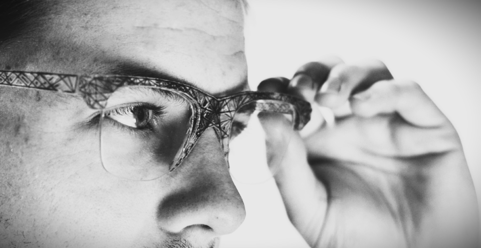
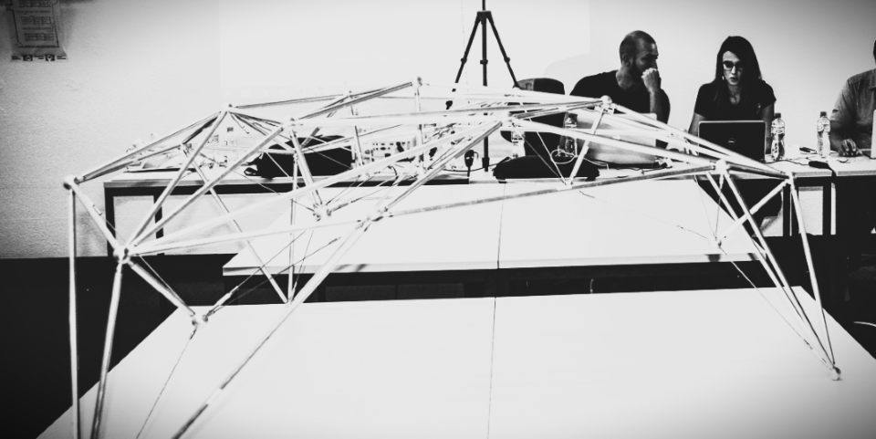

# About me

My personal website [judycurie.com](https://judycurie.com/).

## Short Bio

Judy Curie (Judyta Maria Cichocka) is a passionate designer and entrepreneur in the field of structural art. Her main focus lies in Computational Intelligence methods applied in structural and architectural design. 

She holds PhD in architectural engineering (WRUT) and MEng in Structural Design and Mechanics (MIT). She was a MIT nominee to the SOM STRUCTURAL ENGINEERING RESEARCH GRANT (2019) and recipient of the MIT Art Grant (2019).

She just has set up Fab Faboundation Poland. She aspires to lead cutting edge research into difital fabrication and set up a Fab Lab Node in Poland. She would like to promote creation of the open source architecture and deliver it to the people in need. 

## Digital Art

**Escape Velocity. NFT Collection: Game wars**

“Keep up the good work, if only for a while, if only for the twinkling of a tiny galaxy.”
– Wislawa Szymborska

The Game Wars is a self-organizing generative art that emerges without a designer. It is a question about free will, consciousness and destiny. It is a cellular automata, where the evolution is determined by its initial state, requiring no further input. It is a zero-player game.

Noone can play Game Wars.
Noone wins Game Wars.

Stop war.

## Digital Fabrication

**Multi-material 3D printed eyewear - model Katipo**

honourable mention in Wearable Technology 
Competition
design: J.Cichocka, Z.Challies
date: June 2015
material: 
The presented models were printed on the 
ConnexMulti-Material 3D Printer with usage 
of:
•Transparent material (VeroClear-RGD810) 
- a rigid, nearly colorless material featuring 
provendimensional stability for general pupose
•Rubber-like black (TangoBlack FLX973) of 
elastomer characteristics including Shore 
scale A hardness, elongation at break, tear 
resistance and tensile strength

## Physical Construction

**AJ GAME: From Digital Complexity to Physical Construction**

location: ETH, Zurich, Switzerland
date: 10-11/09/2016
Description:
Nowadays, computational intelligence enables 
designers to create imaginable, complex structures, which are impressive in digital form, 
however can never be reflected in the same 
manner in reality. Development of novel manufacturing techniques brings new possibilities 
for architectural representation. This cluster 
will explore the role of computational design 
in the generation of free form space frame 
structures through simulation with AJ tools, 
optimization processes based on the Swarm 
Intelligence and creation of smart physical

