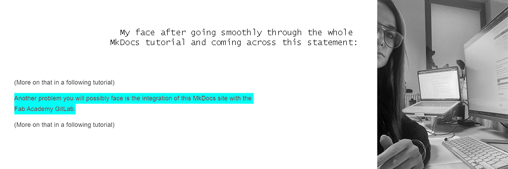

# Week01. Principles and practices

This week I worked on defining my final project idea and started to getting used to the documentation process.


## Photo of the week




## MkDocs Website

After figuring out that I need a new MkDocs template for a personal website, rather than trying to modify the exiting HTML template in my folder (thanks to Rodrigo :)), I had to make it work on my local repository. 


To get the mkdocs template working locally I had to:

1. Install mkdocs theme material, using the following commands (source:  [squidfunk](https://squidfunk.github.io/mkdocs-material/getting-started/))

```
pip install mkdocs-material
git clone https://github.com/squidfunk/mkdocs-material.git
pip install -e mkdocs-material

```

2. Install the missing plugin, using the following command (source: [pypi](https://pypi.org/project/mkdocs-git-revision-date-localized-plugin/))


```
pip install mkdocs-git-revision-date-localized-plugin

```


## Key take aways 

- git push : local -> server

- git pull : server -> local

- question question marks


## Problems/Questions/Dilemas
1. Why does sometimes "commit" command runs, do not stop and not let me prograss in Git Bash?
2. Does pushing local repo with no docs deletes existing file in gitlab repo?
3. Should I do add command if I only modify files?git