# **Week02.** Computer-aided design

|Assignment    |                          |
| ----------- | ------------------------------------ |
| *group*       |  na
| *individual*      | model (raster, vector, 2D, 3D, render, animate, simulate, ...) a possible final project, compress your images and videos, and post a description with your design files on your class page |

## Photo of the week

## Model
I wanted to find geometry concept, that is a cut out of the minimal surface which can be a roofing for 2 cars or a little garden party.

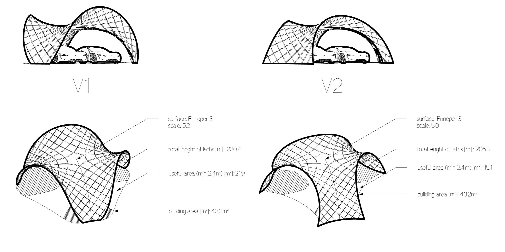

*“if surface is completely minimal, the asymptotics in the gridshell will coincide perfectly perpendicular, which result in torsion-free nodes and straight strips”* (Eike Schling, 2018)

The beauty of these structure lies in their simplicity. Not only they can constructed from the simple flat element but also assembled from flat. Below I made active-bending simulation with Kangaroo2, showing how the flat assembly will look like.

<video width="960"  controls>
  <source src="../../files/week02/SimulationTD500.mp4" type="video/mp4">
</video>

**Video.** Assembly simulation.

To model asymptotic gridshell composed of straight laths and with perpendicular intersection joints, the surface needs to be minimal. I selected Enneper 3 minimal surface, as has promising structurally and geometrically shape for the roof canopy. Below I present in short the workflow for the V1 and V2 versions.

## V1

The Enneper 3  surface was split with the plane and dome.

The network of asymptotics was created using a custom script.

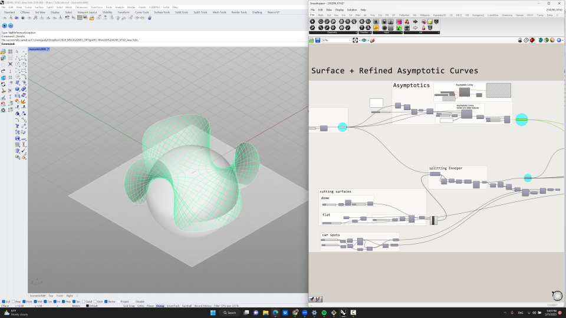

I cutout the selected part of the Enneper surface.

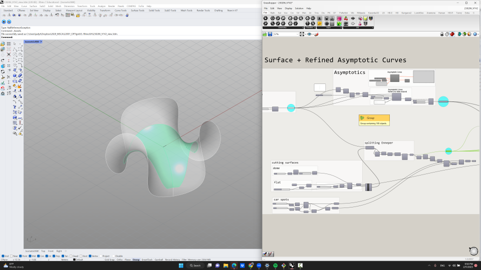
The surface itself and the network of asymptotics were cut to the define outline. On the part of the surface where is starts the asymptotic network starts to get some problems with the direction as the surface is locally not continous/smooth. Therefore I cut 1/3 of the network and make the polar array and connect back with each other.

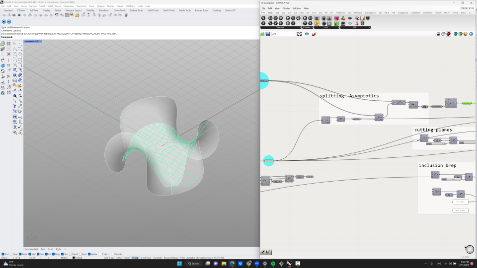
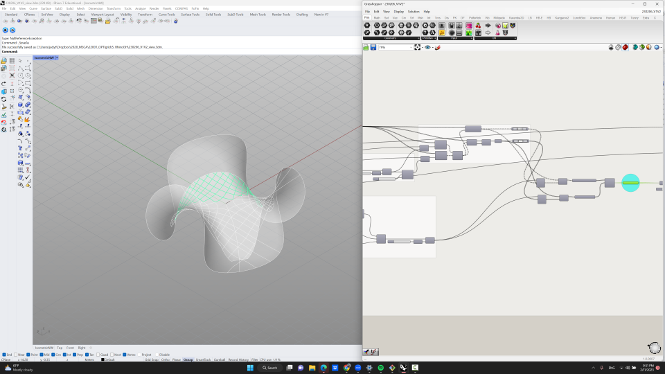
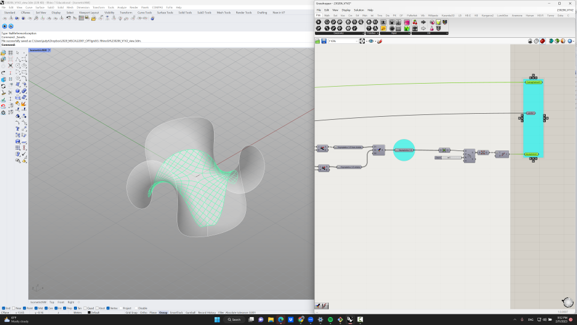

## V2
The Enneper 3 surface created.

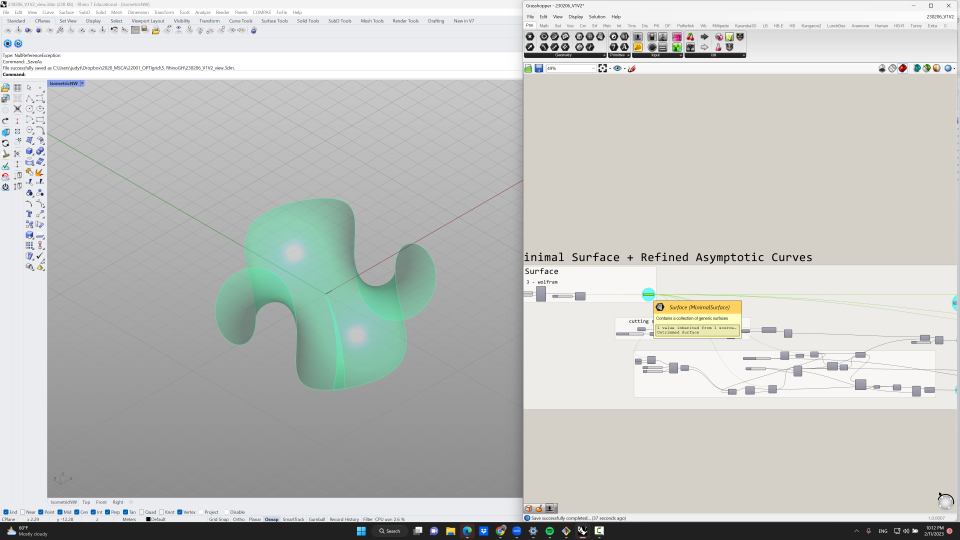
The Enneper 3 surface was split with the plane and 3 geodesic curves.

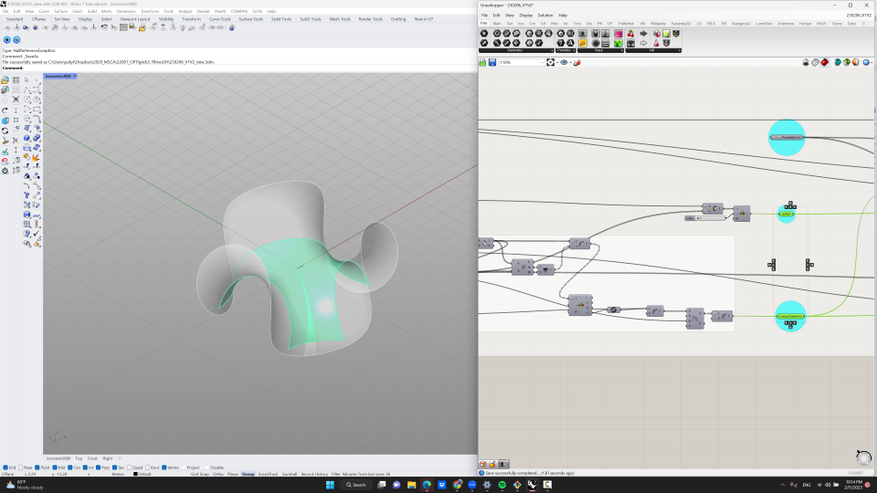
The network of asymptotics was created using a custom script. The surface itself and the network of asymptotics were cut to the define outline. On the part of the surface where is starts the asymptotic network starts to get some problems with the direction as the surface is locally not continous/smooth. Therefore I cut 1/3 of the network and make the polar array and connect back with each other.

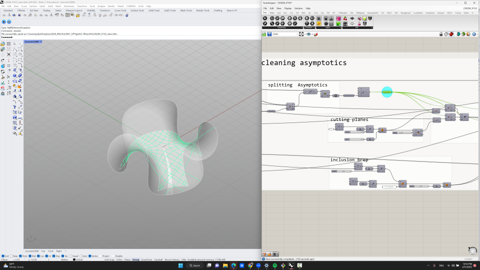
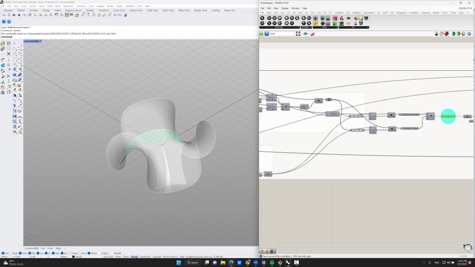
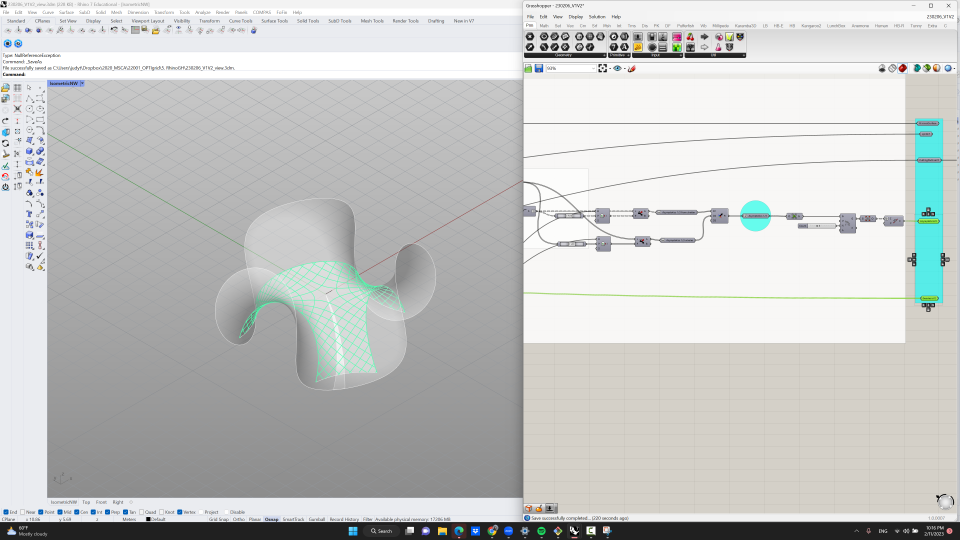
__________________________________________
## Files
**design files**: [V1V2 - Rhino/GH](../files/week02/V1V2.zip){: V1V2}
