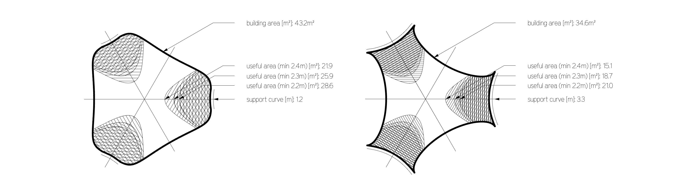
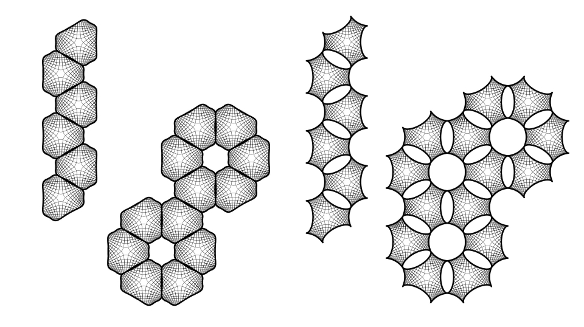
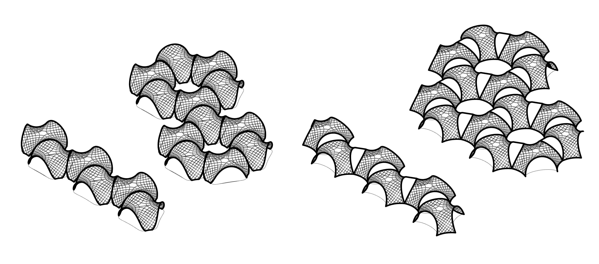

# Week02. Computer-aided design

## Assignment
model (raster, vector, 2D, 3D, render, animate, simulate, ...) a possible final project,
compress your images and videos,
and post a description with your design files on your class page

## Research

I reviewed some research papers about asymptotic gridshells.

1. Asymptotic Gridshells - applications and analysis. [paper](https://www.behance.net/gallery/86066625/MT-Asymptotic-Gridshells-applications-and-analysis)

2. DESIGN AND CONSTRUCTION OF THE ASYMPTOTIC PAVILION [paper](https://mediatum.ub.tum.de/doc/1468899/1468899.pdf)

3. The design, fabrication and assembly of an asymptotic timber gridshell. [paper](https://www.researchgate.net/publication/336367443_The_design_fabrication_and_assembly_of_an_asymptotic_timber_gridshell)

4. Morphology of Kinetic Asymptotic Grids. [paper](https://eikeschling.com/2022/09/23/morphology-of-kinetic-asymptotic-grids/)

5. Designing Asymptotic Geodesic Hybrid Gridshells. [paper](https://eikeschling.com/2022/09/05/designing-asymptotic-geodesic-hybrid-gridshells/)

 “if surface is completely minimal, the asymptotics in the gridshell will coincide perfectly perpendicular, which result in torsion-free nodes and straight strips” (Eike Schling, 2018)

## Design goal

A small scale roof structure/ a canopy, which can be built without a building permit, providing a sheltered space from the rain and the sun.

- [ ] 1) timber gridshell from flat straight planks 

- [ ] 2) covered with watertight matter

- [ ] 3) assembly from flat

- [ ] 4) approx. coverage area 35m2

## Geometric Requirements

**Table 1.** Geometric requirements for asymtotic gridshell.

## Proposals V1 V2

Taking into consideration the geometric requirements, 2 subsurfaces were cut out of the minimal surface Enneper 3. The asymptotic curves were found with the custom-scripted component for Grasshopper.

**Fig 1.** Geometric comparison of the V1 and V2 proposals.

Two proposal V1 and V2 can be built as a stand-alone structures. However for the modular assembly is important for the possibilities to cover large spaces. Some modular arrangements are presented below.

**Fig 2.** Modular arrangements - top view.

**Fig 3.** Modular arrangements - isometry.

## Video

### From Vimeo

<iframe src="https://player.vimeo.com/video/10048961" width="640" height="480" frameborder="0" webkitallowfullscreen mozallowfullscreen allowfullscreen></iframe>

<a href="https://vimeo.com/10048961">Sound Waves</a> from <a href="https://vimeo.com/radarboy">George Gally (Radarboy)</a> on <a href="https://vimeo.com">Vimeo</a>.

### From Youtube

<iframe width="560" height="315" src="https://www.youtube.com/embed/jjNgJFemlC4" frameborder="0" allow="autoplay; encrypted-media" allowfullscreen></iframe>

## 3D Models

<iframe width="640" height="480" src="https://sketchfab.com/models/658c8f8a2f3042c3ad7bdedd83f1c915/embed" frameborder="0" allow="autoplay; fullscreen; vr" mozallowfullscreen="true" webkitallowfullscreen="true"></iframe>

    <a href="https://sketchfab.com/models/658c8f8a2f3042c3ad7bdedd83f1c915?utm_medium=embed&utm_source=website&utm_campaign=share-popup" target="_blank" style="font-weight: bold; color: #1CAAD9;">Dita&#39;s Gown</a>
    by <a href="https://sketchfab.com/francisbitontistudio?utm_medium=embed&utm_source=website&utm_campaign=share-popup" target="_blank" style="font-weight: bold; color: #1CAAD9;">Francis Bitonti Studio</a>
    on <a href="https://sketchfab.com?utm_medium=embed&utm_source=website&utm_campaign=share-popup" target="_blank" style="font-weight: bold; color: #1CAAD9;">Sketchfab</a>

