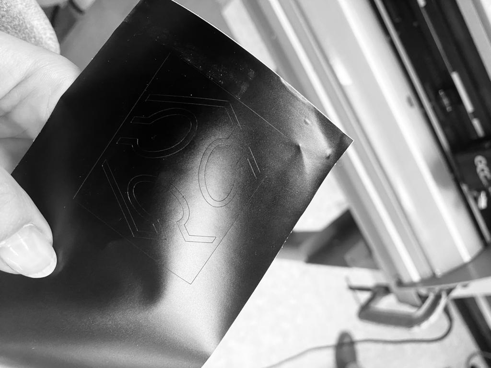
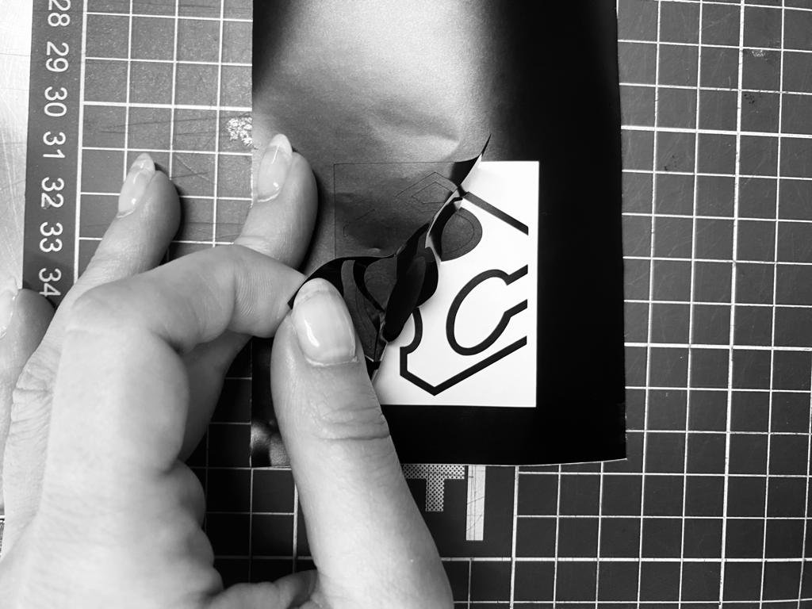
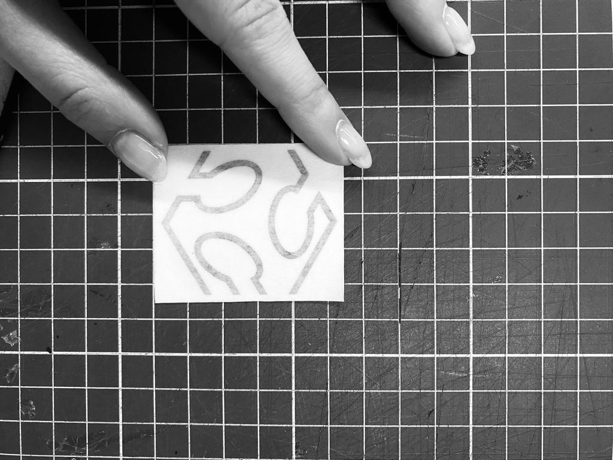
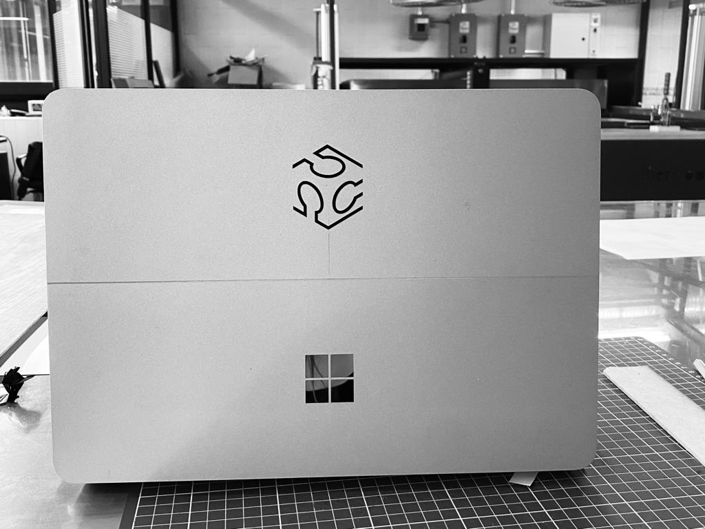
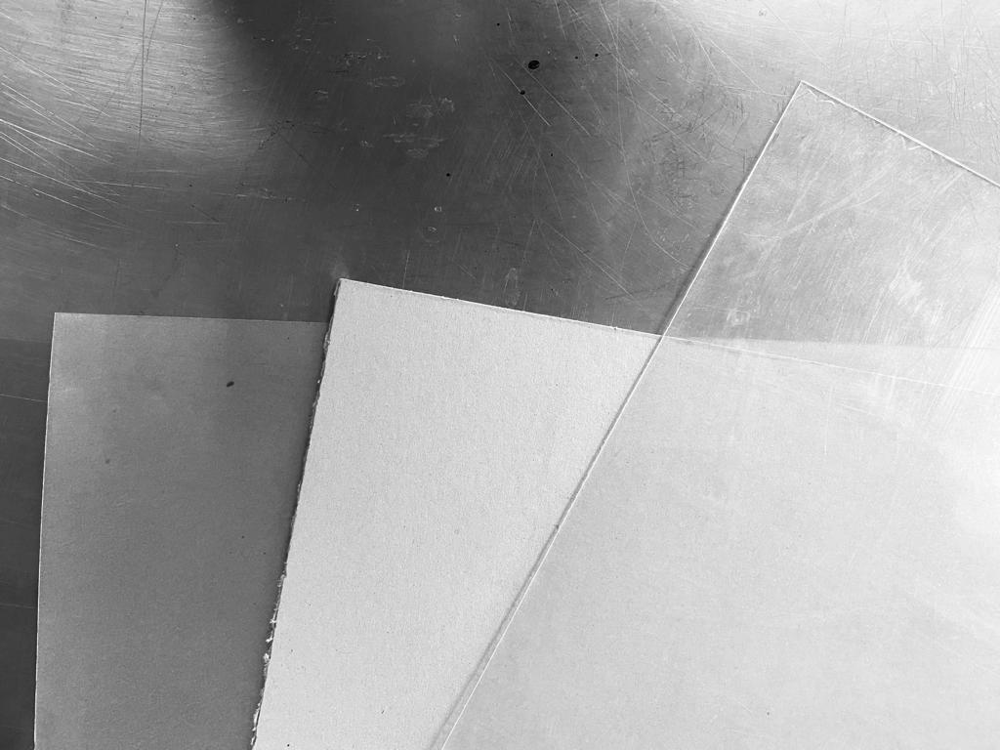
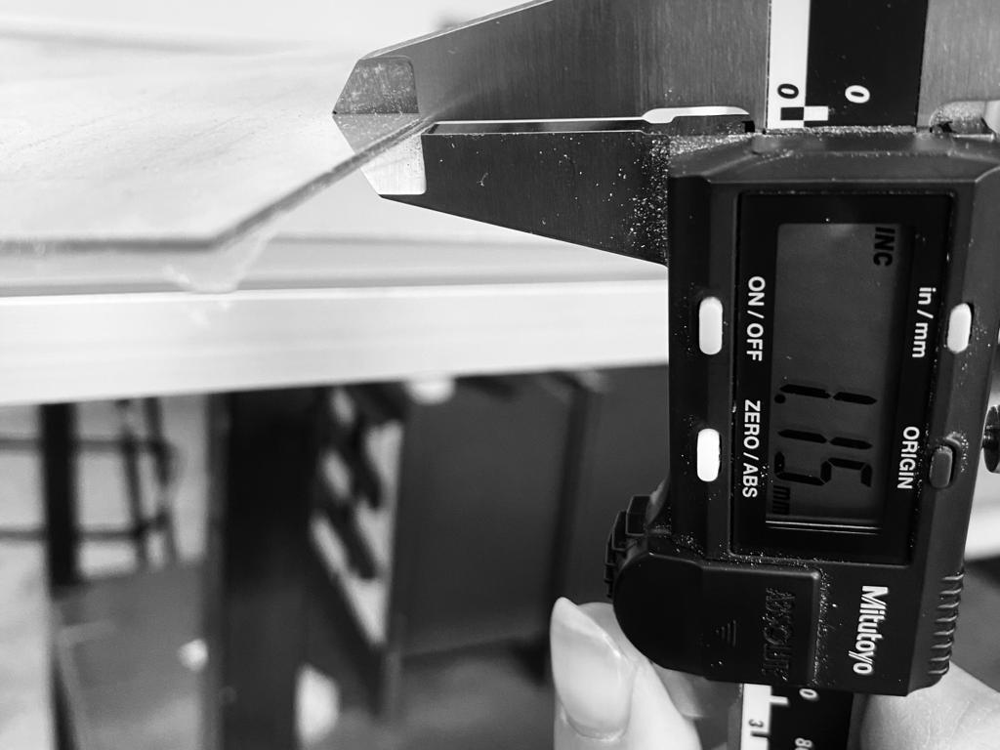
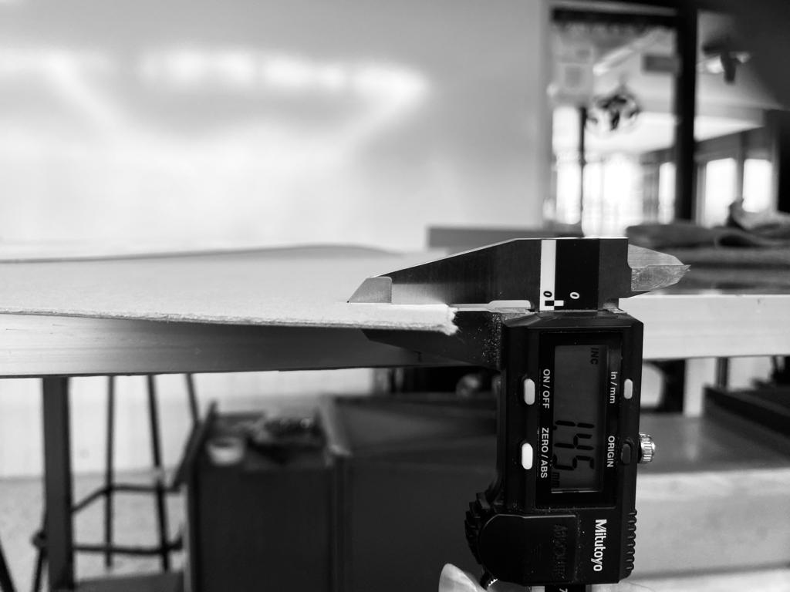
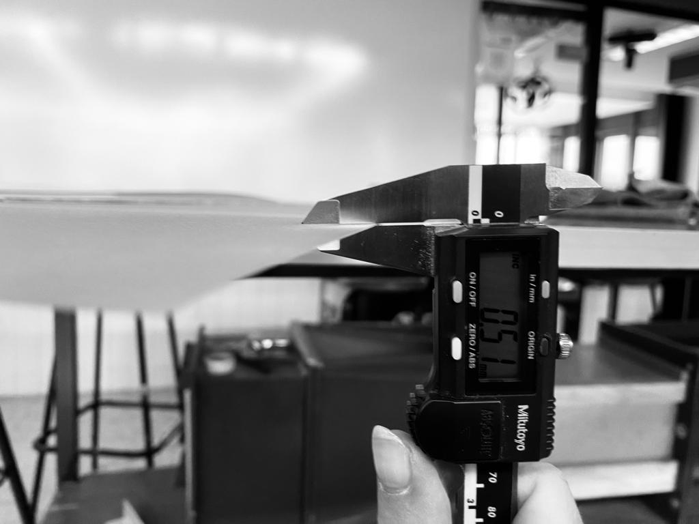
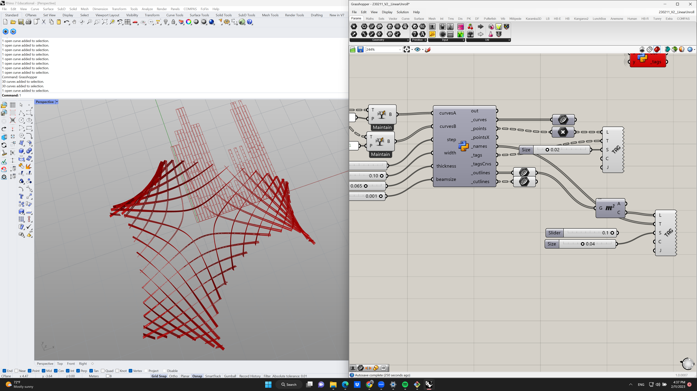
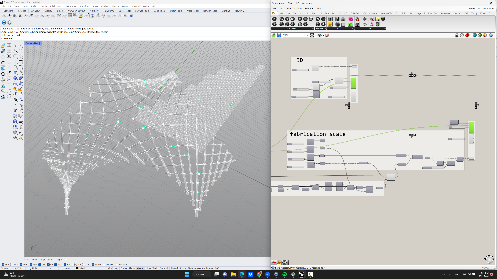

# **Week03.** Computer-Controlled Cutting

## Assignment
*group assignment:*

*characterize your lasercutter's focus, power, speed, rate, kerf, joint clearance and types* 

*individual assignment:*

*cut something on the vinylcutter; design, lasercut, and document a parametric construction kit, accounting for the lasercutter kerf,which can be assembled in multiple ways, and for extra credit include elements that aren't flat* 


## Photo of the week

## Group Assigment

I reviewed some research papers about asymptotic gridshells.











## Individual Assigment

Firstly I prepered a custom Python script for the unrolling of the asymotitic laths and labaling the elements and the connection points. The cutting outlines account for the laser beam and thickness of the material.


```
import rhinoscriptsyntax as rs
import ghpythonlib.components as gh
from Grasshopper.Kernel.Data import GH_Path
from Grasshopper import DataTree
import Rhino


def nestedListToDataTree(nestedlist):
    dataTree = DataTree[object]()
    for i, item_list in enumerate (nestedlist):
        path = GH_Path(i)
        dataTree.AddRange(item_list, path)
    return dataTree

namesA = []
namesB = []
for i in range(len(curvesA)):
    namesA.append("A"+str(i))
    namesB.append("B"+str(i))

paramA = []
indexB = []
for a in curvesA:
    tA = []
    iB = []
    for b in curvesB:
        t = gh.CurveXCurve(a, b)['params_a']
        if t != None:
            tA.append(t)
            i=curvesB.index(b)
            iB.append(namesB[i])
            
    paramA.append(tA)
    indexB.append(iB)
    
paramA = nestedListToDataTree(paramA)
indexB = nestedListToDataTree(indexB)

_curves = []
_points = []
_pointsX = []
_names = []
_tags = []
_tagsCrvs = []
_outlines = []
_cutlines = []

for i in xrange(paramA.BranchCount):
    #create lines
    s = (step+width)*i
    startPt = gh.ConstructPoint(s,0,0)
    lg = gh.Length(curvesA[i])
    if lg == None:
        lg = 0.00
    endPt = gh.ConstructPoint(s, lg, 0)
    line = gh.Line(startPt,endPt)
    pt1 = gh.ConstructPoint(s-0.5*width,0,0)
    pt2 = gh.ConstructPoint(s-0.5*width, lg, 0)
    pt3 = gh.ConstructPoint(s+0.5*width, lg, 0)
    pt4 = gh.ConstructPoint(s+0.5*width,0,0)
    outline = gh.PolyLine([pt1,pt2,pt3,pt4], True)
    
    #create element name
    name = namesA[i] 
    midPt = gh.ConstructPoint(s, lg/2, 0)

    points = []
    pointsX = []
    cutlines = []
    tags = []
    tagsCrvs = []
    
    # create intersection points with tags
    for j in range(len(paramA.Branch(i))):
        pt = gh.EvaluateCurve(line,paramA.Branch(i)[j])['point']
        ptX = gh.EvaluateCurve(curvesA[i],paramA.Branch(i)[j])['point']
        txt =  str(indexB.Branch(i)[j])
        
        #create the cut outline
        cutaxis = gh.LineSDL(pt, gh.UnitX(1),0.5*width)
        cpt1 = gh.Move(pt, gh.ConstructPoint(0,0.5*thickness + 0.5*beamsize,0))['geometry']
        cutline1 = gh.LineSDL(cpt1, gh.UnitX(1),0.5*width+beamsize)
        cutline2 = gh.Mirror(cutline1, gh.XZPlane(pt))['geometry']
        cpt2 = gh.EndPoints(cutline1)['end']
        cpt3 = gh.EndPoints(cutline2)['end']
        cpt4 = gh.EndPoints(cutline2)['start']
        cutline = gh.PolyLine([cpt1,cpt2,cpt3,cpt4], True)
      
        #add instances to the lists
        points.append(pt)
        pointsX.append(ptX)
        tags.append(txt)
        cutlines.append(cutline)
 

    _curves.append(line)
    _points.append(points)
    _pointsX.append(pointsX)
    _cutlines.append(cutlines)
    _outlines.append(outline)
    _names.append(name)
    _tags.append(tags)
    _tagsCrvs.append(tagsCrvs)


_points = nestedListToDataTree(_points)
_pointsX = nestedListToDataTree(_pointsX)
_cutlines = nestedListToDataTree(_cutlines)
_tags = nestedListToDataTree(_tags)
_tagsCrvs = nestedListToDataTree(_tagsCrvs )
```
The code produces layout for the bottom layer of the assymptotics. Analogically the layout is produced for the top layer.

**Fig.** Python Script for unrolling and labeling.

I tried add custom shape of the joints, however there was a problem with the units and tolerances. While I scaled the model x10 the geometry operation on cutting out from the laths outlines the custom joint outlines worked.


I ordered the elements accordingly to its lenght, clean the script. The labels on the elements to cut resemble the labels in the 3D model.



