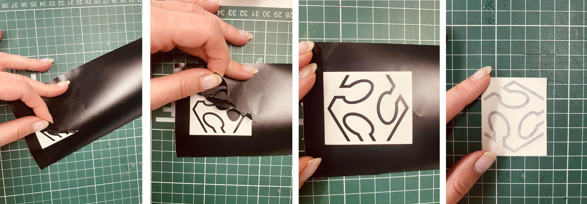
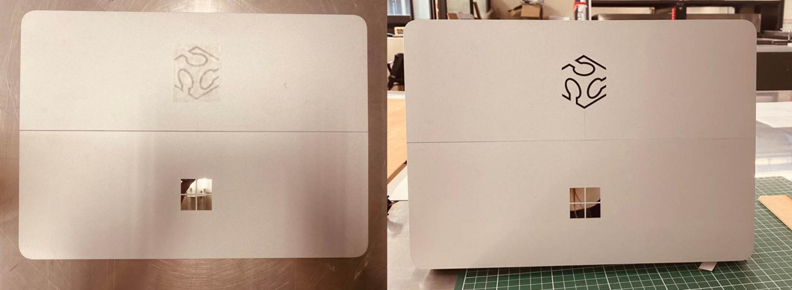

# **Week03.** Computer-Controlled Cutting


|Assignment    |                          |
| ----------- | ------------------------------------ |
| *group*       |  characterize your lasercutter's focus, power, speed, rate, kerf, joint clearance and types [**link**](https://fabacademy.org/2023/labs/ciudadmexico/group%20assignments/computer%20controlled%20cutting/)|
| *individual*      | cut something on the vinylcutter; design, lasercut, and document a parametric construction kit, accounting for the lasercutter kerf,which can be assembled in multiple ways, and for extra credit include elements that aren't flat |


## Photo of the week


## Take aways from the group Assignment
[Group Assignment](https://fabacademy.org/2023/labs/ciudadmexico/group%20assignments/computer%20controlled%20cutting/).

 - always measure the real thickness of the material
 - each new material needs new testing for choosing optimal Settings

## Simulation & Reality

<video width="960"  controls>
  <source src="../../files/week02/SimulationTD500.mp4" type="video/mp4">
</video>

<video width="960"  controls>
  <source src="../../files/week03/WhatsApp Video 2023-02-13 at 19.02.52.mp4" type="video/mp4">
</video>

movies availeble on Youtube
- [simulation](https://youtube.com/embed/Mqb7dUGRLO0)
- [model folding](https://youtube.com/embed/Y_U2DWwXKLk)


## Design & Fabrication

The beauty of asymptotic gridhshell lies in the ease of fabrication. The 3D laths unroll to  flat starlight strips which can be manufactured by laser, milling or even by hand.


To produce below fabrication layout, I prepared a custom Python script for unrolling and labeling of the elements and joints. The code produces layout for the bottom layer of the asymptotics.


The script accounts for the laser beam size (kerf), material thickness, width of the material and tolerances.

The joint connection shape can be rectangular or defined by custom draw curve.


## Material Tests
The material tests were conducted on 2 machines: Spirit GLS 12-100W CO2 (1) and Cromak LC5070Z (2,3,4).
The sample were cut with constant speed and varying power. The chosen speed is the fastest speed for which with 100% power the material was cut.


The model was produces from the 0.8mm Birch Plywood. Based on the sample test the power of 40% was enough to cut the material. As 5% power does nothing, for engraving the power of 7% was chosen.


## Model Assembly
The cut pieces were placed in assembly order divided into Series A- bottom and Series B- top. The assembly was flat and the elements had to be carefully put into the right slots. The assembled flat model was erected gently with hands.


## Vinyl Cutter
I followed the classy Vinyl cut sticker for my laptop. The vector drawing was prepared in Rhino and scaled to 50mm. For cutting the **GCC PUMA III Vinyl cutter** was used wit the follow settings:

- Impresion de control [g]: 85
- Veloc. [cm/s]: 30
- Anchura de material [mm]: 610
- Longitud [mm]: 700


After cutting, the transcalent background needs to be covered with the additional layer.



The sticker with the cover layer was placed on my laptop lid. After making sure that the vinyl part sticks well and removing the transculent layer, the looked perfect :).




## Group assignment

A few materials were considered and their thickness  measured: PET: 1.15mm, proipropylen 0.51mm, and carboard 1.45mm. The sample test was cut on the PET sample (1).


A laser cutter's beam usually has a diameter between 0.1 and 0.3 mm. For the Spirit GLS 12-100W CO2 tested in the FabLab CDMX is 0.1mm (Laser Source, 10.6µm).

## Python script

I prepered a custom Python script for the unrolling of the asymotitic laths and labaling the elements and the connection points. The cutting outlines account for the laser beam and thickness of the material.


```
import rhinoscriptsyntax as rs
import ghpythonlib.components as gh
from Grasshopper.Kernel.Data import GH_Path
from Grasshopper import DataTree
import Rhino


def nestedListToDataTree(nestedlist):
    dataTree = DataTree[object]()
    for i, item_list in enumerate (nestedlist):
        path = GH_Path(i)
        dataTree.AddRange(item_list, path)
    return dataTree

namesA = []
namesB = []
for i in range(len(curvesA)):
    namesA.append("A"+str(i))
    namesB.append("B"+str(i))

paramA = []
indexB = []
for a in curvesA:
    tA = []
    iB = []
    for b in curvesB:
        t = gh.CurveXCurve(a, b)['params_a']
        if t != None:
            tA.append(t)
            i=curvesB.index(b)
            iB.append(namesB[i])

    paramA.append(tA)
    indexB.append(iB)

paramA = nestedListToDataTree(paramA)
indexB = nestedListToDataTree(indexB)

_curves = []
_points = []
_pointsX = []
_names = []
_tags = []
_tagsCrvs = []
_outlines = []
_cutlines = []

for i in xrange(paramA.BranchCount):
    #create lines
    s = (step+width)*i
    startPt = gh.ConstructPoint(s,0,0)
    lg = gh.Length(curvesA[i])
    if lg == None:
        lg = 0.00
    endPt = gh.ConstructPoint(s, lg, 0)
    line = gh.Line(startPt,endPt)
    pt1 = gh.ConstructPoint(s-0.5*width,0,0)
    pt2 = gh.ConstructPoint(s-0.5*width, lg, 0)
    pt3 = gh.ConstructPoint(s+0.5*width, lg, 0)
    pt4 = gh.ConstructPoint(s+0.5*width,0,0)
    outline = gh.PolyLine([pt1,pt2,pt3,pt4], True)

    #create element name
    name = namesA[i]
    midPt = gh.ConstructPoint(s, lg/2, 0)

    points = []
    pointsX = []
    cutlines = []
    tags = []
    tagsCrvs = []

    # create intersection points with tags
    for j in range(len(paramA.Branch(i))):
        pt = gh.EvaluateCurve(line,paramA.Branch(i)[j])['point']
        ptX = gh.EvaluateCurve(curvesA[i],paramA.Branch(i)[j])['point']
        txt =  str(indexB.Branch(i)[j])

        #create the cut outline
        cutaxis = gh.LineSDL(pt, gh.UnitX(1),0.5*width)
        cpt1 = gh.Move(pt, gh.ConstructPoint(0,0.5*thickness + 0.5*beamsize,0))['geometry']
        cutline1 = gh.LineSDL(cpt1, gh.UnitX(1),0.5*width+beamsize)
        cutline2 = gh.Mirror(cutline1, gh.XZPlane(pt))['geometry']
        cpt2 = gh.EndPoints(cutline1)['end']
        cpt3 = gh.EndPoints(cutline2)['end']
        cpt4 = gh.EndPoints(cutline2)['start']
        cutline = gh.PolyLine([cpt1,cpt2,cpt3,cpt4], True)

        #add instances to the lists
        points.append(pt)
        pointsX.append(ptX)
        tags.append(txt)
        cutlines.append(cutline)


    _curves.append(line)
    _points.append(points)
    _pointsX.append(pointsX)
    _cutlines.append(cutlines)
    _outlines.append(outline)
    _names.append(name)
    _tags.append(tags)
    _tagsCrvs.append(tagsCrvs)


_points = nestedListToDataTree(_points)
_pointsX = nestedListToDataTree(_pointsX)
_cutlines = nestedListToDataTree(_cutlines)
_tags = nestedListToDataTree(_tags)
_tagsCrvs = nestedListToDataTree(_tagsCrvs )
```
## Further work


## Conclusions/Problems/Questions/Dilemmas


Scale and Tolerance problem

I tried add custom shape of the joints, however there was a problem with the units and tolerances. In [m] model the asymptotic cross sections worked correctly, while the cutout line for joints was not planar accordingly to the software and couldn't be subtracted from the lath outline. While I scaled the model x10 the geometry operation on cutting out from the laths outlines the custom joint outlines worked.


Jumping out stripes

While the laths were placed on the board directly to each other, they started to stick out from the bed while being cut. Not recommended layout for the stirp cutting.


__________________________________________
## Files

**design files**:

[V1V2-LinearUnroll - Rhino/GH](../files/week03/230213-V1V2-LinearUnroll.zip){: V1V2-LinearUnroll}

[V1V2-Cutting Files - pdf ](../files/week03/230212_V1V2 - cutting.pdf){: 230212_V1V2 - cutting}

[Vinyl cutter - Sticker - Rhino](../files/week03/230209_Sticker.3dm){: Sticker}
