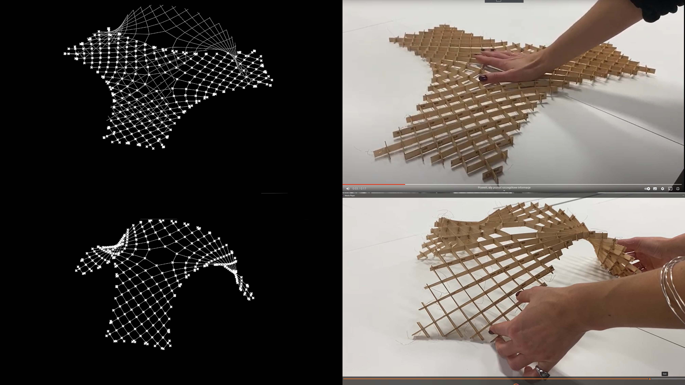

# **Week04.** Embedded programming

|Assignment    |                          |
| ----------- | ------------------------------------ |
| *group*       |  compare the performance and development workflows for other architectures
| *individual*      | browse through the data sheet for your microcontroller
      program a microcontroller development board
         to interact (with local input &/or output) and communicate (remotely)
      extra credit: use different languages &/or development environments |

## Photo of the week
When the reality matches simulation.

