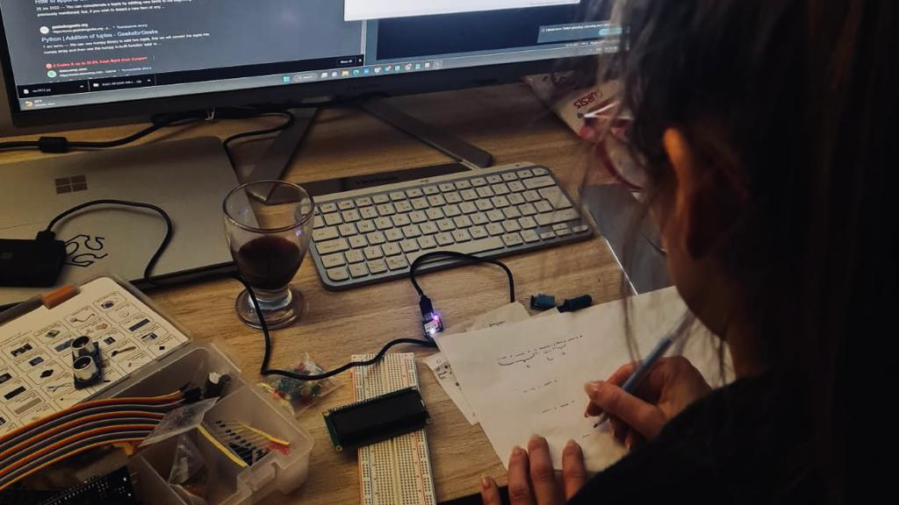
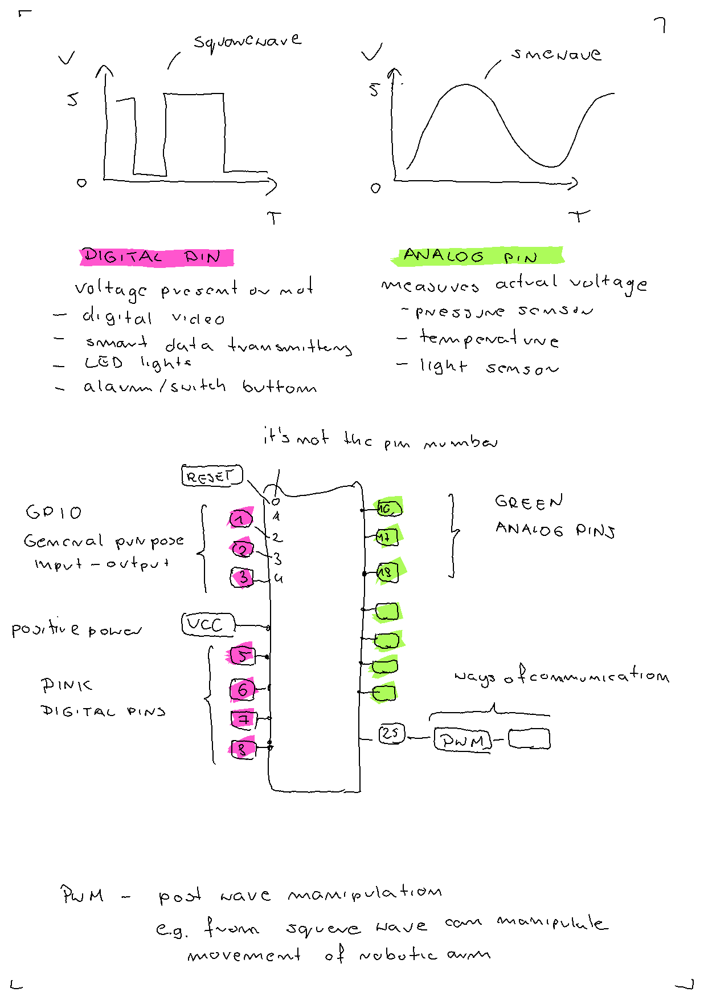
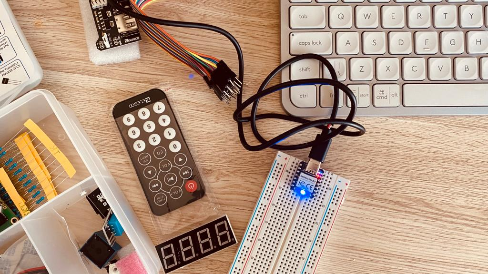
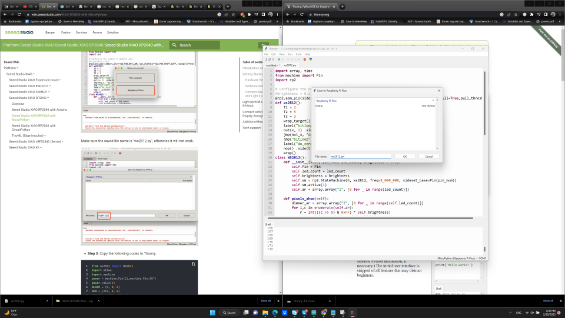
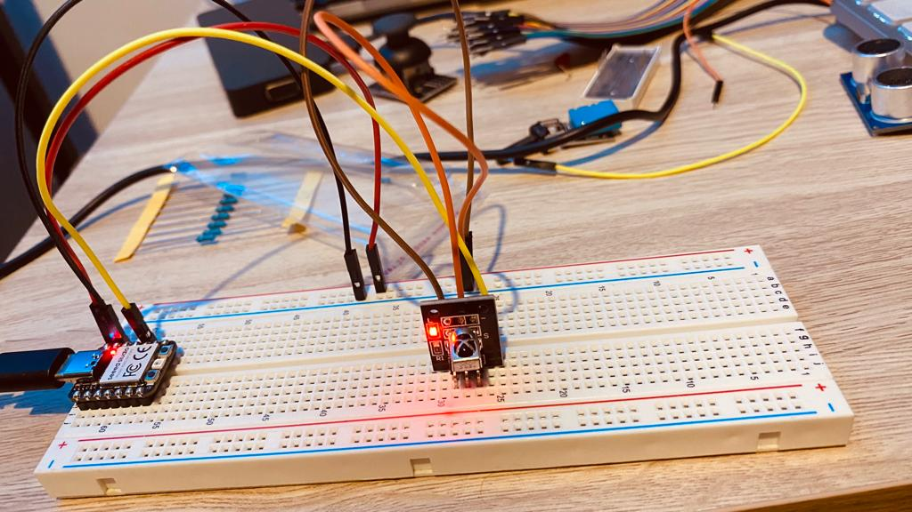

# **Week04.** Embedded programming


|Assignment    |                          |
| ----------- | ------------------------------------ |
| *group*       |  compare the performance and development workflows for other architectures [link](https://fabacademy.org/2023/labs/ciudadmexico/group%20assignments/embeddedd%20programming/)
| *individual*      | browse through the data sheet for your microcontroller; program a microcontroller development board; to interact (with local input &/or output) and communicate (remotely); extra credit: use different languages &/or development environments |


## Photo of the week
Reading the morse light signals from RP2040.



##Intro to electronics

The started the work this week only on Saturday, joining the open global time session. Rico gave us a very useful brief introduction. Below there is a note from the meeting.



Rico also recommended a youtube video - A simple guide to electronic components [**link**](https://www.youtube.com/watch?v=6Maq5IyHSuc).


##RP2040 data sheet


### RP2040 Project Examples
- https://projecthub.arduino.cc/Aboubakr_Elhammoumi/77347b69-2ade-4a44-b724-3bb91e954188
- https://how2electronics.com/getting-started-with-seeed-xiao-rp2040-with-projects/

##RP2040 with Arduino

source: https://wiki.seeedstudio.com/XIAO-RP2040-with-Arduino/
I took the following steps:

1. Step 1. Download and Install the latest version of Arduino IDE according to your operating system
2. Step 2. Launch the Arduino application.
3. Step 3. Add Seeed Studio XIAO RP2040 board package to your Arduino IDE
4. Navigate to File > Preferences, and fill Additional Boards Manager URLs with the url below: *https://github.com/earlephilhower/arduino-pico/releases/download/global/package_rp2040_index.json*. **This packacage doesn't work anymore!**


5. Therefore, I used board Raspberry Pi Pico and the example codes worked as expected for the user LED.
6. For blinkng the RGB LED, the library “Adafruit_NeoPixel”. The operationed worked.

Blinking LED ARDUINO IDE

```
#include <Adafruit_NeoPixel.h>

int Power = 11;
int PIN  = 12;
#define NUMPIXELS 1

Adafruit_NeoPixel pixels(NUMPIXELS, PIN, NEO_GRB + NEO_KHZ800);

void setup() {
  pixels.begin();
  pinMode(Power,OUTPUT);
  digitalWrite(Power, HIGH);

}

void loop() {
  pixels.clear();
  pixels.setPixelColor(0, pixels.Color(15, 25, 205));
  delay(400);
  pixels.show();
  pixels.clear();
  pixels.setPixelColor(0, pixels.Color(103, 25, 205));
  delay(400);
  pixels.show();
  pixels.clear();
  pixels.setPixelColor(0, pixels.Color(233, 242, 205));
  delay(400);
  pixels.show();
  pixels.clear();
  pixels.setPixelColor(0, pixels.Color(233, 23, 23));
  delay(400);
  pixels.show();
  pixels.clear();
  pixels.setPixelColor(0, pixels.Color(12, 66, 101));
  delay(400);
  pixels.show();
  delay(500);

}


```



##RP2040 with MicroPython
source: https://wiki.seeedstudio.com/XIAO-RP2040-with-MicroPython/


1. Step 1. Download and Install the latest version of Thonny according to your operating system
2. Step 2. Launch the Arduino application.
3. Step 3. Add Seeed Studio XIAO RP2040 board package to your Thonny - navigate to Tools > Options > Interpreter > Choose MicroPython (Raspberry Pi Pico), Port: <Try to detect port automatically >,
4. Click Install or update MircoPython, to have the Seeed Studio XIAO RP2040 board detected, you need to double-tap the reset Button.


5. For blinking  LED the ws2812.py library has to be downloaded, opened with Tonny and saved as RaspberryPi file "ws2812.py".Blinking LED works correctly.


Blinking LED MicroPython

```
from ws2812 import WS2812
import utime
import machine
power = machine.Pin(11,machine.Pin.OUT)
power.value(1)
BLACK = (0, 0, 0)
RED = (255, 0, 0)
YELLOW = (255, 150, 0)
GREEN = (0, 255, 0)
CYAN = (0, 255, 255)
BLUE = (0, 0, 255)
PURPLE = (180, 0, 255)
WHITE = (255, 255, 255)
COLORS = (BLACK, RED, YELLOW, GREEN, CYAN, BLUE, PURPLE, WHITE)

led = WS2812(12,1)#WS2812(pin_num,led_count)

while True:
    print("Beautiful color")
    for color in COLORS:
        led.pixels_fill(color)
        led.pixels_show()
        utime.sleep(0.2)

```

Loading the code in MircoPython is much faster than through Arduiono IDE.

##The Morse Code in MicoroPython
I wanted to blink the LED light as the morse code communicator.
To symbolize dots, turn your light on for 1 second.
To symbolize dashes, turn your light on for 3 seconds.
The time gap between dots and dashes is 1 second with the light off.
The time gap between full letters is 3 seconds with the light off.
The pause between complete words is 7 seconds with the light off. source: https://the-daily-dabble.com/morse-code-light/

I followed below rules to create the code:


```
from ws2812 import WS2812
import utime
import machine
power = machine.Pin(11,machine.Pin.OUT)
power.value(1)
BLACK = (0, 0, 0)
WHITE = (255, 255, 255)

A = (BLACK,WHITE,BLACK,WHITE,WHITE,WHITE)
C = (WHITE,WHITE,WHITE,BLACK,WHITE,BLACK,WHITE,WHITE,WHITE,BLACK,WHITE)
L = (WHITE,BLACK,WHITE,WHITE,WHITE,BLACK,WHITE,BLACK,WHITE)
S = (WHITE,BLACK,WHITE,BLACK,WHITE)
T = (WHITE,WHITE,WHITE)
I = (WHITE,BLACK,WHITE)
M = (WHITE,WHITE,WHITE,BLACK,WHITE,WHITE,WHITE)
E = (WHITE,BLACK)
LETTERPAUSE = (BLACK,BLACK,BLACK)
WORDPAUSE = (BLACK,BLACK,BLACK,BLACK,BLACK,BLACK,BLACK)
word = "CLASS TIME "
CLASSTIME = (C,L,A,S,S, WORDPAUSE, T, I, M,E, WORDPAUSE)

led = WS2812(12,1)#WS2812(pin_num,led_count)

while True:
    for i in range(len(word)):
        print (word[i])
        letter =  CLASSTIME[i] + LETTERPAUSE
        for color in letter:
            led.pixels_fill(color)
            led.pixels_show()
            utime.sleep(1)
```

<video width="960"  controls>
  <source src="../../images/week04/WhatsApp Video 2023-02-21 at 11.26.44.mp4" type="video/mp4">
</video>


##RP2040 wireless

I tried to connect the wireless module to the RP2040 to try the remote communication. I prepared first the connection scheme (based on the arduino uno board r3 scheme). However, after a few trials I got some little smoke from the module :)
 



## Conclusions/Problems/Questions/Dilemas
- double click on reset button to reset on rp2040?
- Loading the code in MircoPython is much faster than through Arduiono IDE.
- Reset Button & Boot Button
- The components can be burnt :)
- After connecting to Thonny, I had problems to send the code through the Arduino IDE again the device.

