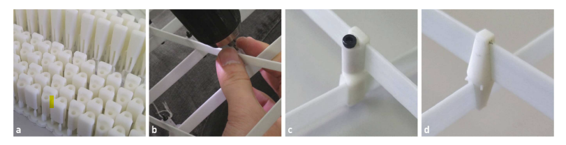
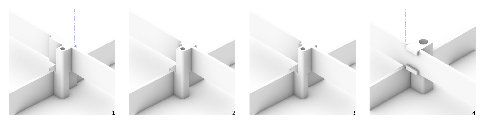
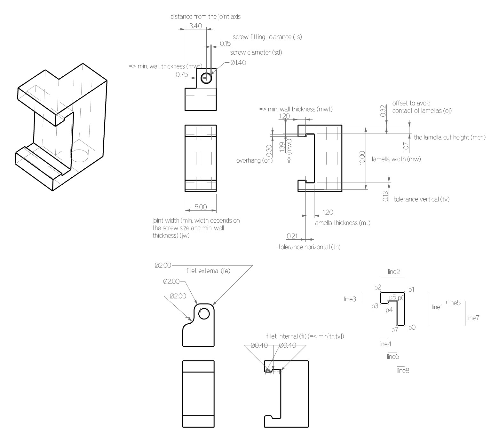
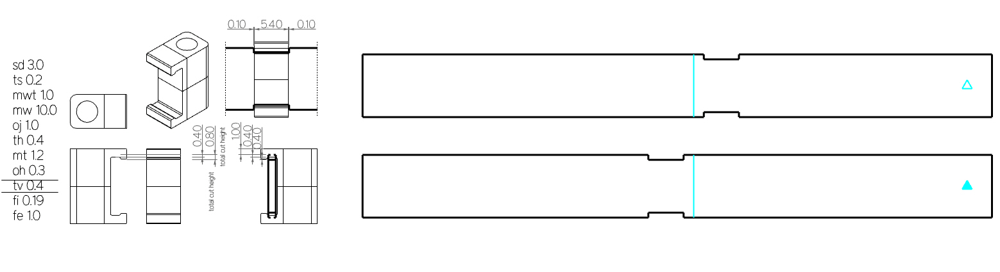

# **Week05.** 3D Scanning and Printing


|Assignment    |                          |
| ----------- | ------------------------------------ |
| *group*       | test the design rules for your 3D printer(s)
| *individual*      | design and 3D print an object (small, few cm3, limited by printer time) that could not be made subtractively, 3D scan an object (and optionally print it) |


## Photo of the week


## 3D Kinetic Joint Design

<iframe width="960" height="315" src="https://videopress.com/v/6qmRjpjx" frameborder="0" allow="autoplay; encrypted-media" allowfullscreen></iframe>
**Video.** Morphology of kinetic asymptotic gridshells - research by Eike Schling. 

The assymptotic gridshells can work as kinetic structures, if the joint allows it. Inspired by work done by Eike Schling (video above), which I saw at the Design Symposium Modelling in September 2022,  I attempted to design my own kinetic joint for the model structure. 


**Fig.** The GRP lamellas were connected by hand (b) with 3d printed sleeves and M3 bolts (c). The sleeves are batch-printed (a) with a Form 3 Stereolithography (SLA) printer. A second, rigid sleeve ( d) is used as internal restraint. [(Eike & Schikore, 2022)](https://eikeschling.com/2022/09/23/morphology-of-kinetic-asymptotic-grids/)

I started from reading more about preseted above project. The kinetic joints, which Schling named "sleeves", where printed with SLA and connected using 3M 20mm bolts: 

*"The physical experimental models are designed and constructed from glass fibre reinforced plastic lamellas (1 x 10 mm) and joined laterally on two levels using 3D-printed sleeves. M3 steel bolts (20 mm) create the scissor joints, which allow rotation around the normal axis. The joints are located with a 3 mm offset to the theoretical intersection points due to the lateral connection. The positions are marked by hand and the 3D joints are threaded and glued onto the glass fibre lamella."* [(Eike & Schikore, 2022)](https://eikeschling.com/2022/09/23/morphology-of-kinetic-asymptotic-grids/)

I found one drawback about this joint design - the positions of the joins had to be marked by hand and the sleeve-joints manually glued at the right place on the lamella. I came up with the idea to design a joint, which has "click", no glue connection (therefore can be also reused in the other models), and which is placed exactly in the cutout in the lamella - making it easy and precise to assemble. The first sketch of the solution below.


**Fig.** Click 3D-printed joint idea. 

First I made a few static models to test the idea in 3D.  


**Fig.** Development of the static model. 1 - the clips in the middle of the joint axis, 2 - clips made shorter, edge not touching the axis, 3- some more fillets added for smoother desing and easier fabricaiton, 4 - a model with more up to scale screw size :).

Preparation of the static 3D models let me figure out the right parameters that should control the algoritmic model. 



**Fig.** Design parameters for kinetic joint.

<video width="960"  controls>
  <source src="../../images/week05/joint-c.mp4" type="video/mp4">
</video>

```
__author__ = "judyt"
__version__ = "2023.02.24"

import rhinoscriptsyntax as rs
import ghpythonlib.components as gh
import math

#geometry rules
if fi> th or fi>tv:
    fi = min(tv,th)

point = gh.ConstructPoint(0,0,0)
plane = gh.XYPlane(point)
circle = gh.Circle(plane, sd*0.5 + ts)
rec = gh.Polygon(plane, (sd*0.5+ts+mwt)* math.sqrt(2), 4, 0)['polygon']
rec = gh.Rotate(rec, math.pi/4, plane)['geometry']
rparams = gh.Discontinuity(rec,1)['parameters']
rec = gh.Fillet(rec,rparams[0],fe)['curve']
rparams = gh.Discontinuity(rec,1)['parameters']
rec = gh.Fillet(rec,rparams[0],fe)['curve']
rparams = gh.Discontinuity(rec,1)['parameters']

srf1 = gh.BoundarySurfaces([rec,circle])
vec1 = gh.UnitZ(0.5*mw+oj)
ext1 = gh.Extrude(srf1, vec1)

p0 = gh.ConstructPoint(0,-(0.5*sd+ts+mwt),0)
p1 = gh.Move(p0,gh.UnitZ(0.5*mw+oj))['geometry']
p2 = gh.Move(p1,gh.UnitY(-(mwt+mt+th+mwt)))['geometry']
p3 = gh.Move(p2,gh.UnitZ(-(mwt+tv+oh)))['geometry']
p4 = gh.Move(p3,gh.UnitY(mwt))['geometry']
p5 = gh.Move(p4,gh.UnitZ(oh))['geometry']
p6 = gh.Move(p5,gh.UnitY(mt+th))['geometry']
p7 = gh.Move(p6,gh.UnitZ(-(0.5*mw+oj-mwt-tv)))['geometry']

polyline = gh.PolyLine([p0,p1,p2,p3,p4,p5,p6,p7],True)
params = gh.Discontinuity(polyline,1)['parameters']

pts = [p0,p1,p2,p3,p4,p5,p6,p7]
filletpts = [p2,p3,p4,p5,p6]
filletcrv = gh.Fillet(polyline,params[2],fi)['curve']
for i in range(len(filletpts)-1):
    newparams = gh.Discontinuity(filletcrv,1)['parameters']
    filletcrv = gh.Fillet(filletcrv,newparams[0],fi)['curve']
    
if jw == None:
    jw = sd+2*mwt+2*ts
srf2 = gh.BoundarySurfaces(filletcrv)
srf2 = gh.Move(srf2, gh.UnitX(0.5*sd+mwt+ts))['geometry']

vec2 = gh.UnitX(jw)
ext2 = gh.Extrude(srf2, -vec2)
    
geo = gh.SolidUnion([ext1,ext2])
geom = gh.Mirror(geo, gh.XYPlane(point))['geometry']
geo = gh.SolidUnion([geo,geom])

fabparams = ["sd "+str(sd), "ts "+ str(ts), "mwt "+ str(mwt), "mw "+ str(mw), "oj "+str(oj) , "th "+str(th), "mt "+ str(mt), "oh "+str(oh), "tv "+ str(tv), "fi " +str(fi), "fe "+str(fe), "jw "+ str(jw)]

```

**Why the joint cannot be made substractively?**
The model of the kinetic joint cannot be made substarctively with a 3-axis machine. There is a little chance it could be made by the 5 or 6-axis robot arm, if the tool size would allow it. 
 


## 3D printing


I prepered a custom Python script for the generation of the 3D joint model. I generated 3 models to test with different design parameters.





I prepared the file for printing exporting the .stl files directly from Rhino. The pairs of connectors and the matchinh laths were marked for recognistion. The final fabrication model.


## Further work


- It would be great if the joint would allow to block it at 90 deg (to stop the kinetic behaviour and keep the final shape in place). 

- Maybe it would be possible to create a model where the joint is composed of 2 parts which are already connected together (without a screw).

- Definitely SLA printing would help for print precision and maybe it would show better friction property to keep lamellas in place.

- Testing of the clip joint should be conducted on scaled- model, as with the stress caused by bending the stripes around 2 axis can casue that the lamella simply jumps out of the joint.

- Writing the script directly with rhinosyntax. 


## Conclusions

### Summary of the model parameters after 3D printing tests


| Model Parameter     | FDM PLY                         |
| ---------------------- | ------------------------------------ |
| screw diameter`sd`       | 3mm - working fine (for screw with the thread 2.8mm) with the below tolerance  |
| tolerance screw`ts`       | 0.2mm - just fine |
| min. wall thickness    | 1mm working fine in all parts of the model, maybe it can go even lower for smaller size of the joint (0.8mm) |
|member width `mw`| 10mm its enough of width to cut put parts, anyhow can vary just avoiding stipes getting too narrow|
|overhang joint `oh` | 0.1mm - works fine, could be to small for longer elements (they will touch during roatation, 1mm was too much|
|tolerance horizontal `th`| 0.4mm was working fine with the internal fillets 0.2mm, `th` > 2`fi`|
|tolerance vertical `tv`| 0.2mm -just fine, 0.4mm seemed to big, tolerance vertial has to be smaller than overhang parameter, `tv`< `oh`|
|fillet internal (radius) `fi`| 0.2mm -just fine, `fi`< 0.5`th`|
|fillet external (radius) `fe`| 1mm - just fine, `fe` < 0.5`sd`|
|tolerance horizontal lamella  `thl`| 0.1mm from each side worked perfectly|

## Problems/Questions/Dilemas