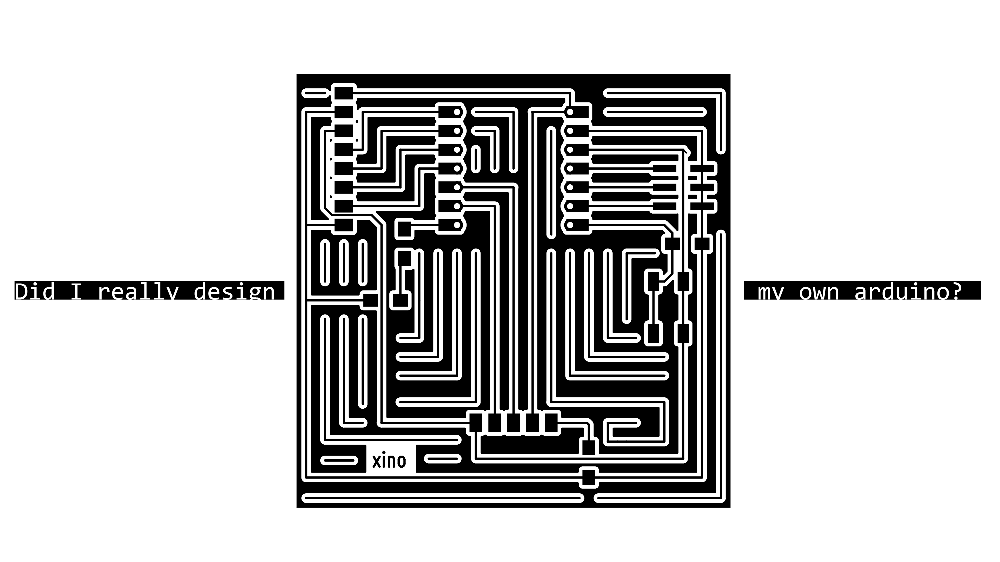
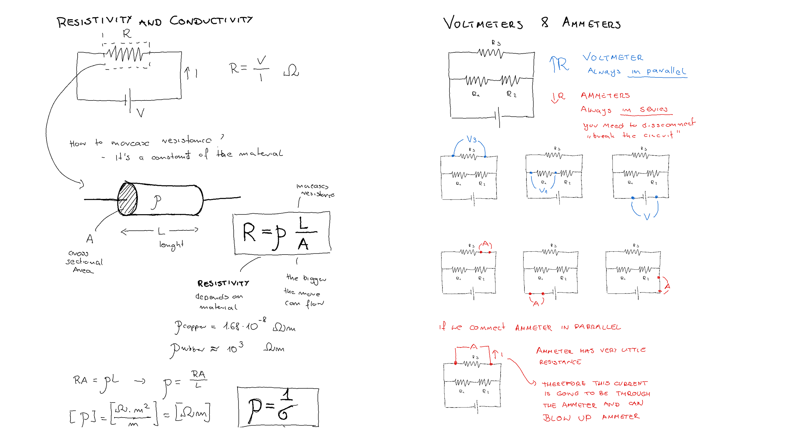
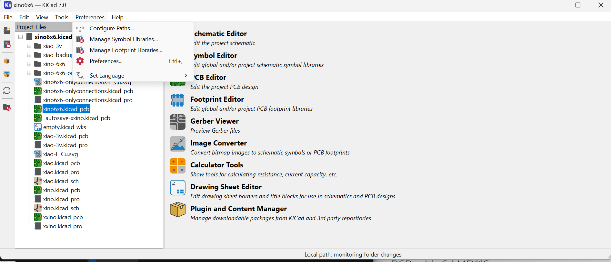
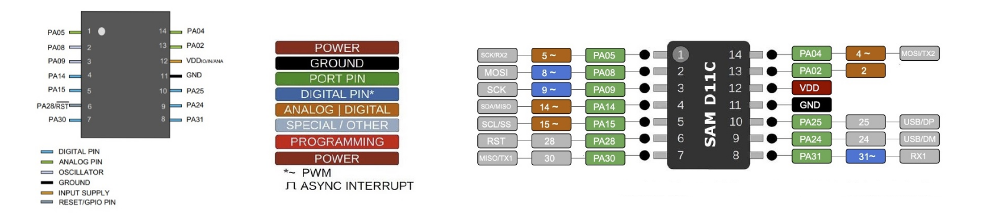
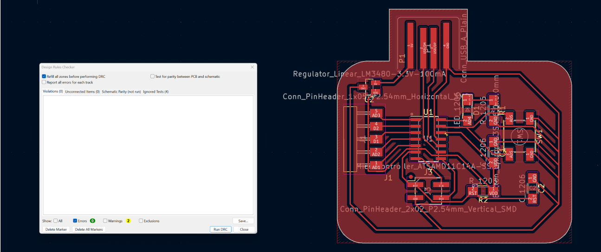
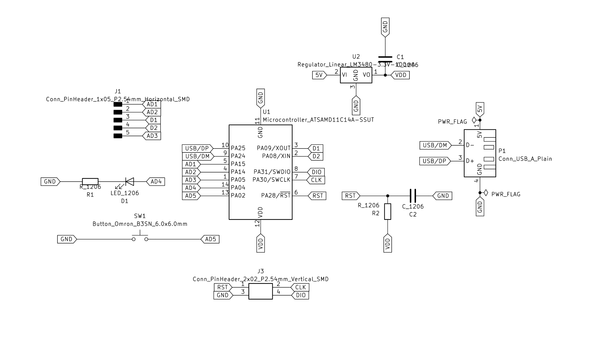
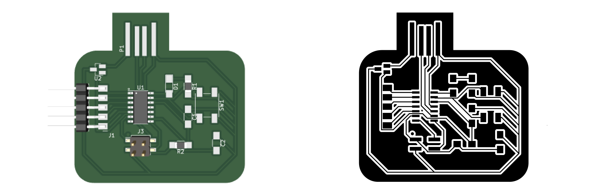
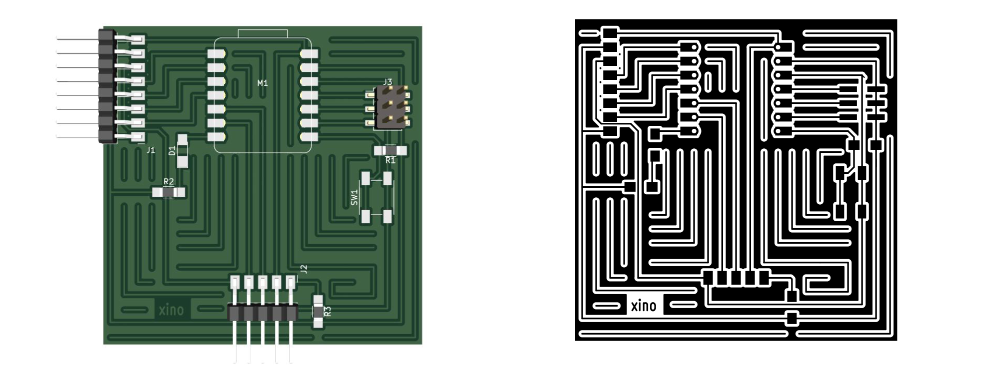

# **Week06.** Electronics Design

|Assignment    |                          |
| ----------- | ------------------------------------ |
| *group*       |  use the test equipment in your lab to observe the operation of a microcontroller circuit board [**link**](https://fabacademy.org/2023/labs/ciudadmexico/group%20assignments/electronics%20design/)|
| *individual*      |design a development board to interact and communicate with an embedded microcontroller, extra credit: try another design workflow, extra credit: make a case for it, extra credit: simulate its operation|

## Photo of the week

## Take aways from the group Assignment
[Group Assignment](https://fabacademy.org/2023/labs/ciudadmexico/group%20assignments/electronics%20design/).

 - USB gives 5V current
 - continuity is the key

## Basic Knowledge Refreshement

As I had last physics classes 15 years ago, I had to start with refreshing the basics. I watched the
[https://www.khanacademy.org/science/physics/circuits-topic](https://www.khanacademy.org/science/physics/circuits-topic). You can find my notes below.

## PCB Design with KiCAD
I have followed the KiCAD tutorial available at: [KiCAD 7.0 Tutorial](https://docs.kicad.org/7.0/en/getting_started_in_kicad/getting_started_in_kicad.html). Below are my shorter version of the basic steps for the PCB design.

**The typical workflow in KiCad consists of two main tasks: drawing a schematic and laying out a circuit board.** A KiCad project is a folder with a project file, a schematic, a board layout, and optionally other associated files such as symbol and footprint libraries, simulation data, purchasing information, etc.

1. Typically, the schematic is drawn first.
2. When the schematic is complete and the design has passed an electrical rules check (ERC), the design information in the schematic is transferred to the board editor and layout begins. Often the schematic will need to be updated after layout has begun.
3. Laying out a circuit board.
4. When the board layout is complete and the board has passed the Design Rules Check (DRC), fabrication outputs are generated so that the board can be manufactured by a PCB fabricator.

### Getting Started with KiCad

1. Starting new project: File → New Project, create new folder, Save.
2. Setting up -backup directory: Preferences → Preferences → Common → Project Backup.
3. Openning Schematic Design: Choose: Copy default global symbol library table (recommended).
4. The mouse controls are configurable in Preferences → Preferences…​ → Mouse and Touchpad.
5. Hotkeys can be changed in Preferences → Preferences…​ → Hotkeys.

### Schematic Design

6. Schematic Sheet Setup: File → Page Settings.
7. Adding Symbols to the Schematic: Add a Symbol button or press "a"
	you can add elements e.g. LED - Led, R - Resistor, Battery_Cell - battery.
8. Additional objects can be added to the selection with Shift+click, or removed with Ctrl+Shift+click. You can toggle an item’s selection state with Ctrl+click.
9. M - move, R - rotate , G - drag, del  - delate objects. For moving unconnected symbols, G and M behave identically, but for symbols with wires attached, G moves the symbol and keeps the wires attached, while M moves the symbol and leaves the wires behind.

10. Add power and ground symbols to the schematic: Add a Power Symbol button or use the P hotkey. Add a VCC symbol and GND symbol and then connect them to the circuit with wires.
11. Labeling wires:  Net Label button in the right toolbar (L), type a label name (led), and place the label into the schematic so that the square attachment point overlaps with the wire. Rotate and align the label as necessary.

12. Annotation, Symbol Properties, and Footprints:
 	- Annotation:By default in KiCad 7.0, symbols are automatically annotated when they are added to the schematic. Automatic annotation can be enabled or disabled using the annotate  button in the left toolbar.
 	- Symbol Properties: Select the LED, right-click, and select Properties…​ (E)
	 - Footprint Assignment:use the footprint assignment tool by clicking the icon button in the top toolbar. Footprints can be previewed by right-clicking a footprint and selecting View selected footprint.

13. Electrical Rules Check (ERC): full list of electrical rules and to adjust their severity: File → Schematic Setup…​ → Electrical Rules → Violation Severity, to run the check: clicking the ERC button (erc 24) in the top toolbar and then clicking Run ERC.
	- common KiCad ERC errors: "Input Power pin not driven by any Output Power pins". Power symbols are set up to require a power output pin, such as the output of a voltage regulator, on the same net; otherwise KiCad thinks the net is undriven.

14. Bill of Materials:Tools → Generate BOM.

###Circuit Board

15. PCB Editor Basics: pan by dragging with the middle mouse button or right mouse button, and zoom with the scrollwheel or F1/F2.The toolbar on the left side has various display options for the board, including units and toggles for outline/filled display modes for tracks, vias, pads, and zones. The toolbar just to the right of the canvas contains tools for designing the PCB.

16. Board Setup and Stackup:File → Page Settings…​
17. File → Board Setup…​ to define how the PCB will be manufactured. The most important settings are the stackup, i.e. what copper and dielectric layers the PCB will have (and their thicknesses), and the design rules, e.g. sizes and spacing for tracks and vias.
To set the stackup, open the Board Stackup → Physical Stackup page of the Board Setup window. For this guide, leave the number of copper layers at 2, but more complicated projects might require more layers.
18. Next, go to the Design Rules → Constraints page.
19. Finally, open the Design Rules → Net Classes page. A net class is a set of design rules associated with a specific group of nets. This page lists the design rules for each net class in the design and allows assigning nets to each net class.

20. Importing Changes From Schematic: Tools → Update PCB from Schematic…​, or press F8. Read through the messages in the Changes To Be Applied window, which will say that the three components in the schematic will be added to the board. Click Update PCB, Close.
21. Drawing A Board Outline:
 -  The board is defined by drawing a board outline on the Edge.Cuts layer.
 - Switch to a coarse grid by selecting 1mm in the Grid dropdown menu above the canvas.
  - To draw on the Edge.Cuts layer, click Edge.Cuts in the Layers tab of the Appearance panel at right
22. Placing Footprints: Click it to select it, then press M to move it. Press F to flip it to the opposite side;
	Plaacing Rules:
Some footprints may have exact requirements for their locations, such as connectors, indicators, or buttons and switches.

- Some components may need to be placed according to electrical considerations. Bypass capacitors should be close to the power pins of the associated IC and sensitive analog components should be far from digital interference.

- Almost all components have a "Courtyard" (or two if both Front and Back are defined). Generally Courtyards should not intersect.

- Otherwise components should be positioned for ease of routing. Connected components should generally be close together, and arranged to minimize routing complexity. The ratsnest (the thin lines indicating connections between pads) is useful for determining how best position footprints relative to other footprints.

23. Routing Tracks: The first trace will be drawn on the front of the board, so change the active layer to F.Cu in the Layers tab of the Appearance panel.Click Route Tracks add tracks 24 in the right-hand toolbar or press X. Another way to make a connection across layers is with a via. Start routing at the VCC pad of BT1 on the back of the board. Press V and click halfway between BT1 and R1 to insert a via, which also switches the active layer to F.Cu. Complete the track on the top side of the board by clicking on the VCC pad of R1.

24. Placing Copper Zones: Add a GND zone on the bottom of the board by switching to the bottom copper layer and clicking the Add a filled zone button add zone 24 in the right toolbar. Click on the PCB to place the first corner of the zone. Fill the zone with Edit → Fill All Zones (B).

25. Design Rule Checking
	- File → Board Setup…​ → Design Rules → Violation Severity
	- Run a DRC check with Inspect → Design Rules Checker, or use the button erc 24 in the top toolbar. Click Run DRC. When the checks are complete, no errors or warnings should be reported. Close the DRC window.

26. Open the 3D viewer with View → 3D Viewer.

### Adding FabAcadmy Libraries for KiCAD

Download the KiCAD library from Gitlab: [Gitlab:KiCAD library](https://gitlab.fabcloud.org/pub/libraries/electronics/kicad) and follow readme.md file for instruction how to intall library. I copied the whole folder downloaded from gitlab to: C:\Program Files\KiCad\7.0\lib. **Remember to instal libraries when you open project (not in the schematic or pcb project file)!**

## PCB with SAMD11C
First, I revied the pin layout provided by the producent.

I prepared the schematic desing reviewing [Samdino](http://fabacademy.org/2020/labs/leon/students/adrian-torres/fabxiao.html).
I started preparing my first board design based on the schematic provided by Rodrigo Shiordia [Designing the board with ATSAMD11C14A(https://fabacademy.org/2020/labs/ciudadmexico/students/rodrigo-shiordia/week%206.html). The schematic was checked with the Electrical Rules Check (ERC).

The design was prepared using default Design Rules and passed Design Rules Checker.

The final project schematic and board presented below.

**Fig.**The final project schematic with SAMD11C.

**Fig.**The final project PCB board with SAMD11C.

## PCB with XIAO RP2040/XIAO ESP32-C3

The XIAO RP2040 can be replaced with XIAO ESP32-C3, as they have the same size and pin layout.

I prepared the schematic desing reviewing [Fab-XIAO](http://fabacademy.org/2020/labs/leon/students/adrian-torres/fabxiao.html).The schematic was checked with the Electrical Rules Check (ERC).

This time I used different Desing Rules: Min.wire width = min.clearance = 0.3mm. I attempted to use 0.4mm, but with this parameters the wires can not go between pins and caused a lot of compliations with layout.

**Fig.**The initial PCB board design with XIAO RP2040: left- wiring, right - complete design.

**Fig.**The final PCB board design with XIAO RP2040: left- wiring, right - complete design.

**Fig.**The final project schematic with XIAO RP2040.

**Fig.**The final project PCB board with XIAO RP2040: left (3D view), right: the copper layer.

## Problems/Questions/Dilemas
1. Using 0.4mm clearance and wire width blocked the possibilite to have routes between pins.

__________________________________________
## Files
**samd11 KiCAD files**: [SAMD11 - KiCAD](../files/week06/samd11.zip){: samd11}

**xino 6x6 KiCAD files**: [XINO 6x6 - KiCAD](../files/week06/xino6x6-onlyconnections0.4.zip){: xino6x6}

**xino 6x6 fabrication files**: [XINO - svg](../files/week06/xino6x6-onlyconnections0.4-Edge_Cuts.zip){: xino6x6-production}
