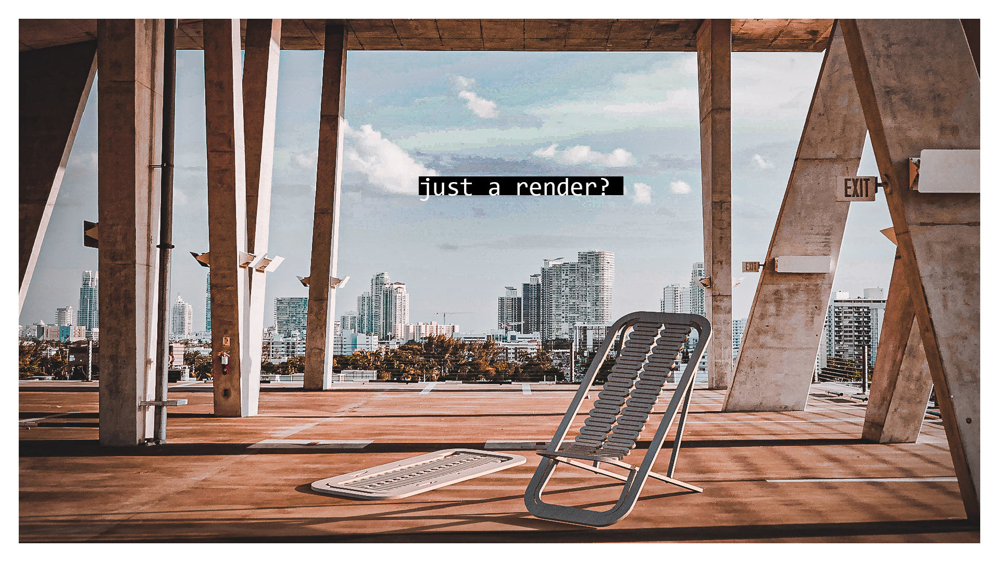
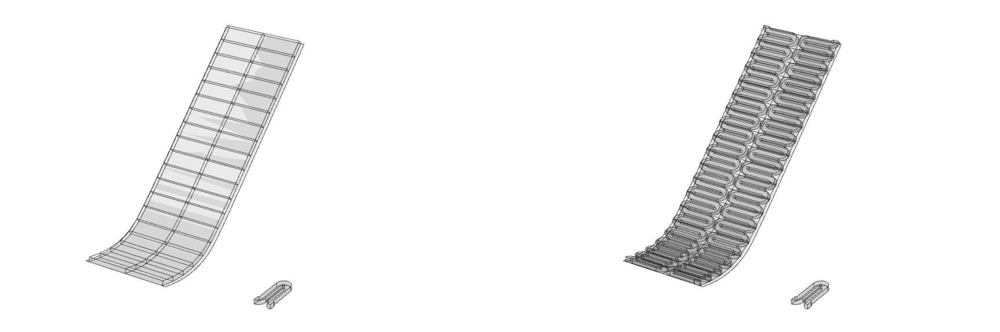
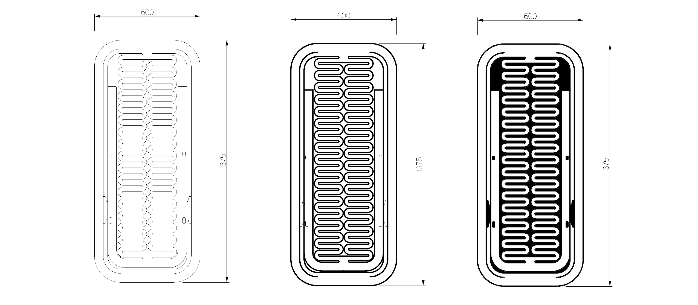
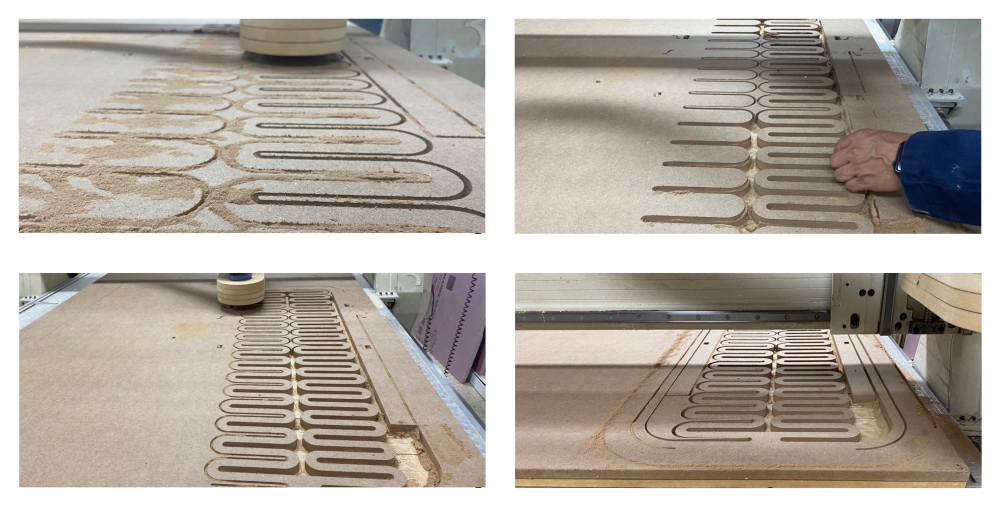
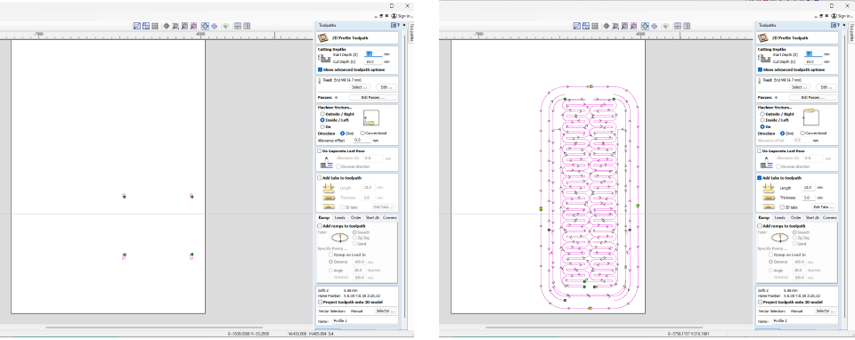
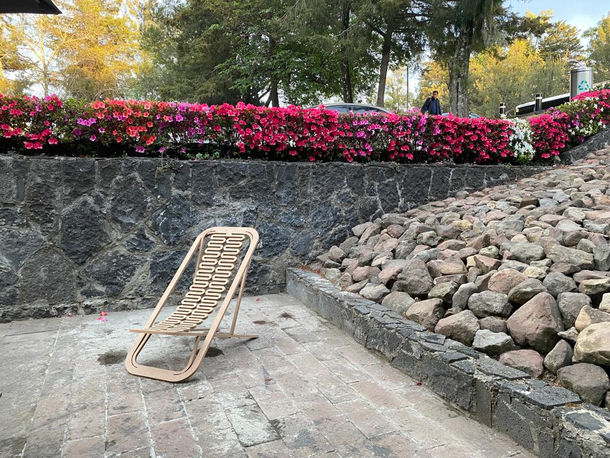
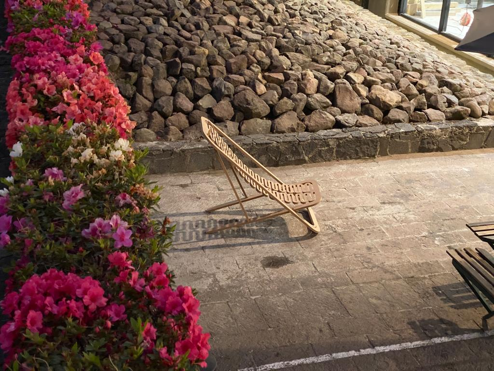
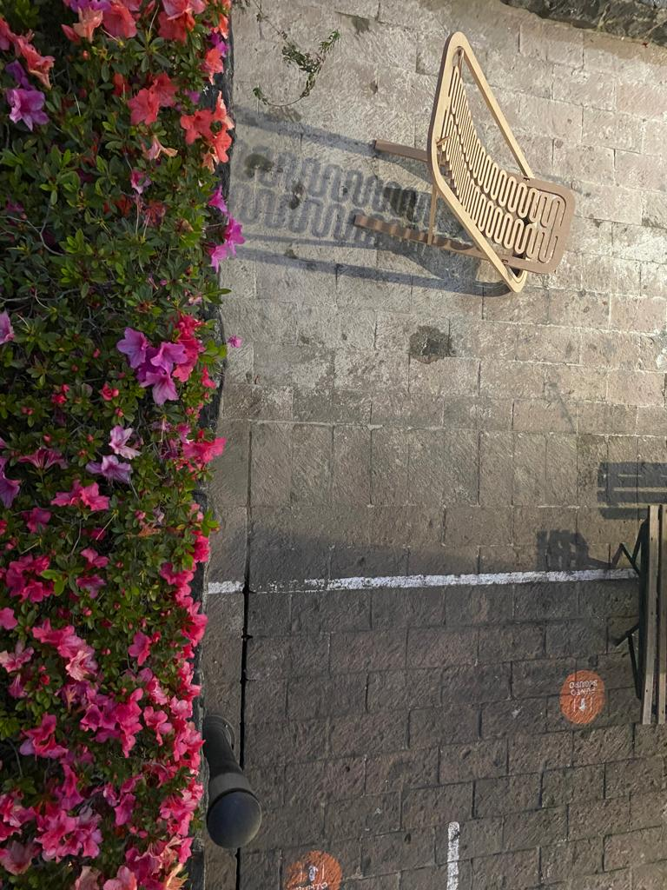

# **Week07.** Computer-Controlled Machining

|Assignment    |                          |
| ----------- | ------------------------------------ |
| *group*       | do your lab's safety training; test runout, alignment, fixturing, speeds, feeds, materials, and toolpaths for your machine [**link**](https://fabacademy.org/2023/labs/ciudadmexico/group%20assignments/machining/)|
| *individual*      | make (design+mill+assemble) something big (~meter-scale); extra credit: don't use fasteners or glue; extra credit: include curved surfaces|


## Photo of the week




## Lecture Notes

- Shapeoko 3 xxl working area is 830mm x850mm.

- Chairigami - cardboard products.

## Take aways from the group Assignment
[Group Assignment](https://fabacademy.org/2023/labs/ciudadmexico/group%20assignments/machining/).

 - basic health & safety rules
 - how to setup the files for cutting: material, tool, step size, planning tasks
 - how to setup machine: warming up spindle, setting up origin, bed and material levels
 - trying different joint tolerances for the 18mm MDF - 18.2mm seemed to work fine

## Chat GPT trial

I asked Chat GPT for a Python script for Grasshopper that generates a simple deck chair. Below the response:
```
import Rhino.Geometry as rg

# Set input values
height = height # input variable for the overall height of the chair
width = width # input variable for the overall width of the chair
depth = depth # input variable for the overall depth of the chair
thickness = thickness # input variable for the thickness of the chair frame
leg_height = leg_height # input variable for the height of the chair legs
back_height = back_height # input variable for the height of the chair backrest
seat_height = seat_height # input variable for the height of the chair seat
back_angle = back_angle # input variable for the angle of the chair backrest
seat_angle = seat_angle # input variable for the angle of the chair seat

# Create base frame
base_frame = rg.Box(rg.Plane.WorldXY, rg.Point3D(0,0,0), depth, width, thickness)

# Create front legs
front_left_leg = rg.Box(rg.Plane(rg.Point3d(thickness, 0, thickness),hickness, leg_height, thickness))
front_right_leg = rg.Box(rg.Plane.WorldXY, rg.Point3d(depth - thickness, 0, thickness), thickness, leg_height, thickness)

# Create back legs
back_left_leg = rg.Box(rg.Plane.WorldXY, rg.Point3d(thickness, 0, width - 2 * thickness), thickness, leg_height, thickness)
back_right_leg = rg.Box(rg.Plane.WorldXY, rg.Point3d(depth - thickness, 0, width - 2 * thickness), thickness, leg_height, thickness)

# Create backrest
backrest = rg.Box(rg.Plane.WorldXY, rg.Point3d(0, leg_height - thickness, thickness), depth, back_height, thickness)
backrest_transform = rg.Transform.Rotation(back_angle, rg.Vector3d.YAxis, rg.Point3d(0, leg_height, 0))
backrest.Transform(backrest_transform)

# Create seat
seat = rg.Box(rg.Plane.WorldXY, rg.Point3d(0, seat_height - thickness, thickness), depth, thickness, width - 2 * thickness)
seat_transform = rg.Transform.Rotation(seat_angle, rg.Vector3d.XAxis, rg.Point3d(0, seat_height, 0))
seat.Transform(seat_transform)

# Join all objects together
all_objects = [base_frame, front_left_leg, front_right_leg, back_left_leg, back_right_leg, backrest, seat]
result = rg.Brep.JoinBreps(all_objects, 0.01)

# Output the result
chair = result[0]


```
 This code doesn't work. Apparently Chat GPT made ups some functions that doesnt exist.


```
Runtime error (MissingMemberException): 'Rhino.Geometry' object has no attribute 'Point3D'

Traceback:
  line 25, in script

```
## Idea
A deckchair has a well established design for decades. Its simple, foldable and comfortable. I found in the internet some deckchair drawings from previous century.


## Design

I have started with some basic dimensions of the simple deckchair, keeping in mind that the seat lenght (if not strechted a lot) should have a lenght of the dashed line. I inteded to design a deckchair that can be milled from one rectangular piece of the board.

**Design objectives:**

 - deckchair is produced as one element

 - no glue, fasteners or other additional elements

 - assembly from flat

 - design fits in rectangle (minimize waste)


The frame design went through a few iterations. I practised also using the rhinoscript syntax and rhino geometry for the generation of the flex part of the deck chair, which could be easily modified if it turns out to be to flexible or too stiff.
```
__author__ = "judyt"
__version__ = "2023.03.12"

import rhinoscriptsyntax as rs
import Rhino.Geometry as rg
import math
import clr
from Grasshopper.Kernel.Data import GH_Path
from Grasshopper import DataTree

def nestedListToDataTree(nestedlist):
    dataTree = DataTree[object]()
    for i,item_list in enumerate (nestedlist):
        path = GH_Path(i)
        dataTree.AddRange(item_list,path)
    return dataTree

def Spiral(p,len, rad):

    point = rg.Point3d(p[0]+rad,p[1],p[2])
    point2 = rg.Point3d(p[0]+len-rad,p[1],p[2])
    point3 = rg.Point3d(p[0]+rad,p[1]+rad*2,p[2])
    point4 = rg.Point3d(p[0]+len-rad,p[1]+2*rad,p[2])
    line =  rg.Line(point,point2)
    center = rg.Point3d(p[0]+len-rad,p[1]+rad,p[2])
    plane = rg.Plane(center, rg.Vector3d(0,1,0), rg.Vector3d(1,0,0))
    arc =rg.Arc(plane, center,rad, math.pi)
    line2 = rg.Line(point3,point4)
    center2 = rg.Point3d(p[0]+rad,p[1]+3*rad,p[2])
    plane2 = rg.Plane(center2, rg.Vector3d(0,1,0), rg.Vector3d(-1,0,0))
    arc2 =rg.Arc(plane2, center2,rad, math.pi)

    return  [line, arc, line2, arc2]

spirals = []
for i in range(iter):
    pt = rg.Point3d(p[0],p[1]+i*4*rad,p[2])
    spiral = Spiral(pt, len, rad)
    spirals.append(spiral)

spirals = nestedListToDataTree(spirals)
```
Modelling the flexible part required some more thought. The surface shape was approximated taking into account the total lengh of the flex part.  The exact shape is possible to be defined using simuluation with active bending  and gravity, calibrating the material properties, in particular the tensile and bending stenght of the material.

In order to model the flex part in 3D, the following steps were taken:

- seperate the tile part of the flex part
- create a mesh with equalized faces
 - offset the mesh (material thickness)
 - use the vertices of the input mesh and offset mesh to define deformed boxes
 - morph the tile element to created boxes
 


After some trial and error process, the final design looked like:


**Fig.** Final design.


## Production

### Setting up g-code file.
**Material:** Medium-Density Fiberboard (MDF) of 18mm

**Tool:** 4.7mm diameter

**Step vertical:** 19mm/6

For the milling a tool of diameter 4.7mm was used. It had to be accounted in the path planning and material waste.


**Fig.** 1. Basic lines. 2. Thin lines  - tool inside, thick ones - tool in the center of the line. 3. Waste (black) vs design material (white).
### Setting up machine.
Before production the following steps had to be taken:

  1. Warm up the spindle.
  2. Set the origin  - F10.
  3. Set the bed level (surface of the spoilboard )- F24.
  4. Set the material surface level -F20.
### Milling process.

**Fig.** Machining process. The flex parts had to be stabilize with the nails.


**Fig.** Final part (left), final part assembled (right).

## Final Pictures





## Problems/Questions/Dilemas
1. The main frames of the deckchar should be directly connected for stability.
2. The flexible parts
3. This design could be adjusted to work as onced-assembled furniture. The foldable design would rather require hinges, as with material fatigue the bend parts would eventually break.
4. The more layers would have the plywood - the better (for flexible parts).
5. The flex pattern require more research - perhaps the back part can be connected in the middle for more stability.
6. Planning for the toolpath requires more thought to stabilize the flex part during cutting without nails.
7. Some of polylines should be connected to enable machine cut the whole layout as one step of depth.

__________________________________________
## Files
**desing & production files**: [CNC-Deckchair - Rhino/GH](../files/week07/CNC-Deckchair.zip){: CNC-Deckchair}
