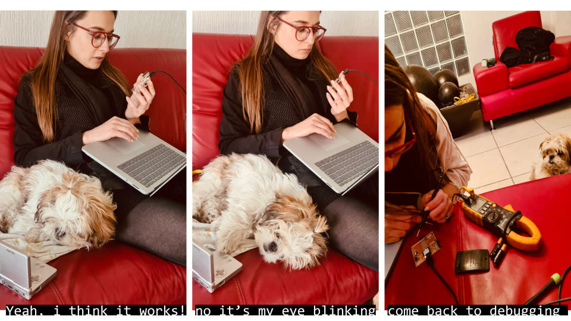
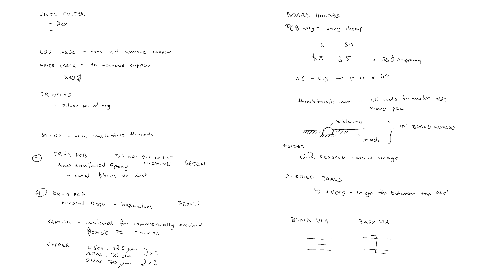
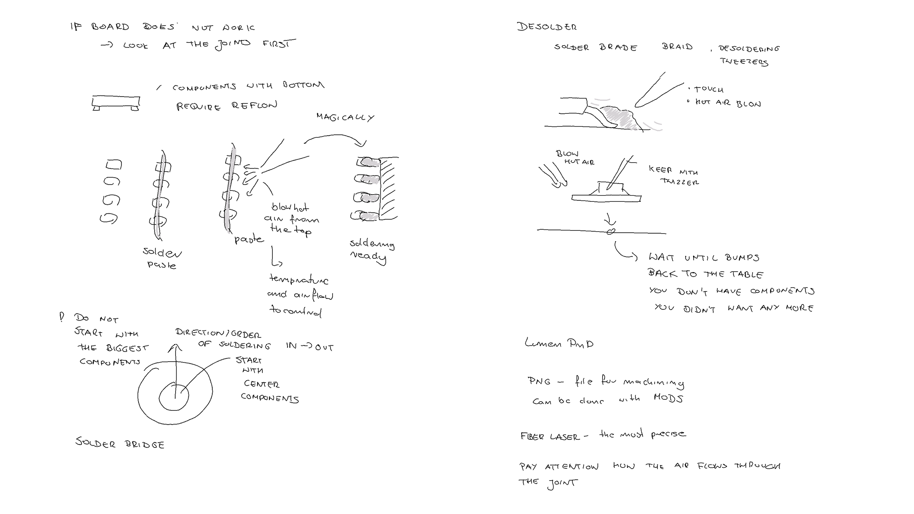
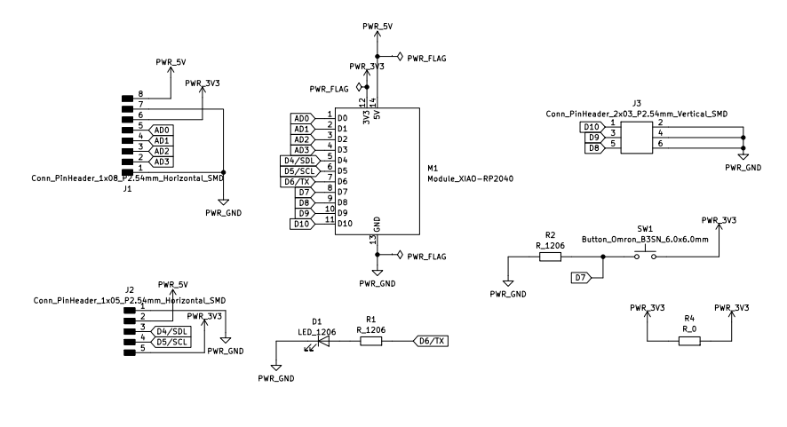
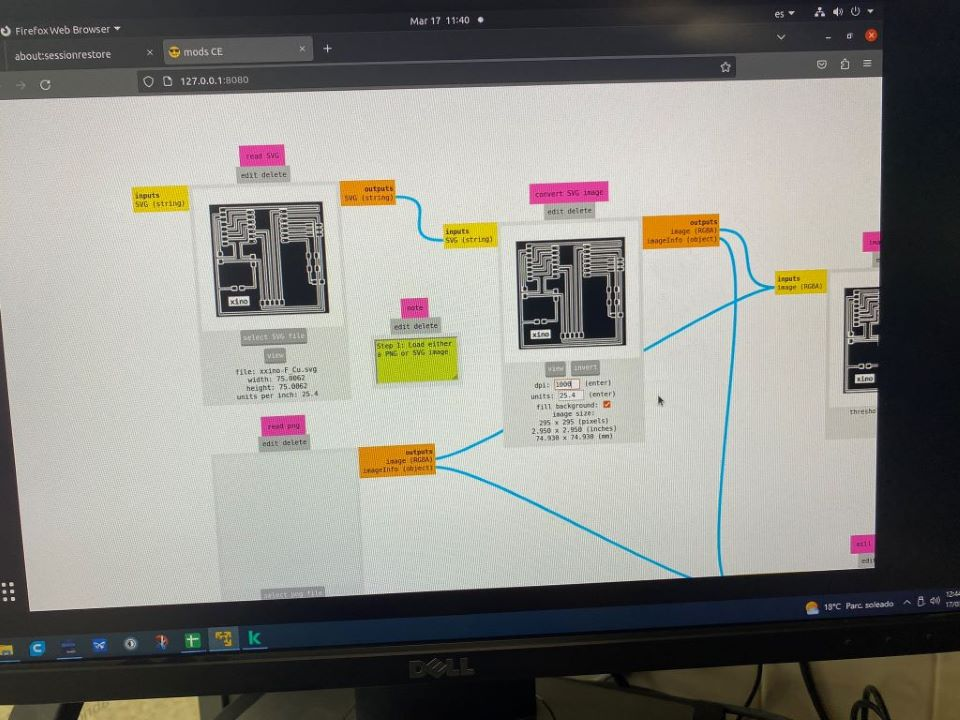
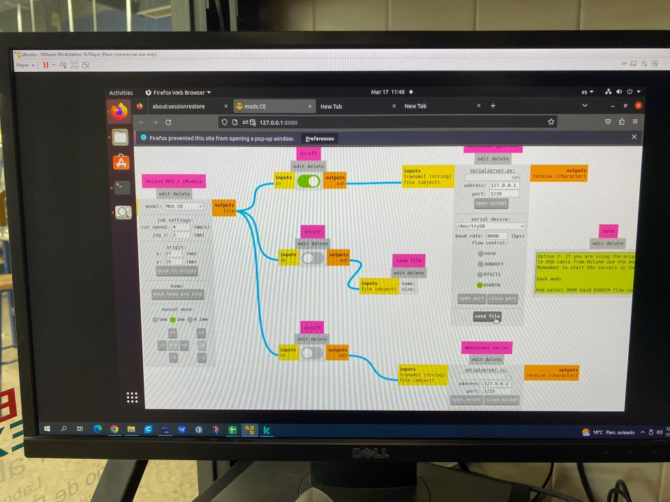
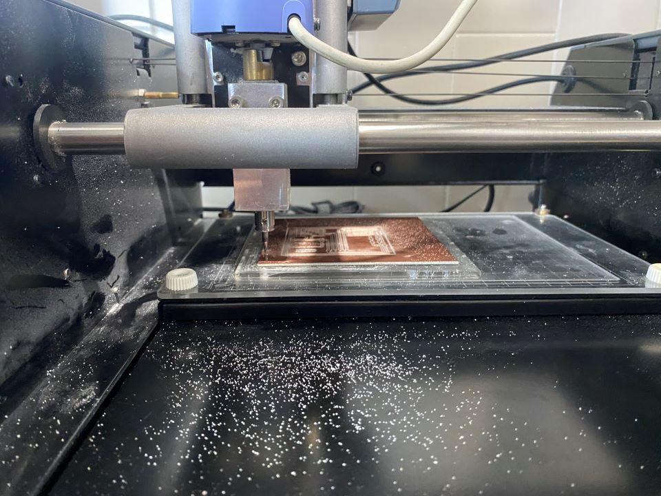

# **Week08.** Electronics Production


|Assignment    |                          |
| ----------- | ------------------------------------ |
| *group*       | characterize the design rules for your in-house PCB production process; extra credit: send a PCB out to a board house|
| *individual*      |  make and test the development board that you designed to interact and communicate with an embedded microcontroller; extra credit: make it with another process|


## Photo of the week




## Lecture Notes






## Take aways from the group Assignment
[Group Assignment](https://fabacademy.org/2023/labs/ciudadmexico/group%20assignments/machining/).

 - min wire width and clearance 0.4mm
 - a tip on calibrating the tool - screw it slightly > put it down > unscrew so that it hits the surface > screw it again
 - workflow how to use mods to generate tool path on the local computer using linux on virtual machine


## Design
The design was based on the Adrian Torres Fab Xiao.

I had to improve the design of the PCB board from the week 6 *Electronics Design* due to the required wire width. 0.4mm wire width didn't allow the wire to go between pin pads, therefore the board required rerouting. Moreover I also found one mistake in the schematic. The schematic of produced PCB board below.


**Fig.** Final design - schematic.


**Fig.** Final design -Exporting production graphics KiKad.


## Production






**Fig.** First PCB produced - the V tool was wrongly calibrated and the it got to deep minimizing the wire width and breaking the continuioty.



**Fig.** Proper Calibration.


**Fig.** Final produced board.


**Fig.** Board + components.

## Debuging

OHm - if 1.1, - no continuioty. if 0.0 there is constinuity

**Fig.** Points to repair the first soldering.

## Code MicroPython
```
from machine import Pin, Timer

led = Pin(0, Pin.OUT) # defaut pit  was 25
Counter = 0
Fun_Num = 0

def fun(tim):
    global Counter
    Counter = Counter + 1
    print(Counter)
    led.value(Counter%2)

tim = Timer(-1)
tim.init(period=1000, mode=Timer.PERIODIC, callback=fun)

```


## Final Photo

**Fig.** Final produced board.


## Final Video
<video width="960"  controls>
  <source src="../../images/week08/WhatsAppVideo 2023-03-21.mp4" type="video/mp4">
</video>


## Problems/Questions/Dilemas
1. More clearance around cable (double the width?)
2. You can sort of feel, when the tool goes to deep - there are too many cut out dust.
3. For connecting RP2040 to MicroPython, the
