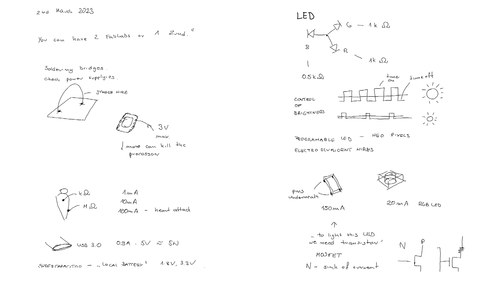
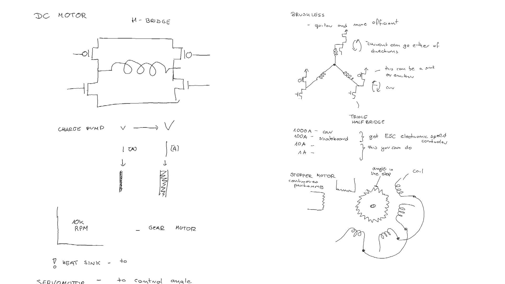
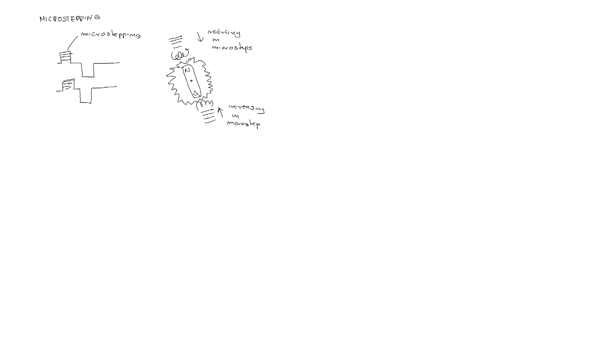
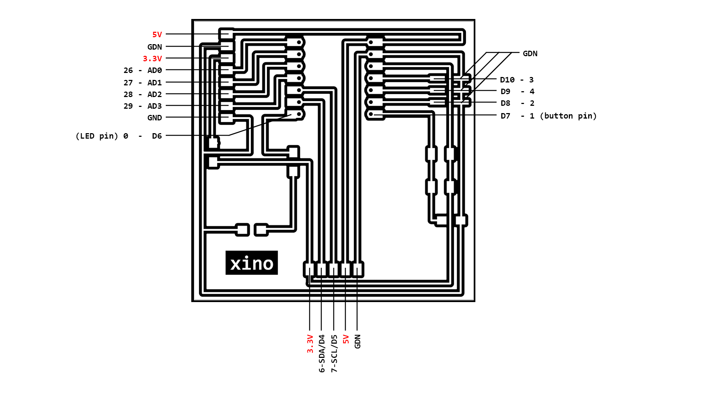
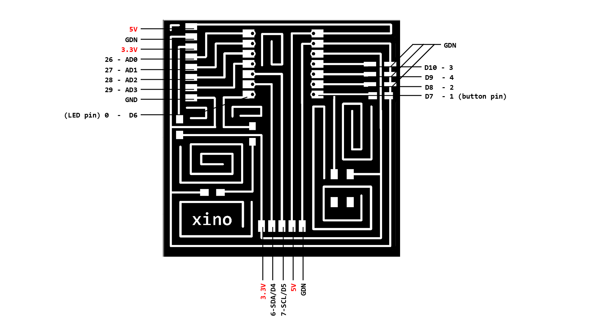

# **Week09.** Output Devices


|Assignment    |                          |
| ----------- | ------------------------------------ |
| *group*       |  measure the power consumption of an output device [link](https://fabacademy.org/2023/labs/ciudadmexico/group%20assignments/output-devices/)|
| *individual*      |   add an output device to a microcontroller board you've designed, and program it to do something|


## Photo of the week


## Lecture Notes






## Take aways from the group Assignment
The power consumption measured with method described:

[Group Assignment](https://fabacademy.org/2023/labs/ciudadmexico/group%20assignments/output-devices).

 - the higher rotation speed - more power consumption

- Power (Watts) = Voltage (Volts) x Current (Amps)

-  S3003 servo: low freq: 5.0V x 0.125A = 0.625W, high freq: 5.0V x 0.3A = 1.5W
max. 5.0V x 0.7A = 3.5W

-  SG90 digital servo: low freq: 5.0V x 0.1A = 0.5W, high freq: 5.0V x 0.3A = 1.5W
max. 5.0V x 0.5A = 2.5W

## Output devices
I have started with preparing the below illustration (photo of the week) to have better understaning of the pin layout.


**Fig.** The schematic of the pin connection of the board to connect OI devices.

### Step motor


**Servo Futaba S3003**[producent specification](https://www.fishfun.nl/index.php/modelbouw/servo-s/servo-futaba-s3003.html)
Voltage range: 4.8V - 6.0V
 maximum current draw: 700mA at 4.8V and 830mA at 6V.


**SG90 digital servo** [producent specification](https://www.towerpro.com.tw/product/sg90-7/)
Operating voltage: 4.8v
 maximum current draw: 500mA at 4.8V
### Code MicroPython

MicroPython Stepper Motor - rotate with specified angle - based on the examples
```
from machine import Pin, PWM
class SERVO:
    def __init__(self, pin):
        self.pin = pin
        self.pwm = PWM(self.pin)
    def turn(self, val):
        self.pwm.freq(100)
        self.pwm.duty_u16(int(val/180*13000+4000))

p = Pin(6, Pin.OUT)

s = SERVO(p)
s.turn(0) # 0 - moves it to 0 position, steps 30, 60, 90
```

<video width="960"  controls>
  <source src="../../images/week09/WhatsApp Video 2023-03-26 at 20.45.44.mp4" type="video/mp4">
</video>


MicroPython Stepper Motor - generated by GPT chat *micropython code for continous rotation of the step motor*
```
import machine
import time

# Define pins for stepper motor
step_pin = machine.Pin(6, machine.Pin.OUT) #default pin 5
dir_pin = machine.Pin(6, machine.Pin.OUT) #default pin 4

# Set initial direction
dir_pin.value(0)  # 0 for clockwise rotation, 1 for counterclockwise

# Set up PWM for controlling speed
pwm = machine.PWM(step_pin)
pwm.freq(200)  # Set PWM frequency to 1 kHz, set frequancies 200,500,1000,2000,5000

# Rotate motor continuously
while True:
    pwm.duty_u16(32768)  # Set duty cycle to 50%
    time.sleep(0.001)  # Wait for some time to allow motor to move
```
<video width="960"  controls>
  <source src="../../images/week09/WhatsApp Video 2023-03-26 at 20.43.11.mp4" type="video/mp4">
</video>

## New Board designed

During testing the board produced in week08 I noticed that the swith button doesn't work correctly.

- redesigning the button trases layout
- min. trace width: 0.6
- clearnace - 0.8 mm
- pad sizes: 3.0x1.8mm (pin headers and microcontroller) 2.2 x 1.8mm (resistors and LED), 2.6 x 1.8mm ( button), 3.15mm x 1.2mm - vertical pin header (-Right click on pad -> Properties -> change size in the window
-Right click on a modified pad  -> Push pad properties on other pads -> Change pads on current)
 - removing not necessary Cu layer for easier soldering of the components

 footprint

**Fig.** The new PCB board traces.

**Fig.** The schematic of the pin connection of the new board to connect OI devices.

**Fig.** The schematic model and case for the new board.

files


## The button works!
With help of my Instructor Rodrigo Shiordia, the button was fixed, and it works without the resistor connected before the button (?)


MicroPython Bliking LED with a Button

```
from machine import Pin

button = Pin(1, Pin.IN, Pin.PULL_UP) #setup pin where the button is connected
button.irq(lambda pin: InterruptsButton(),Pin.IRQ_FALLING)
led = Pin(0, Pin.OUT) #pins for RP2040 LED: 17- RED, 16- GREEN, 25- BLUE
tmp = 0

def InterruptsButton():
    global tmp
    tmp = ~tmp
    led.value(tmp)
while True:  
    pass
```
<video width="960"  controls>
  <source src="../../images/week09/WhatsApp Video 2023-03-28 at 20.44.26.mp4" type="video/mp4">
</video>

## Problems/Questions/Dilemas
1. The motor vibirates and not rotates at some frequancies. Why?
2. Does the swith button really need a resitor?
