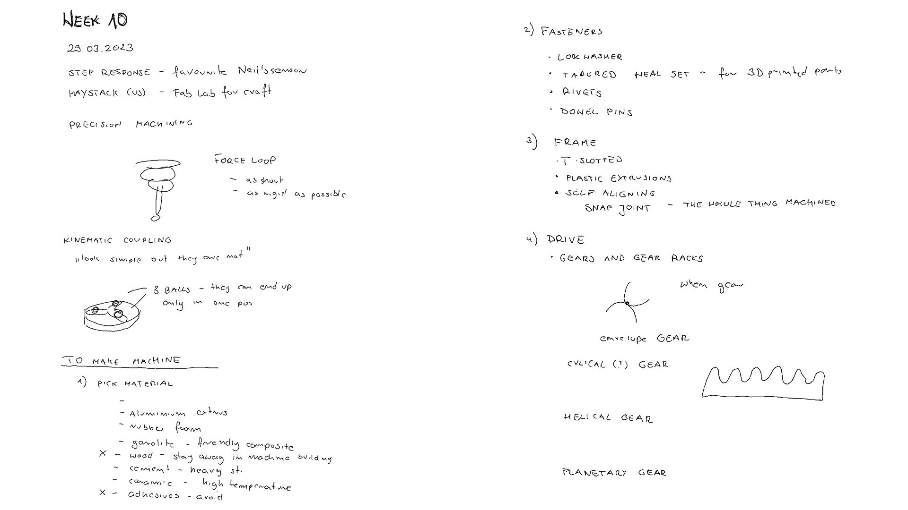
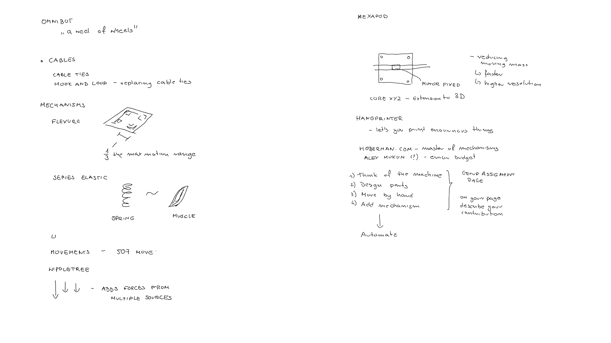
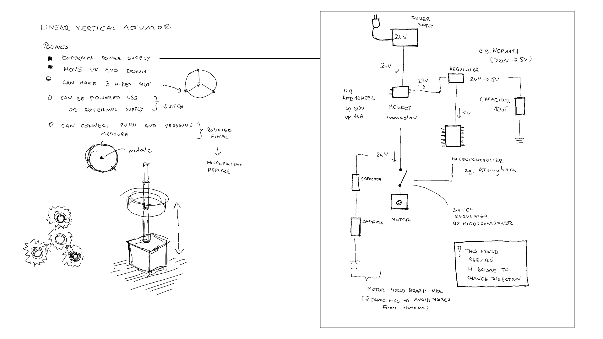
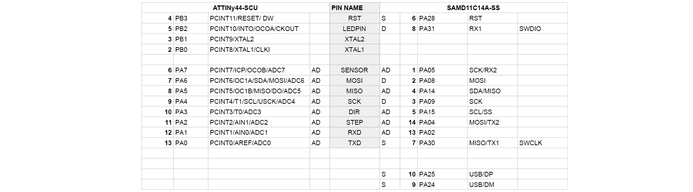
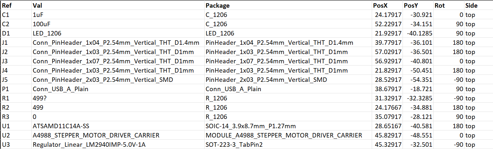
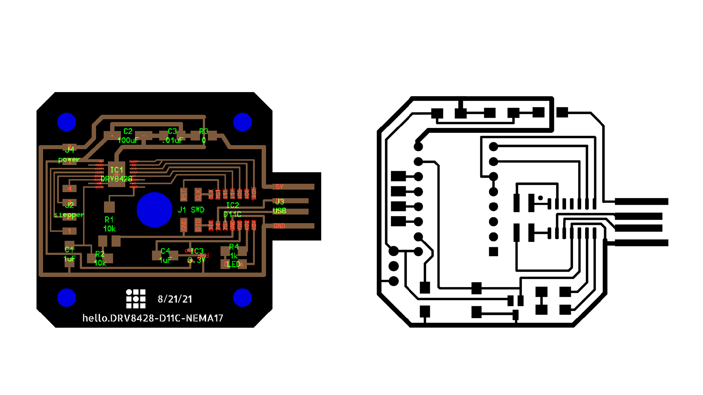
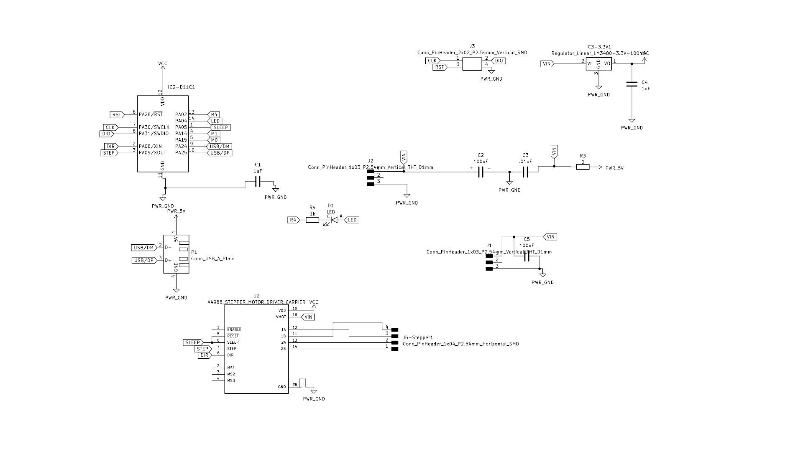
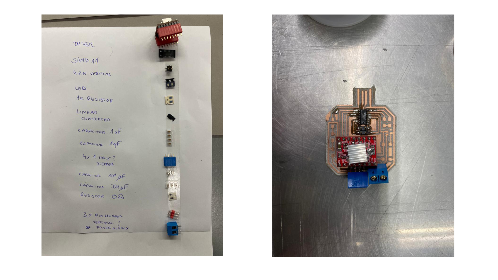
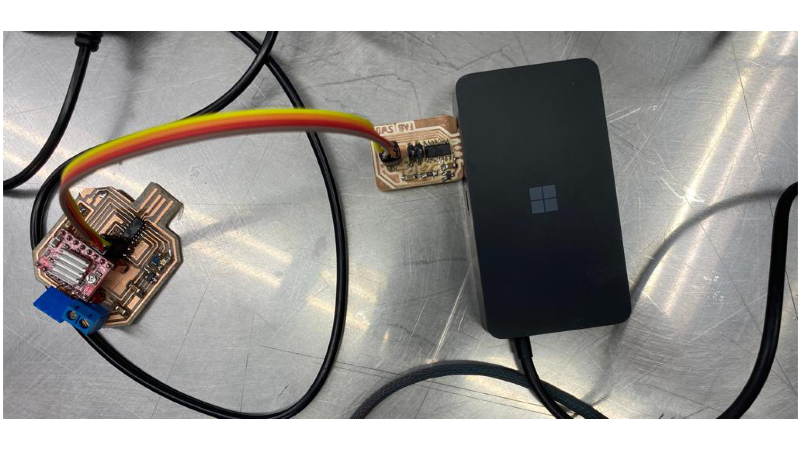

# **Week10.** Machine Building

|Assignment    |                          |
| ----------- | ------------------------------------ |
| *group*       |  design a machine that includes mechanism+actuation+automation+application; build the mechanical parts and operate it manually; document the group project |
| *individual*      |   document your individual contribution|

## Photo of the week

## Lecture Notes

## Lifting Mechanisms
The power consumption measured with method described:

**Fig.** Vertical movement mechanism. Source: http://507movements.com

- [175 - evolution to the crank of an engine](http://507movements.com/mm_175.html)

- [199 -magle-rack](http://507movements.com/mm_199.html)

- [210-curved slotted arm, a rectilinear motion of variable velocity is given to the vertical bar](http://507movements.com/mm_210.html)

- [324](http://507movements.com/mm_324.html)

- [vertical linear beam](https://www.youtube.com/watch?v=cP3-XVwzyDU)

## Board Examples for the external power supply
I have reviewed examples of the PCB boards with external power supply:

- [http://archive.fabacademy.org/archives/2016/fablabtrivandrum/students/369/w13/output_device.html](http://archive.fabacademy.org/archives/2016/fablabtrivandrum/students/369/w13/output_device.html)

- [http://fab.cba.mit.edu/classes/863.04/people/ztaylor/5/asst5.html](http://fab.cba.mit.edu/classes/863.04/people/ztaylor/5/asst5.html)

- [http://fab.cba.mit.edu/classes/863.04/people/ztaylor/5/asst5.html](http://fab.cba.mit.edu/classes/863.04/people/ztaylor/5/asst5.html)

- [https://fab.cba.mit.edu/classes/863.22/EECS/people/Noah/Week9.html](https://fab.cba.mit.edu/classes/863.22/EECS/people/Noah/Week9.html)

- [http://fab.cba.mit.edu/classes/863.15/section.Harvard/people/YLi/Week%2013%20-%20Final%20Project/Week%2013%20-%20Final%20Project.html](http://fab.cba.mit.edu/classes/863.15/section.Harvard/people/YLi/Week%2013%20-%20Final%20Project/Week%2013%20-%20Final%20Project.html)

The most useful for understanding general workflow of connecting power supply - notes in the figure below.

[https://fab.cba.mit.edu/classes/863.22/EECS/people/Noah/Week9.html](https://fab.cba.mit.edu/classes/863.22/EECS/people/Noah/Week9.html)

## Board Properties

**Fig.** Left: Board Properties. Right - schematic for plugin external power supply.

- can use extenal power supply to one step motor

- can be powered both by USB or external supply (switch?)

- can make 3 wires hot

- optionally can connect air pump and pressure sensor (in case of the meachanical acturtor failure, can use )

**I realized that for the control of the direction the design requires the H-Bridge.**

## hello.DRV8428-D11C-NEMA17 &
Therefore, I came back to look for examples with control movement and a power supply.
And I found this great example by Neil dedicated to the motor stepper we inteded to use.

- hello.DRV8428-D11C-NEMA17:  [http://academy.cba.mit.edu/classes/output_devices/DRV8428/hello.DRV8428-D11C-NEMA17.png](http://academy.cba.mit.edu/classes/output_devices/DRV8428/hello.DRV8428-D11C-NEMA17.png)

- gitlab resources: [https://gitlab.cba.mit.edu/neilg/urumbu/-/tree/master/serialstep](https://gitlab.cba.mit.edu/neilg/urumbu/-/tree/master/serialstep)

- python design interface: [https://leomcelroy.com/svg-pcb/?file=hello.DRV8428-D11C-NEMA17.js](https://leomcelroy.com/svg-pcb/?file=hello.DRV8428-D11C-NEMA17.js)

**Fig.** Left: Inspiring design. Right - my trials to adjust it for fabrication in https://leomcelroy.com.

**This design was not possible, as the min. width of the tracks for the machines in local node - 0.4mm and the Neil's design is 0.1mm. Moreover driver DRV8428_HTSSOP was not in the stock.**

For finding alternative ways of producing PCB with such thin wires: https://www.youtube.com/watch?v=5nXNK0cr5v. Anyhow without the all components in stock, it wouldnt be possible to make the board on time for this assigment.

## Board design with A4988 STEPPER MOTOR DRIVER
To make sure we can finish assigment on time, I have to use the A4988 STEPPER MOTOR DRIVER in the design of PCD. I reviewed the Rodrigio Shiordia design of the board for the Stepper Motor NEMA 17.

**Fig.** PCB with Attiny44 and A4988 STEPPER MOTOR DRIVER fitting to the step motor layout.

**This design was possible,however it would be better to use SAMD11C and USB communication.**

## Board design with A4988 STEPPER MOTOR DRIVER & SAMD11C

### Migration from Attiny44 to ATSAMD11C14A

### PCB DESIGN - FAILED

**files KiCAD download**: [kicad files](../files/N17SAMD11-GDN-USB-Edge_Cuts.zip){: download }

**The CNC machining file with the 0.4 track width and 0.4 clearance (due to the Easter break I had to try to make it done on the machine outside Fab Lab at university). Moreover, meantime I dedected a mistake with the USB +/- connections to the SAMD11C)**

## FINAL PCB DESIGN

<video width="960"  controls>
  <source src="../../images/week10/WhatsApp Video 2023-04-12 at 06.23.37.mp4" type="video/mp4">
</video>

**files KiCAD download**: [FINAL kicad files - produced board](../files/N17SAMDacaNeil.zip){: download }

####Loading Bootloader

To load bootloader I followed the instructions provided by Adrian Torres [here](http://fabacademy.org/2020/labs/leon/students/adrian-torres/samdino.html)

#### Arduino hello Files
As the diode was soldered in the oposite direction to the design.

[Arduino-blink](../files/samd-blink.ino){: download }

[Arduino-stepper-motor](../files/samd-stepper-motor.ino){: download }

### Parts

- Step Motor: Nema 17 External 48mm Stack 0.4A Lead 2mm/0.07874" Length 300mm [specification](https://www.oyostepper.com/goods-151-Nema-17-External-48mm-Stack-04A-Lead-2mm007874-Length-300mm.html)

- Stepper Motor Driver: A4988 STEPPER MOTOR DRIVER CARRIER [specification](https://www.snapeda.com/parts/A4988%20STEPPER%20MOTOR%20DRIVER%20CARRIER/Pololu/view-part/)
