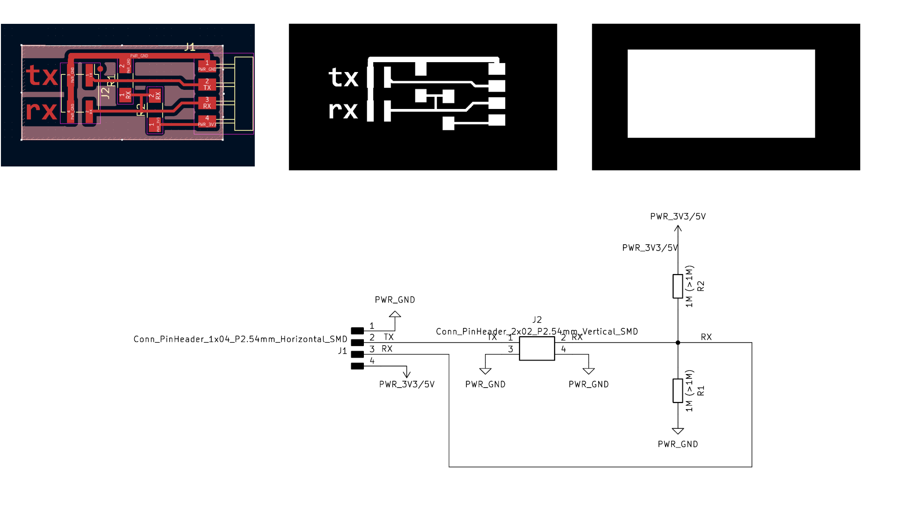

# **Week11.** Input Devices

|Assignment    |                          |
| ----------- | ------------------------------------ |
| *group*       |   probe an input device's analog levels and digital signals [**link**](https://fabacademy.org/2023/labs/ciudadmexico/group%20assignments/input-devices/) |
| *individual*      |    measure something: add a sensor to a microcontroller board that you have designed and read it|


## Photo of the week


## Take aways from the group Assignment
[Group Assignment](https://fabacademy.org/2023/labs/ciudadmexico/group%20assignments/input-devices/).

 - digital inputs scale: 0-1
 - analog inputs scale depends on the device but is not binary

## Lecture Notes


## Step Response

Links:
- bending with step response[ShArc: A Geometric Technique for Multi-Bend/Shape Sensing](https://dl.acm.org/doi/abs/10.1145/3313831.3376269)


**Fig.** Tx-rx sensing. source:https://roberthart56.github.io/SCFAB/SC_lab/Sensors/tx_rx_sensors/index.html.

### Theoretical Explanation
tx - transmit electrode
rx- receiving electrode

- transmit (tx) pin is made alternately high (5V or 3.3V) and low (0V). This charges and discharges the tx electrode.

- On the rx electrode there is a small 'blip' up or down as the tx pin toggles. These blips are measured by the  analog input (ADC), and "low" subtracted from "high"

- This result varies depending on how closely the two plates are coupled by the electric field. It increases as the distance decreases and also changes with the amount of overlap and the material between the plates.


## Board Design


**Fig.** Left: Board  Schematic KiCAD. Middle - Board FCu Layer. Right - Board - Edge Cuts. Bottom - Schematic Design.


**Fig.** Produced Board and components.


**Fig.** Soldered Board and connection to PCB [pcb design](week04.md)

## Micropython Code - Reading Step Response
```
from machine import Pin, ADC
import time

result = 0 # variable for the result of the tx_rx measurement.
analog_pin = ADC(29)
tx_pin = Pin(28, Pin.OUT)
led = WS2812(12,1)#WS2812(pin_num,led_count)

def tx_rx():
    # Function to execute rx_tx algorithm and return a value
    # that depends on coupling of two electrodes.
    # Value returned is a long integer.

    N_samples = 100 # Number of samples to take. Larger number slows it down, but reduces scatter.

    sum = 0
    for i in range(N_samples):
        tx_pin.on() # Step the voltage high on conductor 1.
        read_high = analog_pin.read_u16()# Measure response of conductor 2.
        time.sleep_us(100) # Delay to reach steady state.
        tx_pin.off() # Step the voltage to zero on conductor 1.
        read_low = analog_pin.read_u16() # Measure response of conductor 2.
        diff = read_high - read_low # Desired answer is the difference between high and low.
        sum += diff # Sums up N_samples of these measurements.

    return sum # End of tx_rx function.

while True:
    result = tx_rx()
    result = int((result - 22000) * (1024/(79000 - 22000))) # Mapping the values of the two copper plates, it will depend on their size.
    print(result)
    time.sleep_ms(100)


```

## Micropython Code - Step Response and Color LED
```
from machine import Pin, ADC
import time
from ws2812 import WS2812
import utime

power = machine.Pin(11,machine.Pin.OUT)
power.value(0)
BLACK = (0, 0, 0)
WHITE = (255, 255, 255)
result = 0 # variable for the result of the tx_rx measurement.
analog_pin = ADC(29)
tx_pin = Pin(28, Pin.OUT)
led = WS2812(12,1)#WS2812(pin_num,led_count)

def tx_rx():
    # Function to execute rx_tx algorithm and return a value
    # that depends on coupling of two electrodes.
    # Value returned is a long integer.

    N_samples = 100 # Number of samples to take. Larger number slows it down, but reduces scatter.

    sum = 0
    for i in range(N_samples):
        tx_pin.on() # Step the voltage high on conductor 1.
        read_high = analog_pin.read_u16()# Measure response of conductor 2.
        time.sleep_us(100) # Delay to reach steady state.
        tx_pin.off() # Step the voltage to zero on conductor 1.
        read_low = analog_pin.read_u16() # Measure response of conductor 2.
        diff = read_high - read_low # Desired answer is the difference between high and low.
        sum += diff # Sums up N_samples of these measurements.

    return sum # End of tx_rx function.

r= []
while True:
    result = tx_rx()
    result = int((result - 22000) * (1024/(79000 - 22000))) # Mapping the values of the two copper plates, it will depend on their size.
    print(result)
    r.append(result)
    time.sleep_ms(100)
    c = int((result-800)/350*255)
    color = [255-c,200-c,150-c]
    #print(color)

    led.pixels_fill(color)
    led.pixels_show()

```   
## Final Video
<video width="960"  controls>
  <source src="../../images/week11/WhatsApp Video 2023-04-18 at 19.43.04_6.mp4" type="video/mp4">
</video>

__________________________________________
## Files
**desing files**: [Xino - Step Response KiCAD](../files/week11/xino-step-response-kicad.zip){: Xino - Step Response KiCAD}

**production files**: [Xino - Step Response - SVG/PNG](../files/week11/xino-step-response-production.zip){: Xino - Step Response - SVG/PNG}
