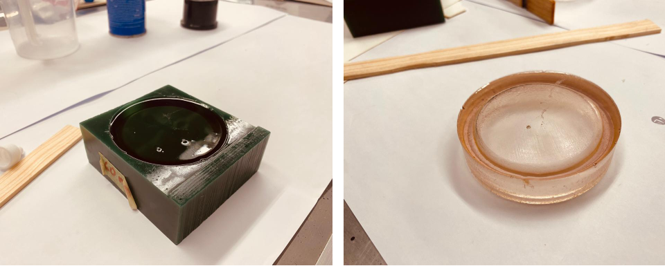
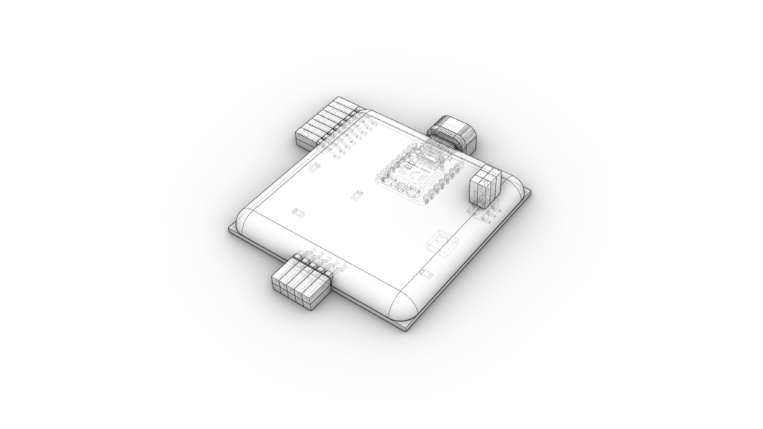
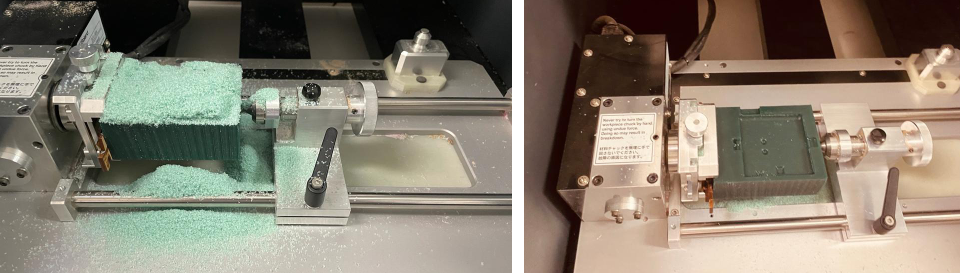
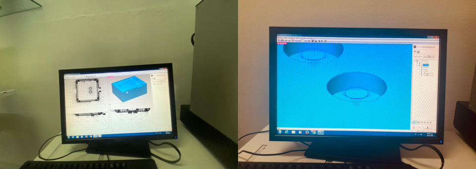
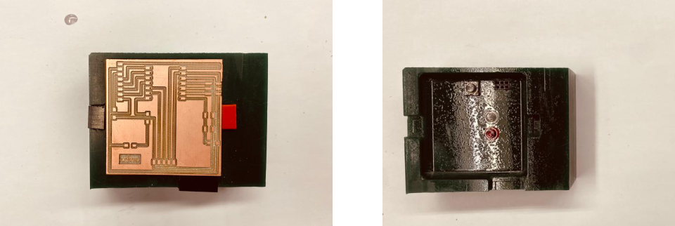
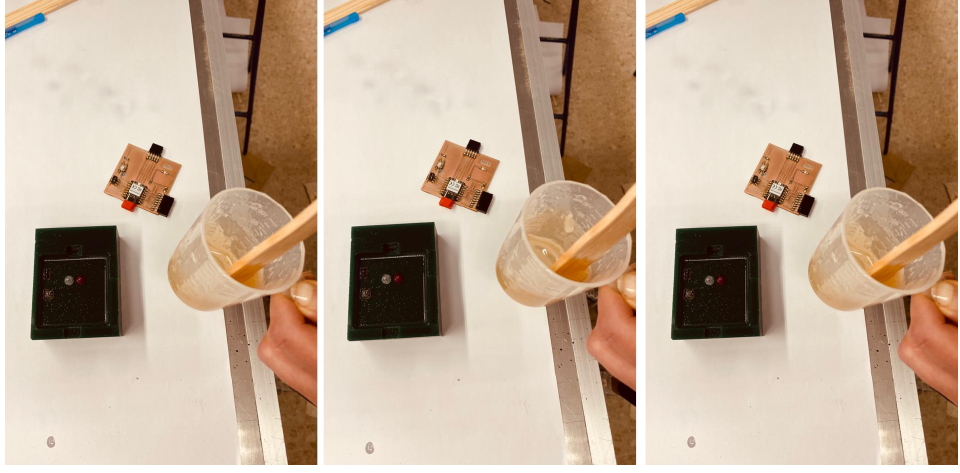

# **Week12.** Molding and Casting

|Assignment    |                          |
| ----------- | ------------------------------------ |
| *group*       |    review the safety data sheets for each of your molding and casting materials, then make and compare test casts with each of them; extra credit: try other molding and casting processes [**link**](https://fabacademy.org/2023/labs/ciudadmexico/group%20assignments/molding%20and%20casting/)|
| *individual*      |    design a mold around the stock and tooling that you'll be using, mill it (rough cut + three-axis finish cut), and use it to cast parts;  extra credit: use more then two mold parts|

## Photo of the week

## Take aways from the group Assignment
[Group Assignment](https://fabacademy.org/2023/labs/ciudadmexico/group%20assignments/molding%20and%20casting/).

 - always wear gloves
 - put foil on the floor - it could be messy
 - resin that we use is not very hazardous but can casue the following:
Eye Contact: Causes serious eye irritation.
Inhalation: Harmful if inhaled. It can irritate the respiratory tract.
Skin Contact: Causes skin irritation.
Ingestion: Irritating to the mouth, throat and stomach.

## Lecture Notes

## Idea

OVERMOLDING
http://fabacademy.org/archives/2012/students/bas.withagen/cl08asgn.html

**Fig.** Idea how to the overmolding should look like with my board produced in [week08](../assignments/week08.md).

## Testing

Preparations:
- gloves
- foil on the floor

The following materials were availabe for the assigment and for testing:

**Fig.** The materials available in the local stock for molding and casting week.

For the test I used the Resin - RESINA PP-70*60.
General purpose polyester resin so you can make multiple applications. It is excellent for making solid and hollow pieces, with fillers and pigments to provide different types of finishes.

Technical data:

- Fast curing even in thin sections
- Percentage Solids Right for Your Application
- Easy wetting to fiberglass
- Consistent cure at various catalyst levels
- Good acceptance of mineral fillers
- Good barcol hardness development
- To start its curing process it is required to add K-2000 catalyst

 Physical and Chemical Properties:

**Material Properties and Hazardous Factors** :[Resin- Data/Safety Sheet](../files/week12/Ficha_RESINAPP-70x607807.pdf){: Resin- Data/Safety Sheet}

.jpeg)
**Fig.** All the equipment : resin, spray, catalyst, mold, mixing sticks, measure cups, paper on the table and floor.

.
**Fig.** Left:Mold with the poured mixture. Right: the casted shape taken out from the mold.

## Mold Modeling

For the mold fabrication we were given the block of wax of dimensions: 92x152x38mm. Weight: 453g.

**Fig.** The green hard wax block for the mold fabriation.

I prepered the model for the mold in Rhino and Grasshopper (files at the bottom of the page).

**Fig.** Modeling the mold with Grasshopper bounding boxes.

**Fig.** Left: the final mold, center: mold with the lego buttons and the pcb with protection cases for pins and usb-c, right: how the protected pcb should fit to the mold.

**Fig.** The expected result taken out after resin is cured (around 24 hours).

## Mold Fabrication
The mold had to been machine in two passes: rough cut  + three-axis finish cut. For both passes the same tool was used flat mill 0.25in:

**Fig.** The tool parameters for mold machining.

**Fig.** The tool feed & speed for mold machining.

**The first pass: rough cut**

**Fig.** Generating the tool path for the rough cut.

**Fig.** Machining and result after the rough pass.

**The second pass: three-axis finish cut**
To achive the curved surfaces another pass was required using 3-d toolpath:

**Fig.** Generating the tool path for the finishing pass.

**Fig.** The final result after the finishing pass.

## Casting

###Preparation
To make the overmolding for the pcb I had to prepare the board to avoid resing getting into the usb port and providing covers for the pins. To protect USB I printed a USB-C cover (files at the bottom of the page). It needed some sanding to fit to the port.

.jpeg)
**Fig.**  Cleaning the PCB.

.jpeg)
**Fig.**. Polishing the USB-C cover- sand paper, and fitting the covers for pins.

**Fig.**.Fiitng the PCB with covers (check) and spraying the mold.

### Mixing
The resin was mixed with the proporiton 1 drop of catalyst K-2000 for 50ml of resin liquid.

**Fig.** The mixed ingredients: Resin 70-60 and catalysit K-2000 (1 drop per 50ml of resin).

**Fig.** Sharing (not scooping) for 8 minutes in both clockwise and counterclockwise direction.

**TO AVOID BUBBLES*:

- I made a test before making the mold to inspect how to prevent BUBBLES
- I sprayed the mold with special spray (instead of talk)
- I didn't rush the process - 8min of mixing.
- I was SHARING not SCOOPING
- I was mixing the mixture in two directions: clockwise and counterclockwise
- I shaked the mold after puring the mixture

### Pouring

The mold was pressed with a weight block to secure well fit.
I had a bit of resin mixture spare after pouring to the pcb mold, therefore I used to to make a second layer in the test mold with embedded metal items.

**Fig.** The machined mold with the pcb pressed with the weght block - left for curing. As I had a bit of the mixture left, I added gold pins and remaing liquid to the test cast :).

## Results

After a few hours...

__________________________________________
## Files
**desing & production files**: [Xxino Mold - Rhino/GH](../files/week12/xxino-mold.zip){: Xxino Mold - Rhino/GH}

**3D model for USB cover**: [3D Print USB C cover - Rhino/STL/GCODE](../files/week12/3D PRINT  usb c cover.zip){: 3D Print USB C cover - Rhino/STL/GCODE}
