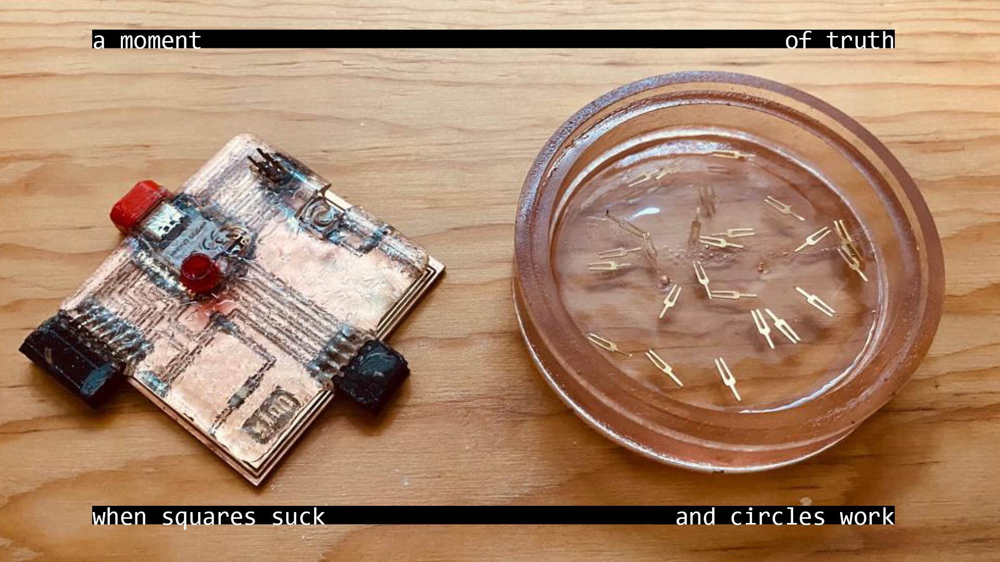
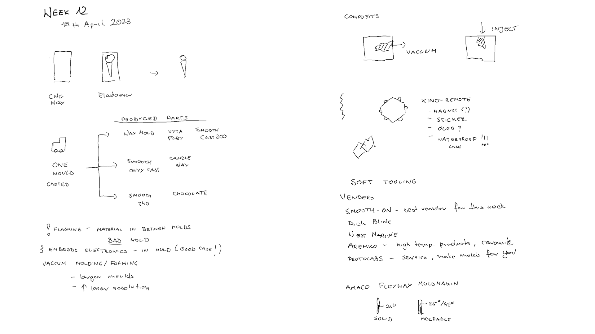
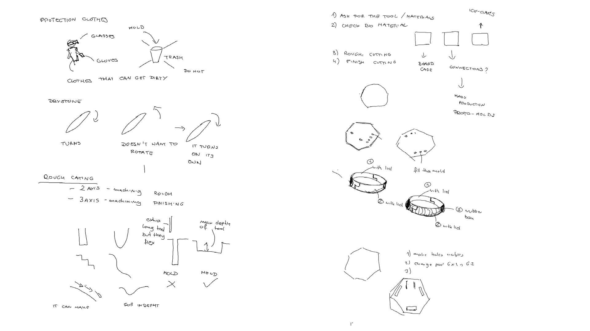
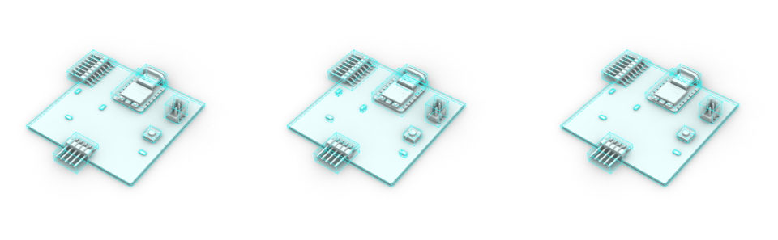
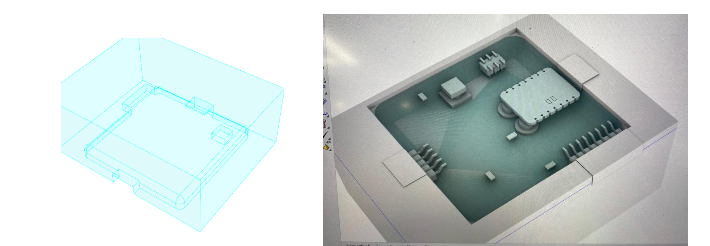
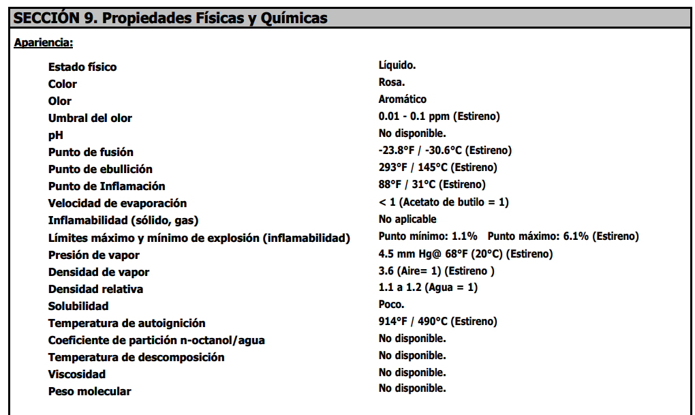
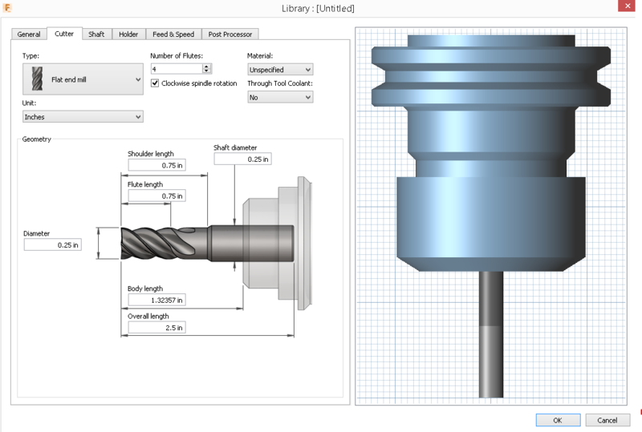
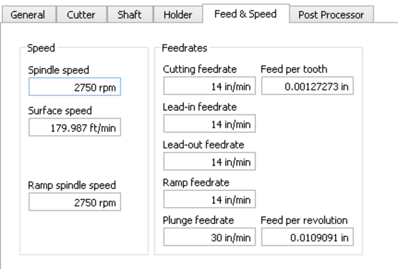
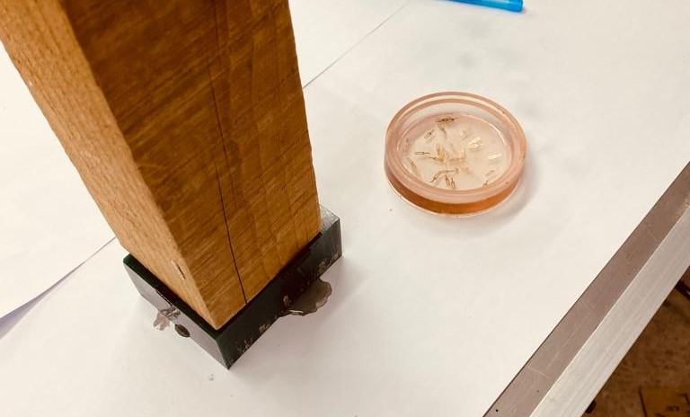
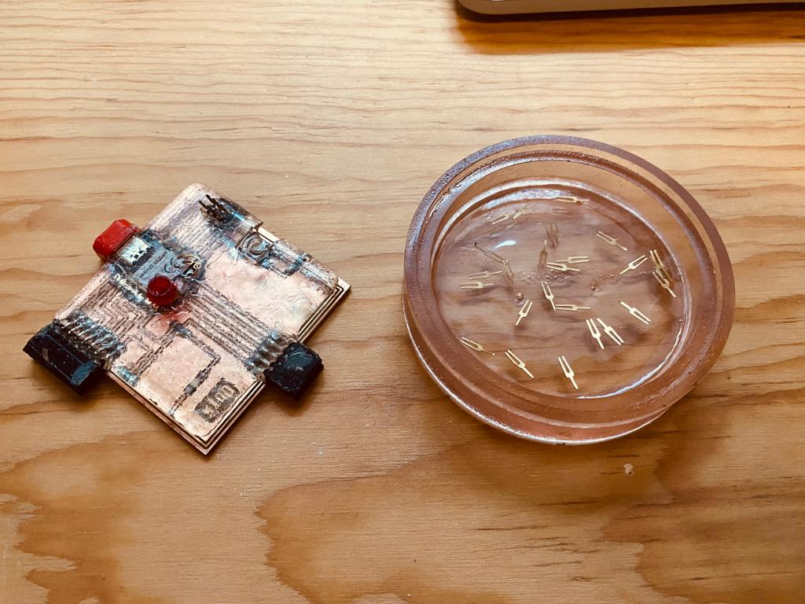

# **Week12.** Molding and Casting

|Assignment    |                          |
| ----------- | ------------------------------------ |
| *group*       |    review the safety data sheets for each of your molding and casting materials, then make and compare test casts with each of them; extra credit: try other molding and casting processes [**link**](https://fabacademy.org/2023/labs/ciudadmexico/group%20assignments/molding%20and%20casting/)|
| *individual*      |    design a mold around the stock and tooling that you'll be using, mill it (rough cut + three-axis finish cut), and use it to cast parts;  extra credit: use more then two mold parts|

## Photo of the week

## Take aways from the group Assignment
[Group Assignment](https://fabacademy.org/2023/labs/ciudadmexico/group%20assignments/molding%20and%20casting/).

 - always wear gloves
 - put foil on the floor - it could be messy
 - resin that we use is not very hazardous but can casue the following:
Eye Contact: Causes serious eye irritation.
Inhalation: Harmful if inhaled. It can irritate the respiratory tract.
Skin Contact: Causes skin irritation.
Ingestion: Irritating to the mouth, throat and stomach.

## Lecture Notes

## Idea

OVERMOLDING
http://fabacademy.org/archives/2012/students/bas.withagen/cl08asgn.html

**Fig.** Xino-remote prototype (final board that can work remotely) more here [xino-remote link](https://fabacademy.org/2023/labs/ciudadmexico/students/judyta-cichocka/projects/xino-remote/).

## Mold Modeling

I prepered the model for the mold in Rhino and Grasshopper (files at the bottom of the page).

## Testing
The following materials were availabe for the assigment and for testing:

For the test I used the Resin - RESINA PP-70*60 wi the following Physical and Chemical Properties:

**Material Properties and Hazardous Factors** :[Resin- Data/Safety Sheet](../files/week12/Ficha_RESINAPP-70x607807.pdf){: Resin- Data/Safety Sheet}

.jpeg)
.jpeg)

## Preparation

To make the overmolding for the pcb I had to prepare the board to avoid resing getting into the usb port and providing covers for the pins. To protect USB I printed a USB-C cover (files at the bottom of the page). It needed some sanding to fit to the port.

.jpeg)
.jpeg)

## Molding

.jpeg)

.jpeg)

.jpeg)
## Results

__________________________________________
## Files
**desing & production files**: [Xxino Mold - Rhino/GH](../files/week12/xxino-mold.zip){: Xxino Mold - Rhino/GH}

**3D model for USB cover**: [3D Print USB C cover - Rhino/STL/GCODE](../files/week12/3D PRINT  usb c cover.zip){: 3D Print USB C cover - Rhino/STL/GCODE}
