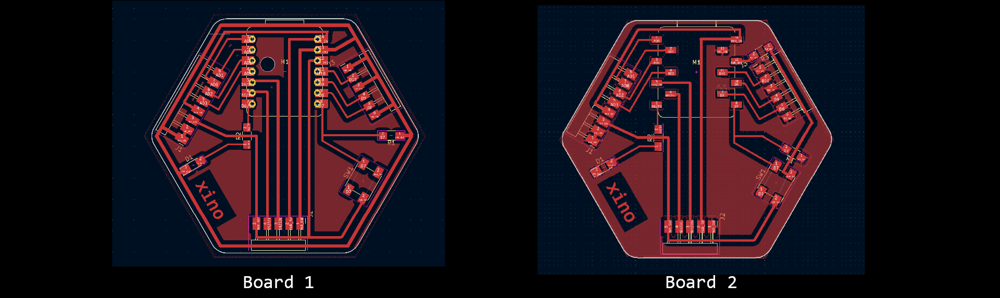
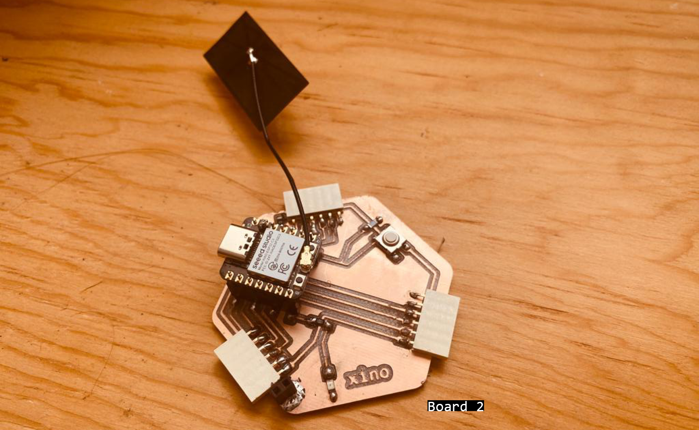

# **Week13.** Networking and Communications

|Assignment    |                          |
| ----------- | ------------------------------------ |
| *group*       |    send a message between two projects |
| *individual*      |    design, build, and connect wired or wireless node(s) with network or bus addresses|


## Photo of the week


## Lecture Notes


## PCB Design & Production
I wanted to build a node that can connect though BLE and can be supported by battery. Below 2 designs with hole for the battery cables and development board with sockets for the XIAO_ESP32C3 or XIAO nRF52840 (Sense).

### KiCad Design

**Fig.** Xino-remote prototypes: left: with ground, right: without ground (final board that can work remotely) more here: [xino-remote link](https://fabacademy.org/2023/labs/ciudadmexico/students/judyta-cichocka/projects/xino-remote/).

To make a board where the plane is the GDN I followed the tutorial: [](https://youtu.be/E5EXnmctXf8)

1. Go to FCu Layer
2. Select Add a Filled Zone (right panel, blue zone button)
3. Click on canvas and the window will pop up: select FCu BCu and PWR_GDN.

4. Select the zone and wait. The zone will appear, the GDN wire will lose the clearance and GDN pads will get a cross. Your GDN plane is ready -> Make sure it connects all the GDN pads (otherwise with the rule check you will get the error).


[board1 - with ground - kiCad + fabrication files](../files/230425-xino-remote-kicad-fabrication-files.zip){: 230425-xino-remote-kicad-fabrication-files }

[board2 - with no ground - kiCad + fabrication files](../files/230426-xino-remote-kicad-fabrication-files.zip){: 230426-xino-remote-kicad-fabrication-files }


**Fig.** Xino-remote pcb prototypes fabricated: left: with ground, right: without ground.



**Fig.** Xino-remote pcb prototype 1 soldered.

After soldering and connecting the board to the computer - pcb was working but after connecting it to the slots in the board it was stopping to work. After checkup with multimeter, I noticed that there was a continutity between GDN and 5V.
**!!! 5V connected to the ground!!!!**
I couldn't find where the soldering could actually cause the problem. After taking the board out and closer inspection I noticed that:

**Fig.** Xino-remote pcb prototype 1 soldered - the production left overs caused the short!.

## XIAO_ESP32C3
ESP32-C3 adds support for the Bluetooth 5 (LE) protocol, with coded PHY and extended advertisement features, while it also provides data redundancy to the packets, thus improving the range (typically 100 meters). Furthermore, it supports the Bluetooth LE.

### Board Check
```
/*
  Blink

// the setup function runs once when you press reset or power the board
void setup() {
  // initialize digital pin LED_BUILTIN as an output.
  pinMode(21, OUTPUT);
}

// the loop function runs over and over again forever
void loop() {
  digitalWrite(21, HIGH);  // turn the LED on (HIGH is the voltage level)
  delay(1000);                      // wait for a second
  digitalWrite(21, LOW);   // turn the LED off by making the voltage LOW
  delay(1000);                      // wait for a second
}

```
### WIFI
I followed this [tutorial](https://wiki.seeedstudio.com/XIAO_ESP32C3_WiFi_Usage) to establish the WiFi network with ESP32C3.

**Fig.** Xino-remote with ESP32C3 crating a WiFi network.


## nRF52840 ble
https://how2electronics.com/send-receive-data-to-mobile-app-with-xiao-ble-nrf52840-sense/

1. Install Application
2. Download a library called Arduino BLE.  [Github librry Arduino BLE] (https://github.com/arduino-libraries/ArduinoBLE).From this GitHub repository - Code-> download ZIP

3. Add the Arduino BLE library to the Arduino Library folder using add zip option: Sketch->Include Library->Add .ZIP library -> select the downloaded .zip file "ArduinoBLE-master.zip"

4. now upload the following

```
#include <ArduinoBLE.h>

BLEService ledService("19B10000-E8F2-537E-4F6C-D104768A1214"); // Bluetooth® Low Energy LED Service

// Bluetooth® Low Energy LED Switch Characteristic - custom 128-bit UUID, read and writable by central
BLEByteCharacteristic switchCharacteristic("19B10001-E8F2-537E-4F6C-D104768A1214", BLERead | BLEWrite);

const int ledPin = LED_BUILTIN; // pin to use for the LED

void setup() {
  Serial.begin(9600);
  while (!Serial);

  // set LED pin to output mode
  pinMode(ledPin, OUTPUT);

  // begin initialization
  if (!BLE.begin()) {
    Serial.println("starting Bluetooth® Low Energy module failed!");

    while (1);
  }

  // set advertised local name and service UUID:
  BLE.setLocalName("LED");
  BLE.setAdvertisedService(ledService);

  // add the characteristic to the service
  ledService.addCharacteristic(switchCharacteristic);

  // add service
  BLE.addService(ledService);

  // set the initial value for the characeristic:
  switchCharacteristic.writeValue(0);

  // start advertising
  BLE.advertise();

  Serial.println("BLE LED Peripheral");
}

void loop() {
  // listen for Bluetooth® Low Energy peripherals to connect:
  BLEDevice central = BLE.central();

  // if a central is connected to peripheral:
  if (central) {
    Serial.print("Connected to central: ");
    // print the central's MAC address:
    Serial.println(central.address());

    // while the central is still connected to peripheral:
  while (central.connected()) {
        if (switchCharacteristic.written()) {
          if (switchCharacteristic.value()) {   
            Serial.println("LED on");
            digitalWrite(ledPin, LOW); // changed from HIGH to LOW       
          } else {                              
            Serial.println(F("LED off"));
            digitalWrite(ledPin, HIGH); // changed from LOW to HIGH     
          }
        }
      }

    // when the central disconnects, print it out:
    Serial.print(F("Disconnected from central: "));
    Serial.println(central.address());
  }
}
```
1. Install Application
2.  need to download a library called Arduino BLE.  [Github  LSM6DS3 Library.] (https://github.com/Seeed-Studio/Seeed_Arduino_LSM6DS3).From this GitHub repository - Code-> download ZIP

3.  Add the Arduino BLE library to the Arduino Library folder using add zip option: Sketch->Inlude Librry->Add .ZIP library -> select the downloaded .zip file "ArduinoBLE-master.zip"

4. now upload the following
```
#include "LSM6DS3.h"
#include "Wire.h"

//Create an instance of class LSM6DS3
LSM6DS3 myIMU(I2C_MODE, 0x6A);    //I2C device address 0x6A

void setup() {
    // put your setup code here, to run once:
    Serial.begin(9600);
    while (!Serial);
    //Call .begin() to configure the IMUs
    if (myIMU.begin() != 0) {
        Serial.println("Device error");
    } else {
        Serial.println("Device OK!");
    }
}

void loop() {
    //Accelerometer
    Serial.print("\nAccelerometer:\n");
    Serial.print(" X1 = ");
    Serial.println(myIMU.readFloatAccelX(), 4);
    Serial.print(" Y1 = ");
    Serial.println(myIMU.readFloatAccelY(), 4);
    Serial.print(" Z1 = ");
    Serial.println(myIMU.readFloatAccelZ(), 4);

    //Gyroscope
    Serial.print("\nGyroscope:\n");
    Serial.print(" X1 = ");
    Serial.println(myIMU.readFloatGyroX(), 4);
    Serial.print(" Y1 = ");
    Serial.println(myIMU.readFloatGyroY(), 4);
    Serial.print(" Z1 = ");
    Serial.println(myIMU.readFloatGyroZ(), 4);

    //Thermometer
    Serial.print("\nThermometer:\n");
    Serial.print(" Degrees C1 = ");
    Serial.println(myIMU.readTempC(), 4);
    Serial.print(" Degrees F1 = ");
    Serial.println(myIMU.readTempF(), 4);

    delay(1000);
}
```
Some other helpful tutorials
- https://www.youtube.com/watch?v=GsseX2rEjfw
https://randomnerdtutorials.com/esp32-bluetooth-low-energy-ble-arduino-ide/

## Final Video
<video width="960"  controls>
  <source src="../../images/week13/WhatsApp Video 2023-05-02 at 19.45.38.mp4" type="video/mp4">
</video>

## Problems

- there is no actual .bin files for ESP32C3 for MicroPython and the examples to make the server and scanner from ESP32 library dont work for ESP32C3
- you need 2 the same board to make BLE/LE communitaction possible (or easier)
