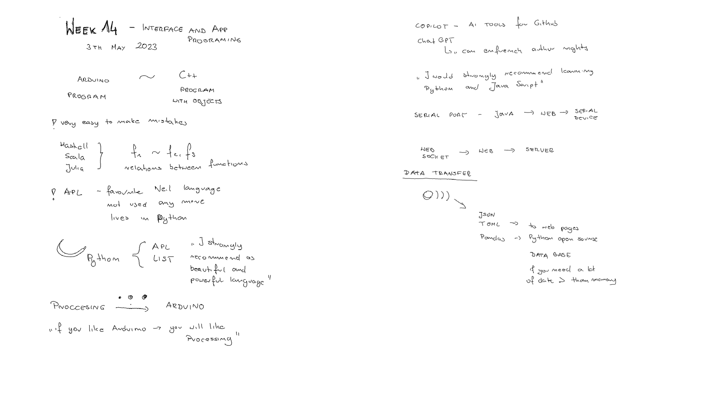
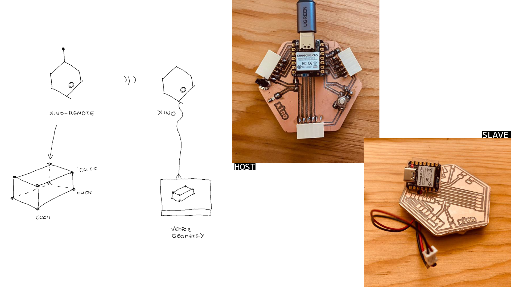
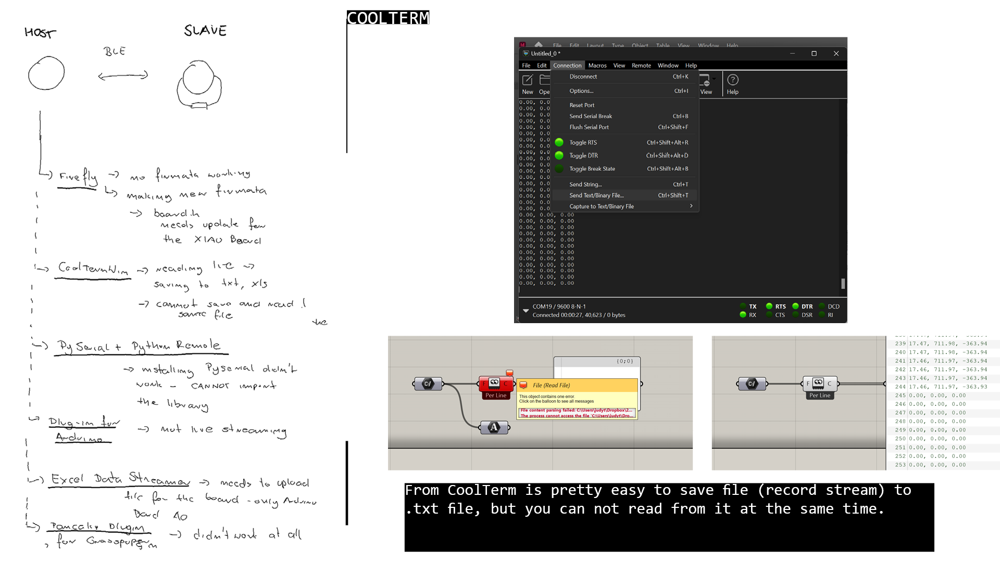
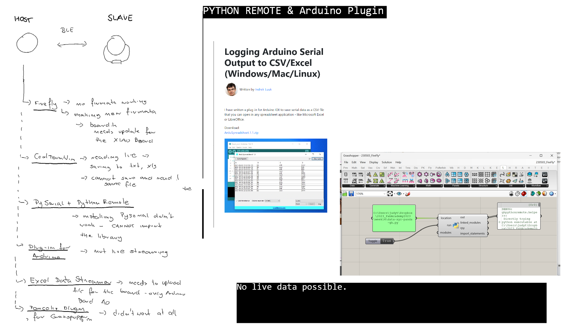
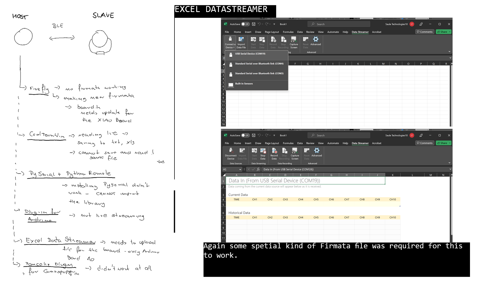
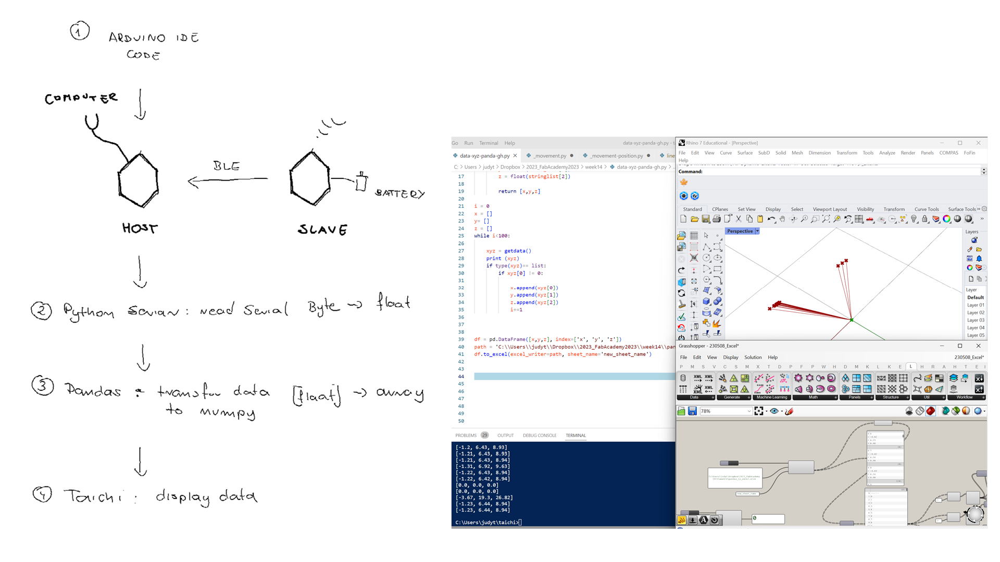
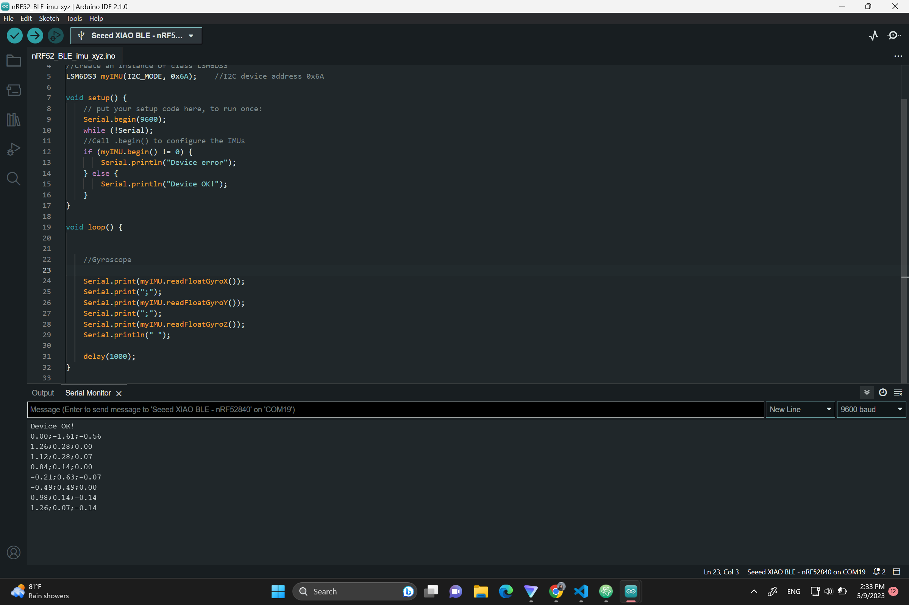
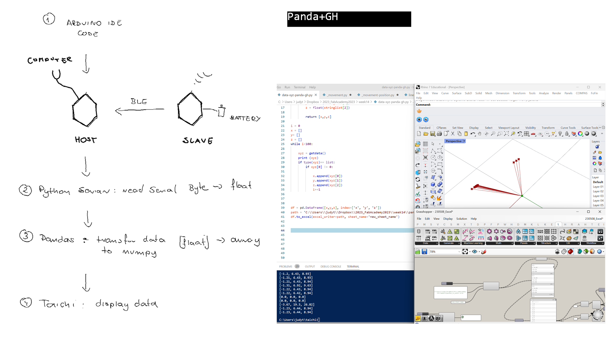

# **Week14.** Interface and Application Programming

|Assignment    |                          |
| ----------- | ------------------------------------ |
| *group*       |    compare as many tool options as possible |
| *individual*      |     write an application that interfaces a user with an  input &/or output device that you made|


## Photo of the week


## Lecture Notes




## Idea


1. 2 nRF5240 (one Sense) communicating via BLE
2. One remote with recharable battery reads the 6FOF IMU data and sends to the second connected to the computer.
3. The data is visualize as geometry (Grasshopper, Thinker)
  - one way is to have the data on the XIAO host and read it
  - second way is to get the wirelessly from XIAO slave
4. Trying Tensor Flow and Tiny ML (https://wiki.seeedstudio.com/XIAO-BLE-Sense-TFLite-Mic)

Some intresting links:

- https://howtomechatronics.com/tutorials/arduino/arduino-and-mpu6050-accelerometer-and-gyroscope-tutorial/
- https://fabacademy.org/2022/labs/cidi/students/victor-ughelli/assignments/week14/


## Fails
### Reading the IMU data with Grasshoper and Firefly


The run Firefly the File "Firefly Firmata" needs to be upload to the (Arduino) Board. You can find it after installing Firefly in Arduino IDE -> File -> Skechbook_> Firefly Firmata. As we are using XIAO, not the

I tried to modify the code to make it compile and upload to XIAO board.  Below the result. **The file compiles and uploads to the XIAO board, but still in Grasshopper the serial port can not be read.**
Another problem to explore is to mannually finde the location of the arduino.exe file while opening the Grasshopper (maybe this is the reason of not reading Genreal Serial Port.
**Adding XIAO to Board.h**[tutorial](https://github.com/MarlinFirmware/MarlinDocumentation/edit/master/_hardware/boards.md).

### Reading the IMU data with Grasshoper with other software

**CoolTerm**: [tutorial](https://www.youtube.com/watch?v=RWgyCcnUxPY). Saving txt from com port  - desont work as you can not write and read at the same Time.

**PythonRemote**: not reading the remote Python file.
**Arduino Plugin** [more](https://circuitjournal.com/arduino-serial-to-spreadsheet)


**Excel DataStreamer** - didnt really stream the data from COM port - > you need to upload specific file to the board and for now I founda only documentation on arduino. It worked though for the in-built sensors.
 - https://support.microsoft.com/en-us/office/enable-the-data-streamer-add-in-70052b28-3b00-41e7-8ab6-8a9f142dffeb

### Reading data from the XIAO slave

1. Download https://www.nordicsemi.com/Products/Development-tools/nRF-Connect-for-Desktop/Download#infotabs
2. https://www.nordicsemi.com/Products/Bluetooth-Low-Energy/Development-software?lang=en#infotabs
3. https://www.nordicsemi.com/Products/Development-tools/nRF-Command-Line-Tools/Download


## HOST: Reading the IMU data for serial communication

6DOF IMUs
3dofs - Accelerometer - measuers linera accelaration, determines acceleration, velocity, position
3DOFs - Gyroscope  - determines orientation

Up front you need to have the nRF5240 installed in your Arduino IDE. All the steps are explain [in this tutorial](https://how2electronics.com/getting-started-with-seeed-xiao-ble-nrf52840-sense/). Once you have the board installed, follow the steps:

1. Download a library called Arduino BLE.  [Github LSM6DS3 Library](https://github.com/Seeed-Studio/Seeed_Arduino_LSM6DS3).From this GitHub repository - Code-> download ZIP
2. Add the Arduino BLE library to the Arduino Library folder using add zip option: Sketch->Include Library ->Add .ZIP library -> select the downloaded .zip file "ArduinoBLE-master.zip"
3. Upload the following:
**This code calulates the position of the device based on the acceleration only when significant movement detected.**

```
#include "LSM6DS3.h"
#include "Wire.h"
#include <SPI.h>

//Create an instance of class LSM6DS3
LSM6DS3 myIMU(I2C_MODE, 0x6A);    //I2C device address 0x6A

// Set initial values for position, velocity, and time
float position[3] = {0, 0, 0};
float velocity[3] = {0, 0, 0};
unsigned long timestamp;
const float accelerationThreshold = 2.5; // threshold of significant in G's

// Define constants for integration
const float SAMPLING_INTERVAL = 0.01; // in seconds
const float GRAVITY = 9.81; // in m/s^2

void setup() {
    // put your setup code here, to run once:
    Serial.begin(9600);
    while (!Serial);
    //Call .begin() to configure the IMUs
    if (myIMU.begin() != 0) {
        Serial.println("Device error");
    } else {
        Serial.println("Device OK!");
    }

  // Set the range of the accelerometer to +/- 16g
  //myIMU.A_SCALE_16G;

  // Set the output data rate of the accelerometer to 104 Hz
  //myIMU.setAccelDataRate(LSM6DS_RATE_104_HZ);

  // Set initial timestamp
  timestamp = millis();
}

void loop() {
  // Read the acceleration data from the LSM6DS3 sensor

  float x = myIMU.readFloatAccelX();
  float y = myIMU.readFloatAccelY();
  float z = myIMU.readFloatAccelZ();

  float aSum = fabs(x) + fabs(y) + fabs(z);
  if (aSum >= accelerationThreshold) {
  //Serial.print(x);
  //Serial.print("   ");
  // Calculate the elapsed time since the last iteration
    unsigned long current_time = millis();
    float elapsed_time = (current_time - timestamp) / 1000.0;

  // Calculate the change in velocity due to acceleration
    float delta_vx = x * GRAVITY * elapsed_time;
    float delta_vy = y * GRAVITY * elapsed_time;
    float delta_vz = z * GRAVITY * elapsed_time;
  //Serial.print(delta_vx);
  //Serial.print("   ");
  // Update the velocity
    velocity[0] += delta_vx;
    velocity[1] += delta_vy;
    velocity[2] += delta_vz;

  // Calculate the change in position due to velocity
    float delta_px = velocity[0] * elapsed_time;
    float delta_py = velocity[1]* elapsed_time;
    float delta_pz = velocity[2]* elapsed_time;
  //Serial.print(delta_px);
  //Serial.print("   ");
  // Update the position
    position[0] += delta_px;
    position[1] += delta_py;
    position[2] += delta_pz;

  // Update the timestamp
    timestamp = current_time;

  }

  // Output the position data
  //Serial.print("Position (x, y, z): ");
  Serial.print(position[0]);
  Serial.print(", ");
  Serial.print(position[1]);
  Serial.print(", ");
  Serial.println(position[2]);

  // Wait for the next iteration
  delay(SAMPLING_INTERVAL * 1000);
  position[0] =0;
  position[1] =0;
  position[2]= 0;
}

```

**Fig.** nRF52840 reading the Gyroscope.

## Reading the IMU data with Python with Panda and GH

## Reading the IMU data with Python and Taichi

I had a problem to install packages through regular pip command. It turned out I had to do it though PyPackages.

```
py -m pip install pyserial
py -m pip install taichi
py -m pip install matplotlib
py -m pip install opencv-python pycairo
```
The serial functions can only use bytes. Anything you want to send must be converted to bytes and converted back on the other end.

for excel write:
```
py -m pip install pandas
py -m pip install xlwt
py -m pip install openpyxl
```


https://yuanming.taichi.graphics/publication/2020-taichi-tutorial/taichi-tutorial.pdf
https://docs.taichi-lang.org/


In Taichi  the left-top of your main scr


```
#
#
import serial
import pandas as pd
import taichi as ti
import numpy as np
import time

ser = serial.Serial('COM19', 9800)

# Function to transform byte serial data to the List of floats
def getdata():

   line = ser.readline()
   if line:
        string = line.decode()  
        string = string.replace("\r\n","")  
        stringlist = string.split(",", 3)
        x = float(stringlist[0])
        y = float(stringlist[1])
        z = float(stringlist[2])

        return [x,y,z]

i = 0
x = []
y= []
z = []
r = []
num = 100
while i<num:

    print (getdata())
    xyz = getdata()
    if type(xyz)== list: # protect to avoid NoneType data
        if xyz[0] != 0:
            x.append(xyz[0])
            y.append(xyz[1])
            z.append(xyz[2])
            sumA = xyz[0]+xyz[1]+xyz[2]
            r.append(sumA)
            i+=1

# Function to remap sensor data to display
def reMap(value, maxInput, minInput, maxOutput, minOutput):

	value = maxInput if value > maxInput else value
	value = minInput if value < minInput else value

	inputSpan = maxInput - minInput
	outputSpan = maxOutput - minOutput

	scaledThrust = float(value - minInput) / float(inputSpan)

	return minOutput + (scaledThrust * outputSpan)

# First remap of values to X domain

for i in range(num):

    y[i]=reMap(y[i],max(y),min(y),max(x),min(x))
    z[i]=reMap(z[i],max(z),min(z),max(x),min(x))

X = [0]*num
Y = [0]*num
Z = [0]*num
R = [0]*num


for i in range(num):
    X[i] = x[i]#sum(x[0:i])
    Y[i] = y[i]#sum(y[0:i])
    Z[i] = z[i]#sum(z[0:i])    
    R[i] = r[i]

print (min(X),max(X))
print (min(Y), max(Y))
print (min(Z),max(Z))  
#Second remap to 0 and 1

for i in range(num):
    X[i]=reMap(X[i],max(X),min(X),0.45,-0.45)+0.5
    Y[i]=reMap(Y[i],max(X),min(X),-0.45, 0.45)+0.5
    Z[i]=int(reMap(Z[i],max(Z),min(Z),2,0))
    R[i] = reMap(R[i],max(R),min(R),10,2)


print (X)
print (Y)
print (Z)

zero = [0.5]*num

pos = pd.DataFrame({"X": X, "Y": Y}).to_numpy()
pos_b = pd.DataFrame({"X": zero, "Y": zero}).to_numpy()
rad = np.array(R)
indices = np.array(Z)
print (pos)
print (indices)

width = 800
height = 800
gui = ti.GUI("circles", res=(width, height))
while gui.running:
    gui.circles(pos, radius=rad, palette=[0x068587, 0xED553B, 0xEEEEF0], palette_indices=indices)
    gui.lines(begin=pos_b, end=pos, radius=1, color=0xEEEEF0)
    gui.show()

```

## Final Video
<video width="960"  controls>
  <source src="../../images/week14/WhatsApp Video 2023-05-10 at 01.16.51.mp4" type="video/mp4">
</video>

## Problems
 - many problems with integration of data through systems
 - Taich is absolutely great but requires more timestamp
 - Taichi is good for imported data as numbpy ndarrays (2,n), but if the ndarray has one dimension >3, Taichi requires ti.Vector.field
 - as the ti.Vector.field the data needs to be integer or a slice, cannot be external funtion (it makes it a bit harder to use live daata.)

## Next steps
 - position data from the SLAVE xino thorugh BLE
 - inclusion the position change based on the Gyroscope Data
