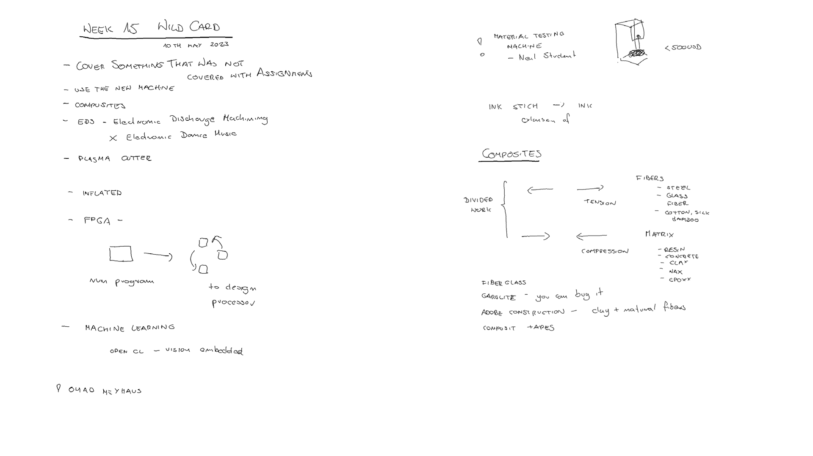
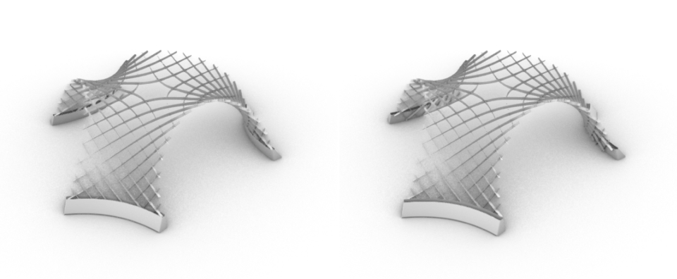
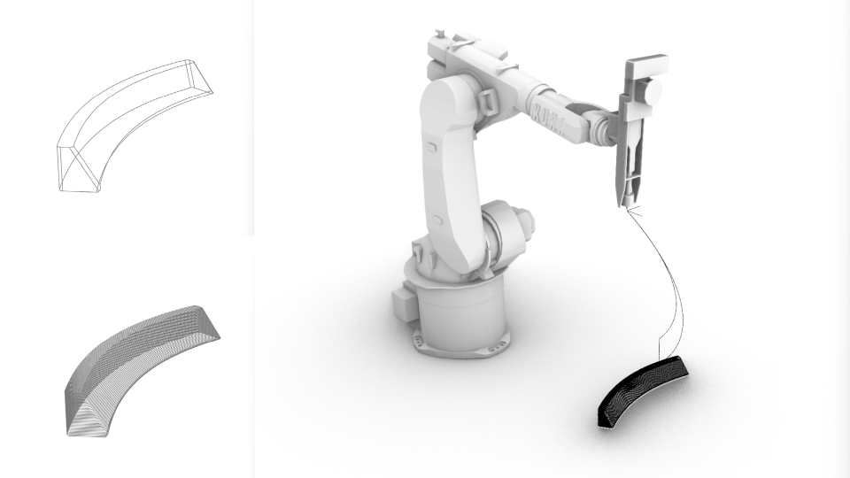
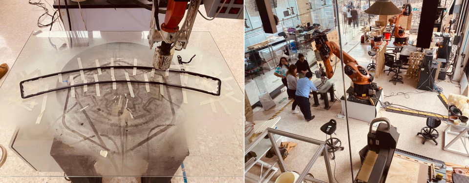
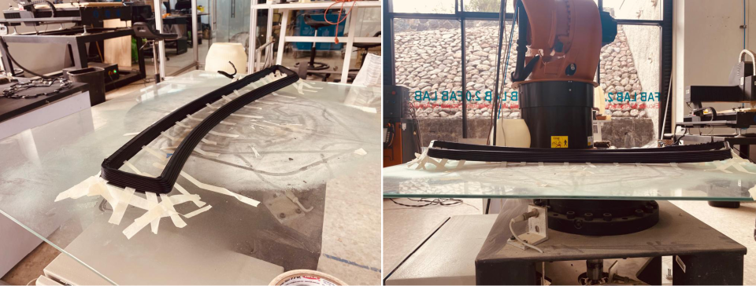
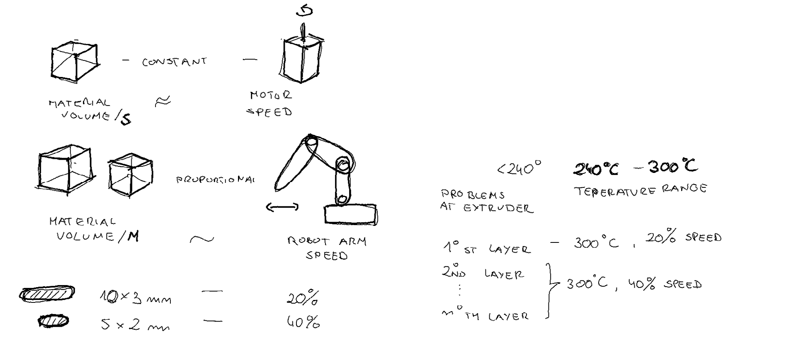
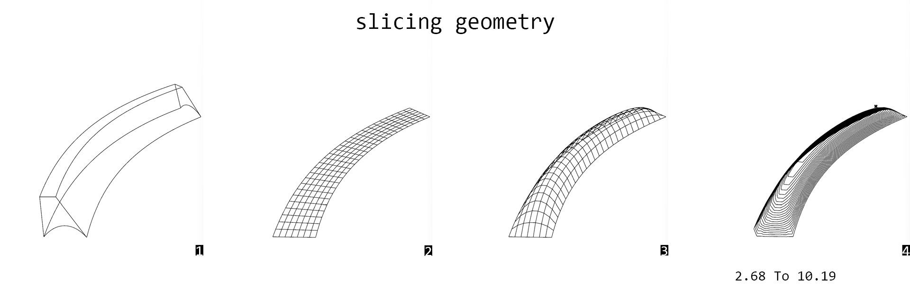
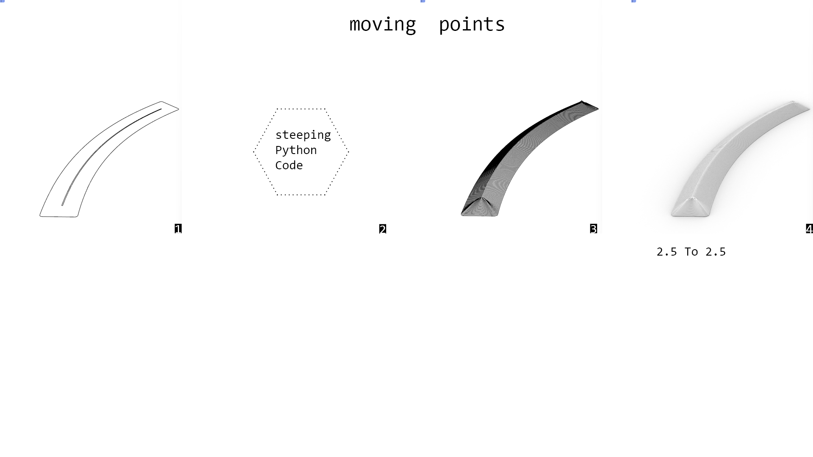
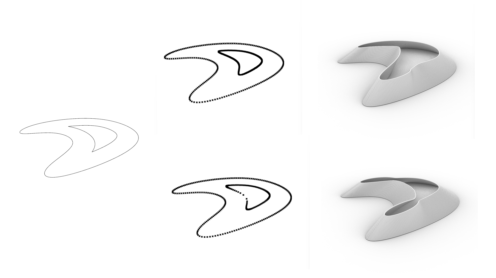
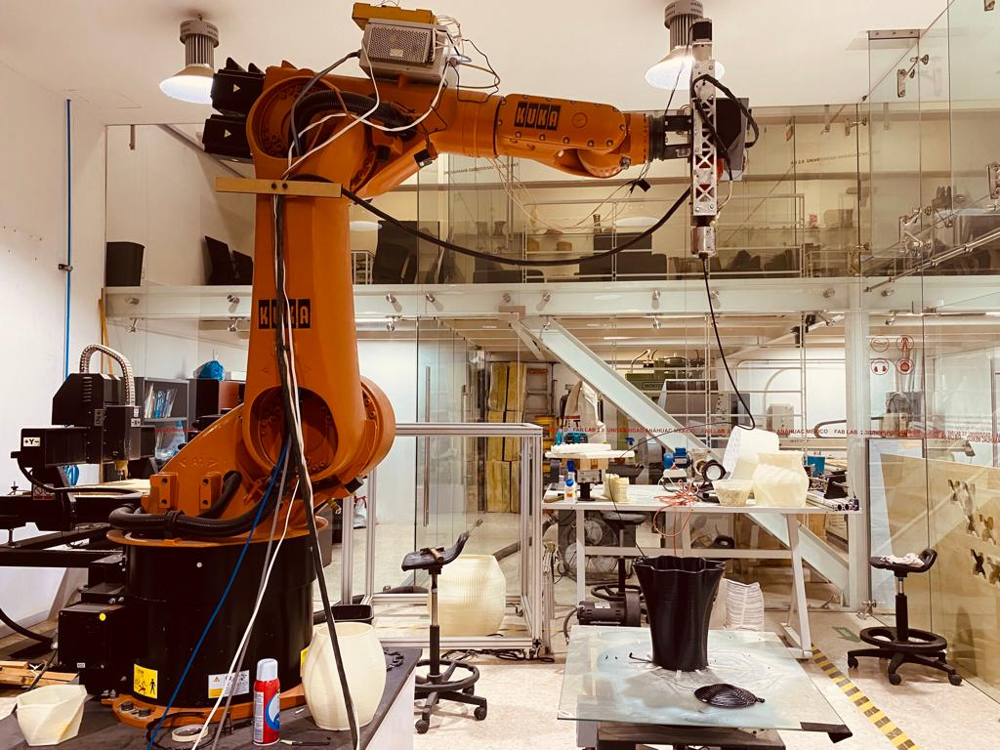

# **Week15.** Wild Card

|Assignment    |                          |
| ----------- | ------------------------------------ |
| *group*       |    - |
| *individual*      |        Design and produce something with a digital fabrication process (incorporating computer-aided design and manufacturing) not covered in another assignment, documenting the requirements that your assignment meets, and including everything necessary to reproduce it.|


## Photo of the week


## Lecture Notes




## Idea


To design support holders for the final project scaled gridshell in scale 1:5.  The holders were desinged to be possible to fit the structure legs into them or (for some unknown reasons occuring duting physical assembly) if this would be not possible, they can keep the structure from unfolding staying on the outside.

## First Print


**Grasshopper file**: [gh -file](../files/week15/230516-print1.gh){: print1 }

**Robot Path**: [src-file](../files/week15/230516-print1.src){: print1 }

**Fig.** Initial exitement - thinking its going well!


**Fig.** Huge contraction of plastic and failoure.


**Fig.** Some notes on Robot Printing.

## Bottom Design

The second leg was meant to be printed with the bottom, therefore I explored a few strategies. Firstly I added a catenary loft to the geometry of the support-leg. However this didn't work as the robot needs to have closed curves at each printing level.
**The bottom of the print needs to be double-curved to keep the closed curves as isolines.**

All of the below calculation are made on the assumption that extruded plastic is of 2.5mm diameter.


**Fig.** 1- initial piece, 2 - grid at the bottom surface, 3- FDM found geometry (funicular shape like bricks structures that can be build without support), 4. Slicing 2.5mm.

**Isolines with the same height can be too far from each other to be printed.**


**Fig.** 1- initial piece, 2 - bottom outline curve, 3- curves offsetted 2.2mm, 4. Vertical series move with 1.18mm between layers (calculated from Pitagoras).

**The corner point still are too far.**



**Path generation trials**: [gh-file](../files/week15/codigos bancos y espiral-JC-bottom-master.gh){: path generation trials }
**Fig.** 1- bottom outline and desired top outline, 2 code below, 3. generated polylines by iterative moving of the points from bottom outline, 4. render, assuming circural cross section of 2.5mm from extruder.


**Fig.** Bottom design with iterative point movement.

The python Grasshoper code for generating the points based on the bottom outline and desired top outline.

- x - points on the bottom outline
- xx - points desired top outline

```
__author__ = "judyt"
__version__ = "2023.05.15"

import rhinoscriptsyntax as rs
import ghpythonlib.components as gh
import math
import clr
from Grasshopper.Kernel.Data import GH_Path
from Grasshopper import DataTree

def nestedListToDataTree(nestedlist):
    dataTree = DataTree[object]()
    for i,item_list in enumerate (nestedlist):
        path = GH_Path(i)
        dataTree.AddRange(item_list,path)
    return dataTree

height = math.sqrt(d**2 - offset**2)
print height
xpoints = []
points = x
pointsX = xx
for i in range (y):
    newpointsX = []
    newpoints = []
    center = gh.Average(points)
    for j in range(len(points)):
        #vecXYdir = gh.Vector2Pt(points[j], center, True)
        vecXYdir = rs.VectorUnitize(rs.VectorCreate(pointsX[j],points[j]))


        vecXY = gh.Amplitude(vecXYdir, offset)
        vecZ = gh.UnitZ(height)
        vec = rs.VectorAdd(vecXY,vecZ)

        newpoint = gh.Move(points[j],vec)['geometry']
        newpointX = gh.Move(pointsX[j],vecZ)['geometry']
        print newpointX
        newpoints.append(newpoint)
        newpointsX.append(newpointX)
    xpoints.append(newpoints)
    points = newpoints
    pointsX = newpointsX

xpoints = nestedListToDataTree(xpoints)

```

**Fig.** Left: bottom curve and desired top curve, Right: results of the iterative point movement with different offset values.


**Fig.** Left: bottom curve and desired top curve, Right: results of the iterative point movement with different XY vector generation (top: equal division of curves, bottom: the closes point to the desired curve).


## Final Design
Bottom cone geometry generated with the script, with 5mm offset (XY distance between layers) and 2.5 height (in this case it was constant). In this example also offsetting and moving curves would work the same.

**Design & path generation**: [gh-file](../files/week15/SIN-VASE_JC_MASTER.gh){: final design }

**Robot path - vase with bottom**: [src-file](../files/week15/bottom.src){: robot path vase with bottom }

**Robot path - vase walls only **: [src-file](../files/week15/vase.src){: robot path vase walls only }


**Fig.** Bottom print.

- 1st layer, 300C, 10% speed
- 2-7th layer 300C, 20% speed
- 8-15th layer, 240C, 20% speed (but extruder was cooling down slowely, therfore the temperature between these layers varied between 300 and 240)


## Final Video
<video width="960"  controls>
  <source src="../../images/week15/WhatsApp Video 2023-05-16 at 23.12.38.mp4" type="video/mp4">
</video>


## Takeaways

- extruded plastic contracts a lot, linear elements almost impossible
- avoid sharp corners
- amount of extruded platic varies depending on the
