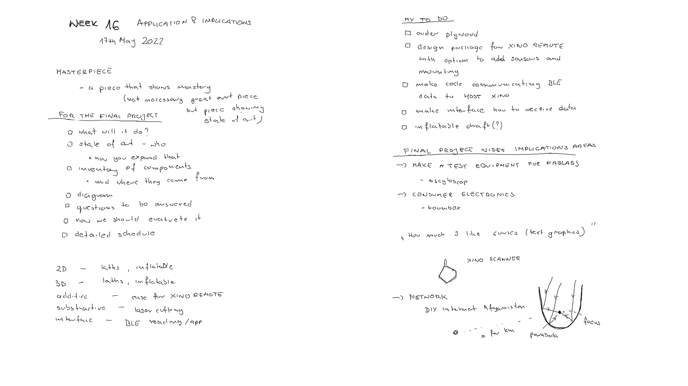
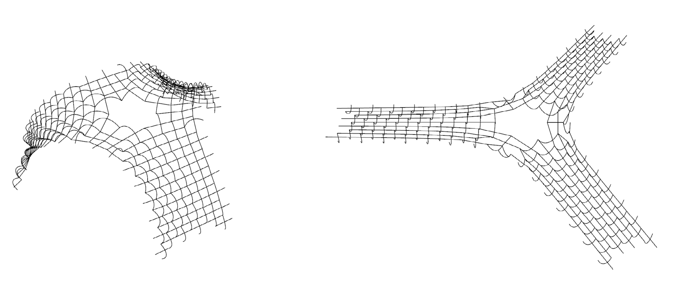
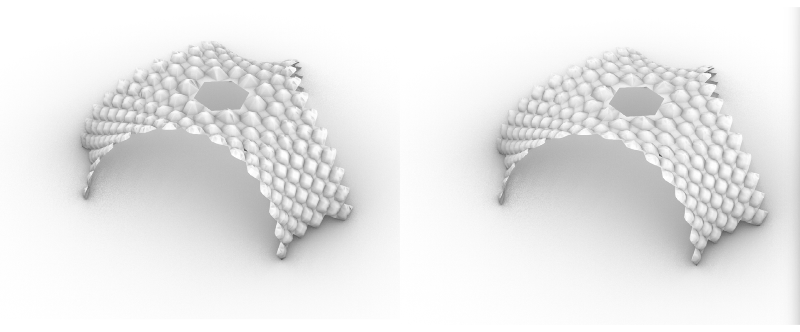

# **Week16.** Applications and Implications

|Assignment    |                          |
| ----------- | ------------------------------------ |
| *group*       |    - |
| *individual*      |        Propose a final project masterpiece that integrates the range of units covered, answering: What will it do? Who's done what beforehand? What will you design? What materials and components will be used? Where will come from? How much will they cost? What parts and systems will be made? What processes will be used? What questions need to be answered? How will it be evaluated? Your project should incorporate 2D and 3D design, additive and subtractive fabrication processes, electronics design and production, embedded microcontroller interfacing and programming, system integration and packaging. Where possible, you should make rather than buy the parts of your project. Projects can be separate or joint, but need to show individual mastery of the skills, and be independently operable |

## Photo of the week

## Lecture Notes

## Checkpoints
- [ ] what it will do?
    * [ ] logic diagram
- [ ] state of art - who did what in this topic?
    * [ ] how you expand it?
- [ ] inventory of Components and where they come From
- [ ] questions to be answered
- [ ] *how should we evaluate it?*
- [ ] detailed schedule

**What will it do?**

it will be a device for controlling the assembly stage (measuring height), which could be attached to the top of a structure both in the model and real scale. The device will be remotely through Bluetooth communicating with the host device reading the height (and alternatively controlling the assembly device e.g. pumped membrane).

**Who’s done what beforehand?**
State of art:

- [Sam Calish inflatables](http://fab.cba.mit.edu/classes/863.12/people/calisch/inflate/inflate.html)
- [how to make inflatables](https://www.instructables.com/Giant-Inflatable-Robot/)
- (https://www.softrobotics.io/)

**What will you design?**

- I will desing a kinetic model of a asymptotic gridshell with attached sensor working on battery, measuing height and communitcaint with the host board (-> for further control of the output assembly sytem - developed in later spirals)

**What materials and components will be used? Where will come from?How much will they cost?**
inventory of Components and where they come From

 |Part|Material   |    Amount/Count   | Price/unit|Cost|
 |---| ----------- | ----------------|------|----|
 |GRIDSHELL|[Plywood 0.8mm flex](https://thinplywood.com/product/koskiply-birch/) |0.154 m2 = 0.23 x 1PANEL 1.22mx1.22m| $38.60/unit|$8.74|
 |BASE| [MDF 3mm](https://www.sodimac.com.mx/sodimac-mx/product/448761/mdf-delgado-30-mm-122-x-244-cm/448761/) | 2m2 = 4 x PANEL 0.61 X 1.22 M |$4.79/unit|$19.16|
 |XINO HOST, XINO SLAVE	| PCB Proto Board FR1 (lab)| 2 copper board 15x15cm |$1.24/unit |$2.48|
 |XINO HOST, XINO SLAVE|[Seeed Studio XIAO nRFN5240](https://www.seeedstudio.com/Seeed-XIAO-BLE-Sense-nRF52840-p-5253.html) |2|$15.99/unit|$32.00|
 |XINO HOST, XINO SLAVE (lab)|0Ω resistor|x2|$0.09/unit|$0.18|
 |XINO HOST, XINO SLAVE (lab)|499 Ω resistor|x2|$0.09/unit|$0.18|
 |XINO HOST, XINO SLAVE (lab)|1kΩ resistor|x2|$0.09/unit|$0.18|
 |XINO HOST, XINO SLAVE (lab)|LED|x2|$0.35/unit|$0.70|
 |XINO HOST, XINO SLAVE (lab)|Button|x2|$1.00/unit|$2.00|
 |XINO HOST, XINO SLAVE (lab)|Female 1 row horizontal header|x6|$0.15/unit|$0.90|
|XINO SLAVE|[recharchable battery 3.7V](https://www.amazon.com.mx/gp/product/B08FD3V6TF/ref=ppx_od_dt_b_asin_title_s00?ie=UTF8&psc=1) |x1|$23.33/unit|$23.33|
 |**Total**||||**$87.37**|

**What parts and systems will be made?**

- asympritic gridhsell models
- 2 pcbs communicatin remotely

**What processes will be used?**

- gridshell model: laser cutting + (3D printing)
- PCB boards - CNC Machining
- BASE - CNC Cutting

**What questions need to be answered?**
- Should I get plywood from Europe or design the inflatable membrane?

- Device should monitor the height from the acetometer (difficult to calibrate) or should I use ultrasonic sensor?

- How to add the sensing of the presence under the pavilion?

**How will it be evaluated?**
- The design of the gridhshell structure is the most difficult and demading, it works as a mechanism.
The project is highly economical and material efficient and doesnt need glues or additional fasteners.  It should be evaluated as a design study on asymptotic gridshells and possible assembly ssystems and designed method of their control.

## Inflatable
1. Finding a simulation model where the lengths of the disassembled and assembled are almost identical. It required finding the same topology of the points from the simulation model.

2. Finding planes (panels) which could be inflated.

3. The main asymptotic curves have the same length, therefore let's try to find lengths of the diagonals in the disassembled and assembled state.

4. Projecting of the diagonals lengths in the disassembled and assembled state. Their lengths stand for the bottom and top layer of the fabric to be inflated.

5. Visualization of the inflated panels. It doesn't seem to be feasible to inflate panels.

6. Let's check which diagonals shorten the most. Left: black shorten, white-extend. Right: Diagonals shortening more than 15cm on the segment.

7. Making inflatable stipes makes it perfect.

8. The inflated stripes with exact height calculated from the disassembled state (fit loft).

9. Now only I need to figure out how to fabricate such a membrane :).

