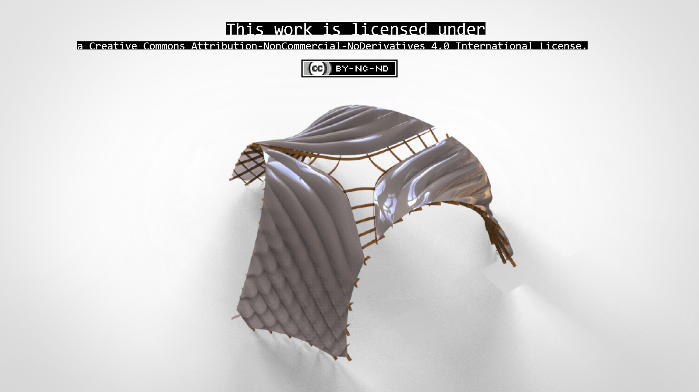

# **Week17.** Invention, Intellectual Property, and Income

|Assignment    |                          |
| ----------- | ------------------------------------ |
| *group*       |    - |
| *individual*      |       develop a plan for dissemination of your final project, prepare drafts of your summary slide (presentation.png, 1920x1080) and video clip (presentation.mp4, 1080p HTML5, < ~minute, < ~10 MB) and put them in your root directory |

## Photo of the week

## Lecture Notes

## Dissamination Plan

- by 01/06 struture fabricated
- by 03/06 PCB Slave attached to model and reading height
- by 06/06 signaling the height: physically- diode and remote BLE communication with HOST
- by 08/06 visual interpretation read by the HOST board
- by 10/06 integration of the design, additional sensor for presense?
- by 13/06 video

## Murphy Law- what can go wrong -Risk Management
- structure of the model can break -> change of the material or scale --> rather change of the scale, as I have only a lot of PET material available
- the calibration of the gyroscope and accelometer of the nRF52840 can be not callibrated enough to measure real height -> check what values it shows, when model fully assembled and mark the heighest point as assembled stage
- BLE communication between SLAVE and HOST can be lost/not working -> focus on the physical signal
- PCBs destroyed (connecting wrong the cables from battery?) -> reading the height with other sensors available

## Drafts of Slide and Video
this slide and video were referenced in the final directory for the presentation:

<video width="960"  controls>
  <source src="../../images/week17/presentation- draft.mp4" type="video/mp4">
</video>

Now the final video and slide are in the root directory and these files are referenced from the files for week 17. 
