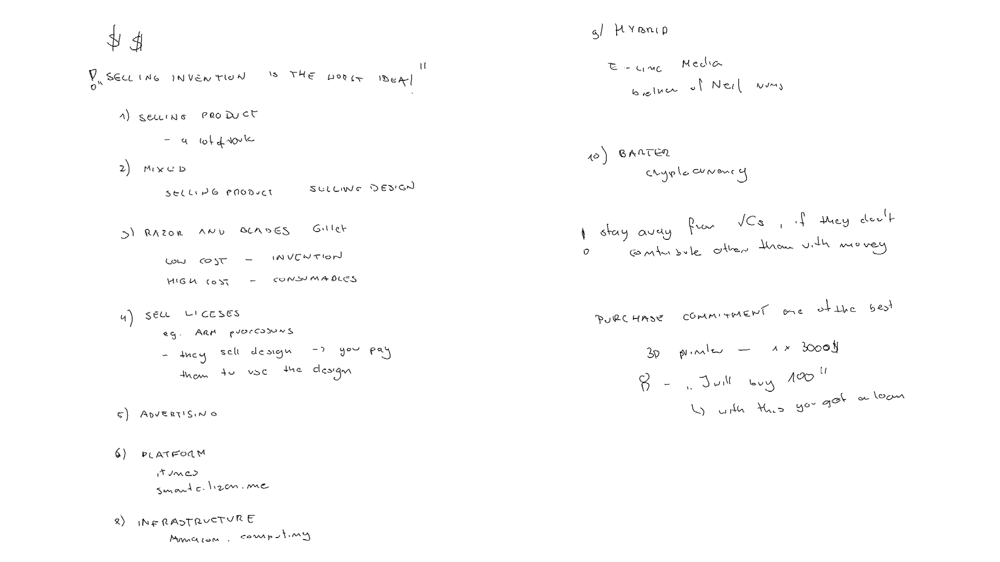

# **Week17.** Invention, Intellectual Property, and Income

|Assignment    |                          |
| ----------- | ------------------------------------ |
| *group*       |    - |
| *individual*      |       develop a plan for dissemination of your final project, prepare drafts of your summary slide (presentation.png, 1920x1080) and video clip (presentation.mp4, 1080p HTML5, < ~minute, < ~10 MB) and put them in your root directory |

## Photo of the week

## Lecture Notes

## Dissamination Plan

- by 01/06 struture fabricated
- by 03/06 reading height
- by 05/06 signaling the height: physically and remote BLE communication with HOST
- by 08/06 integration of the slave board in the Model
- by 10/06 integration of the design, additional sensor for presense?
- by 13/06 video

## Drafts of Slide and Video
referenced from the root directory

<video width="960"  controls>
  <source src="../../images/week17/presentation- draft.mp4" type="video/mp4">
</video>
