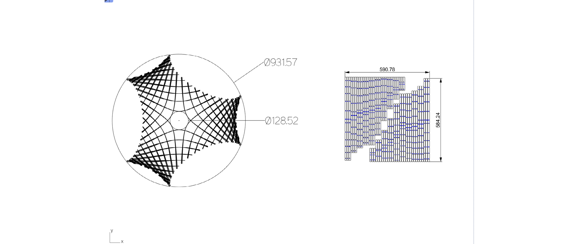
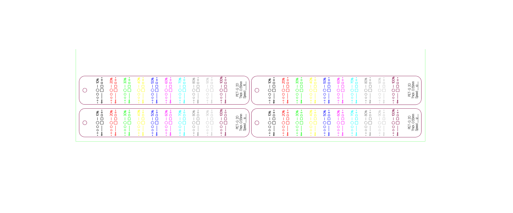
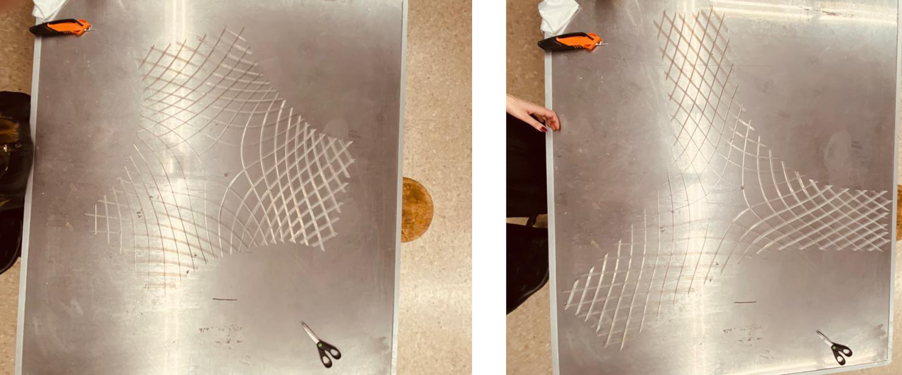
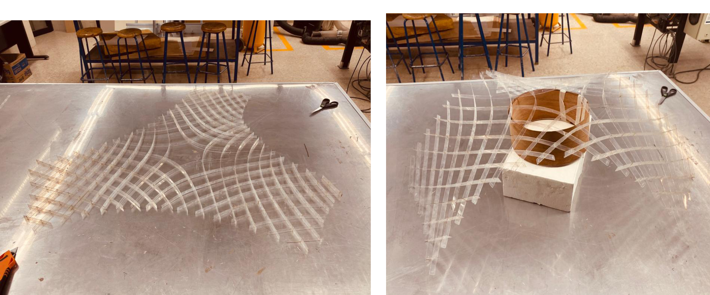

# **Week18.** Project Development

|Assignment    |                          |
| ----------- | ------------------------------------ |
| *group*       |    - |
| *individual*      |      Complete your final project, tracking your progress:what tasks have been completed, and what tasks remain? what's working? what's not? what questions need to be resolved? what will happen when? what have you learned?|

## Photo of the week

## Lecture Notes

## PET model

### Scale
Considering 1:5 and 1:10 scale of the model:

While 1:5 scale is mimics well the behavior of the structure, the limited access to the proper material resembling the stiffness 1:5 (thin plywood) is limited in Mexico (not available). Considering the available material PET, which thickness 1.18mm might somehow resemble the stiffness in scale 1:5, but its not cut fine enough with the available laser. And finally taking into account model 1:5  has 1.8m at the base and cannot be assembled by one person easily:

-> **scale 1:10 was selected**

The scale 1:10 also has a prriopiate lenght of the laths to be cut on th laser with bed size 960x610 (860x600).

### Materials

Calculating the rotational freedom as the slot width:

|Material|  thickness|  50| 60  |70  |**75**  | 80 |90  |   
|--------| ----------|----| ----|----|--------|----|----|  
|PET 20  | 0.55mm    |1.18| 0.95|0.79|**0.72**|0.66|0.55|  
|PET 30  | 0.74mm    |1.59| 1.28|1.06|**0.96**|0.88|0.74|
|PET 40  | 1.18mm    |2.53| 2.04|1.69|**1.54**|1.41|1.18|

### Samples

**Color scheme**

|Priority|  power |  color  | RGB        |
|--------| -------|---------| -----------|
|1       | 10%    |black    | 0,0,0      |  
|2       | 20%    |red      | 255,0,0    |
|3       | 30%    |green    | 0,255,0    |
|4       | 40%    |yellow   | 255,255,0  |
|5       | 50%    |blue     | 0,0,255    |
|6       | 60%    |magenta  | 255,0,255  |
|7       | 70%    |cyan     | 0,0,255    |
|8       | 80%    |grey dark|128,128,128 |
|9       | 90%    |grey     |192,192,192 |
|10      | 100%   |white    |255,255,255 |
-> laser can have problems with black and white, better to use other recognized colors
|10 (cut)      | S min cutting line speed P100%   |indigo   |128,255,128|
|11 (engrave)  | S 100% P 80%   |grey     |64,64,64   |
|12 (no print) | S100% P 0%     |greenish |128,255,128|

**PET-G 20 0.55mm**

For the PET20, thickness 0.55mm the following samples where tested:

- S15P100 - doesnt cut the edge well,details up to 2mm fine
- S13P100 - doesnt cut the egde well, details up to 1mm fine
- **S11P100** - cuts, well the long lines, small slot detail cut fine, minimum speed with 100% power to cut material through on long lines
- S10P100 - cuts well the long lines, might burn details

Kerf for **S11P100**:
for pocket 1.0mm, the real size after cutting with S11P100%: 1.12mm, 1.14mm, 1.24mm. This variation is a result of material folding on the bed and the bed not being flat and some cuts were out of focus -> slot size in design file should be around **0.15mm** smaller than needed to result in proper size after cutting

- Overall: **S11P100**:
- Divided: ->**S10P100**/**S11P100** - long Lines ->**S13P100** - details

**PET-G 30 0.74mm**

For the PET30 the following samples where tested:

- S11P100 - doesn't cut the edge well,
- **S10P100** - cuts well the long lines, small slot detail cut fine, minimum speed with 100% power to cut material through
- S09P100 - cuts well the long lines, might burn details
- S08P100 - cuts well the long lines, might burn details

The minimum speed with 100% power to cut material through: 10
Kerf for **S10P100**:
for pocket 1.0mm, the real size after cutting with S10P100%: 1.22mm, 1.24mm. This variation is a result of material folding on the bed and the bed not being flat and some cuts were out of focus-> slot size in design file should be around **0.24mm** smaller than needed to result in proper size after cutting.

- Overall: **S10P100**:
- Divided: ->**S10P100**/**S09P100** - long Lines ->**S11P100** - details

### 1:10 V2 PET 20, 0.55mm, pocket design size 1.0mm S11P100**
Settings:
CUT: S11P100 -> some elements hard to remove from sheet, detail fine, time of cutting V2:14m59s
ENGRAVE: S80P65 - engrave fine, time:22m44s
total time: 38min

### 1:10 V2 PET 30, 0.74mm, pocket design size 1.0mm S08P100**
Settings:
CUT: S08P100 -> elements easy to remove from sheet, detail too rough, time of cutting V2: 17m25s (2m25s slower than S08)
ENGRAVE: S100P75 - engrave fine, time: 22m05s (40s faster than S80)
total time: 40min

## Key take aways:

- better to cut without the foil, elements might be burned a little bit, but after cutting, foil can burn a little to the PET and its very difficult to remove, also scrabbing it from the engraved places is difficult, foil also makes it harder to get elements out of the sheet
- it's difficult to find the right proportion between the scale of the model and the detail with which the laser can cut out material: for PET20 scale model 1:10 is not stiff enough, but we get a fine detail, for 1:10 PET30 with  **S10P100** we get fine detail, but some elements might be hard to get from the sheet, while **S08P100** burns the detail too much and the pieces cannot be fit with tolerances to
- PET20, S11P100 - optimal setting for cutting with details
- PET30, S10P100 -  optimal setting for cutting with details
- it would be helpful to have the small details curves on the separate layer, this would help to make elements cut well and preserve the details
- 1:10 PET 20 is too weak -> go smaller scale( 1:18?) -> cutting with **S11P100**, and pocket for 75deg freedom 0.72mm - kerf 0.15mm = **0.58mm**
- 1:10 PET 20 with pockets 1mm, resulting in 1.12-1.22mm allows to rotate to 50 deg and assemble it flat effortlessly, but doesn't make the structure to keep the shape (**smaller tolerances keep the shape close to 90deg as in the final shape after assembly-> tolerance 1/4 of the thickness (with accounted kerf)**)
- 1:10 PET 20 with pocket deign size 1.0mm, real size around 1.22mm is good for the kinetic structure, makes it easy to assemble as flat, but makes it too free for the desired final shape -> go smaller tolerances
-

## Next Steps:

 - design 1:18 model for PET 20 allowing 75deg rotation (0.72mm), design size including kerf for S11P100 (0.15mm): 0.58mm -> risk: the pockets too small to get them out of the sheet -> the same model without the holding bump detail or the same model with slower speed on long lines

 - design 1:10 model for PET 30 allowing 75deg rotation (0.96mm), design size including kerf for S10P100 (0.24mm): 0.72mm -> risk the elements might be hard to get them out of the sheet -> the same model with slower speed on long lines (10-9-8) and higher speed on details (10-11-12)-if the model is too weak -> scale downgrade (1:8?)

## Final Project
**what tasks have been completed?**
- fabrication script for unrolling and taging the laths
- pcb host and slave remote communication
- design for 3D printed supports

**and what tasks remain?**

 - finding plywood material replacement & fabrication of structure model
 - desiging the middle part with attached board (some flex material?)
 - calibration of the IMU reading and sending it remotely to the host and/or signalling physically
 - optionally sensing occupancy

**what's working?**

- fabrication script for unrolling and taging the laths
- pcb host and slave remote communication
- slave pcb working on battery

**what's not?**

- measuring the height from the IMU sensor (calibration)
- printing supports with large 3D plastic extrudered failed

**what questions need to be resolved?**

- which material will be working for 1:5 model if not plywood
- how to read the height from IMU sensor
- how to communicate physically when certain height was reached
- how to send it through BLE to the host

**what will happen when?**

- by 01/06 struture fabricated
- by 03/06 reading height
- by 05/06 signaling the height: physically and remote BLE communication with HOST
- by 08/06 integration of the slave board in the Model
- by 10/06 integration of the design, additional sensor for presense?
- by 13/06 video

**what have you learned?**

- the Key Take aways are listened on the [final project website](../projects/final-project.md) at the end of each week section
