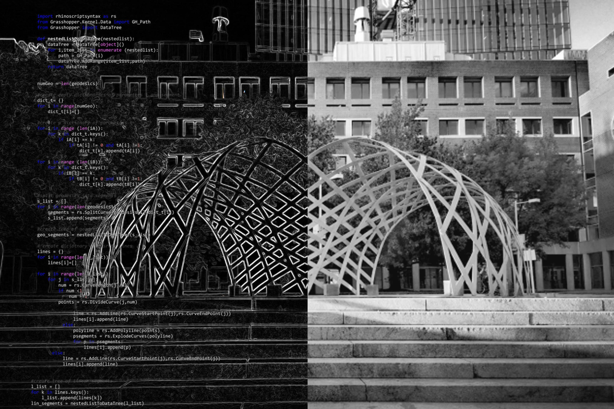

# Home

Fig. Inframe pavilion. Boston. 2019. @judycurie

## Hello, digital world! | Hello, physical world! 
by
### Judy Curie | Judyta Cichocka

## Fab Foundation Poland

This course is meant to be a great start to the Fab Foundation Poland - a Polish daugther of the [Fab Foundation](https://fabfoundation.org/). The Fab Foundation Poland aims to brige the digital and conduct applied research into digital design & fabrication. The actions of the Fab Foundation Poland are primarly aimed for people living currently in Poland: Poles, Ukraininans and other people needing community, new job skills or a digitally fabricated house! 

