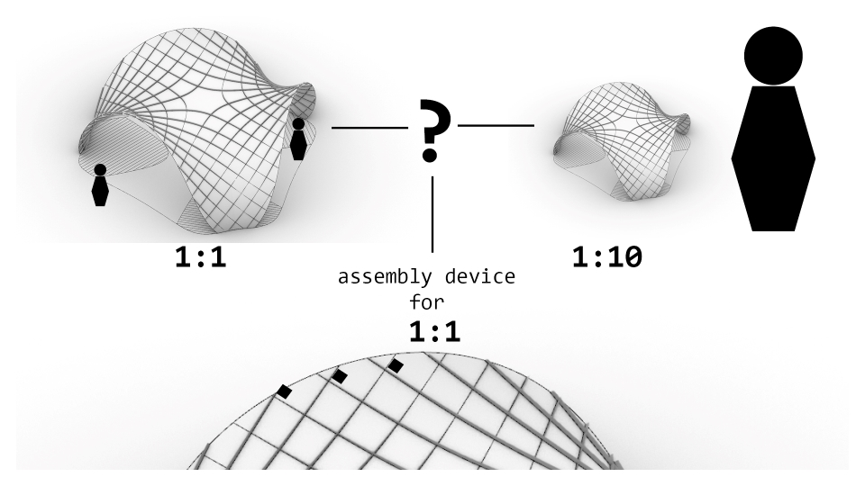

# Final Project

## (A) device for the asymptotic gridshell structure

My participation in Fab Academy 2023 is sponsored by European Union  (EU funding: 101033646).
One of the goals of my OPTIshell research project is to build a prototype of the timber solar canopy structure covered with the PV material.
More about the project [optishell.io](https://optishell.io/).
During Fab Academy I would like to build a stiffness-scaled model and design a device for automated assembly.

**Fig.** Conceptual model.

**Fig.** (A)ssembly device? - Final project dilemma.

**Fig.** (A) sensing device that can work for the real pavilion and a scaled model.

## **Week 01**- Project Objectives
Base idea: a 1:10 model from laser cut thin plywood, filling the spaces with the plate panels, 3D print the foundation structures.

IO additions and difficulty level (+++):
:	add PV elements on some of the plates, connect to battery and show the level of the battery (++);create a sensor at the bottom to remotely display if the place is occupied (+);create a simple machine to erect the structure e.g. an extendable tube in the middle(+++);add sensor of the wind to inform if the wind is too strong (alternatively dismount) (+++)

**Spiral Development**

**Spiral 01 Objectives:**

- [ ] 1) static 1:10 stiffness-scaled model from laser cut thin plywood - single layer laths,

- [ ] 2) filling the spaces with the plate panels

- [ ] 3) 3D printed the foundation structures

- [ ] 4) IO - a sensor showing if the space is occupied (remotely)?

**Spiral 02: Objectives:**

- [ ] 1) a static 1:10 stiffness-scaled model from laser cut thin plywood - double layer laths,

- [ ] 2) filling the spaces with the plate panels + cover with small solar cells

- [ ] 3) 3D printed the foundation structures + installed batteries

- [ ] 4) IO - a sensor showing if the space is occupied (remotely)? + level of battery display

**Spiral 03: Objectives:**

- [ ] 1) a KINETIC 1:10 stiffnes-scaled model from laser cut thin plywood

- [ ] 2) filling the spaces with the plate panels + cover with small solar cells

- [ ] 3) 3D printed the foundation structures + installed batteries

- [ ] 4) IO - a sensor showing if the space is occupied (remotely)? + level of battery display

- [ ] 5) a small machine for self-assembly

## **Week 02** - Architectural Design

I reviewed some research papers about asymptotic gridshells.

1. Asymptotic Gridshells - applications and analysis. [paper](https://www.behance.net/gallery/86066625/MT-Asymptotic-Gridshells-applications-and-analysis)

2. DESIGN AND CONSTRUCTION OF THE ASYMPTOTIC PAVILION [paper](https://mediatum.ub.tum.de/doc/1468899/1468899.pdf)

3. The design, fabrication and assembly of an asymptotic timber gridshell. [paper](https://www.researchgate.net/publication/336367443_The_design_fabrication_and_assembly_of_an_asymptotic_timber_gridshell)

4. Morphology of Kinetic Asymptotic Grids. [paper](https://eikeschling.com/2022/09/23/morphology-of-kinetic-asymptotic-grids/)

5. Designing Asymptotic Geodesic Hybrid Gridshells. [paper](https://eikeschling.com/2022/09/05/designing-asymptotic-geodesic-hybrid-gridshells/)

 “if surface is completely minimal, the asymptotics in the gridshell will coincide perfectly perpendicular, which result in torsion-free nodes and straight strips” (Eike Schling, 2018)

**Design goal**

A small scale roof structure/ a canopy, which can be built without a building permit, providing a sheltered space from the rain and the sun.

- [ ] 1) timber gridshell from flat straight planks

- [ ] 2) covered with watertight matter

- [ ] 3) assembly from flat

- [ ] 4) approx. coverage area 35m2

**Geometric Requirements**

**Table 1.** Geometric requirements for asymtotic gridshell.

**Proposals V1 V2**

Taking into consideration the geometric requirements, 2 subsurfaces were cut out of the minimal surface Enneper 3. The asymptotic curves were found with the custom-scripted component for Grasshopper.

**Fig 1.** Geometric comparison of the V1 and V2 proposals.

Two proposal V1 and V2 can be built as a stand-alone structures. However for the modular assembly is important for the possibilities to cover large spaces. Some modular arrangements are presented below.

**Fig 2.** Modular arrangements - top view.

**Fig 3.** Modular arrangements - isometry.

## **Week 03**- Prototyping Fabrication

I prepared the first model from the thin plywood to test the unrolling script.

<iframe width="960" height="315" src="https://youtube.com/embed/Y_U2DWwXKLk" frameborder="0" allow="autoplay; encrypted-media" allowfullscreen></iframe>

**Key take aways:**

 - the material thickness was around 0.88mm, and the slot has 1mm width, not taking into account kerf, allowing on the rotation around 75deg -> this caused difficulty to assemble it in the flat state, but also triggered the self-assembly effect
 - larger tolerances on joints cause that elements that has few connections required fastening to not fall off from the flat model State

 **Next steps:**

  - accounting for kerf, and the mobility of 60 deg will help in the flat assembly, but decrease the self assembly "willingness"
  - self-interlocking joint would allow to keep the larger tolerances and prevent from falling of elements in the flat state

## **Week 04**- Assembly Mechanism Ideas

Assembly Mechanism Ideas

The inflatable one seems like one that could be multi-scale: resemble quite fine the real properties in the scaled model.

## **Week 05**- Rotational Joint Design

I developed a kinetic 3D printed joint that doesn't need glue.

**Fig.** The best working dimensions for the joint model for the lath in scale 1:18 (1cm width).

Please see the [3D Scanning and Printing Assigment](../assignments/week05.md) for further details.
## **Week 06** - Structural Analysis: Single vs Double Layer

**Design Workflow**
Realizing the complexity of the asymptotic gridshell design enabling erection from a flat grid.

source: 
Schling, E., &#38; Schikore, J. (2022). Morphology of Kinetic Asymptotic Grids. In C. Gengnagel (Ed.), <i>DMS 2022, Towards Radical Regeneration</i> (pp. 374–393). Springer Nature Switzerland.

**Structural Analysis**

Lath: 10cm width, 2x6.5mm thickness (double)

Material: wood 'birch' E:910[kN/cm2] G12:360[kN/cm2] G3:360[kN/cm2] gamma:4.5[kN/m3] alphaT:5.0E-6[1/C°] ft:3.8[kN/cm2] fc:-3.8[kN/cm2]

Total mass: 131.504203kg

<video width="960"  controls>
  <source src="../../images/230329_analysis.mp4" type="video/mp4">
</video>
**Video**Double layer: Deformation of the structure factorized 0-20: Left - gravity, Right: Wind.

|Analysis|    Gravity                      | Wind 0.365kN/m2|
| ----------- | ------------------------------------ |--|
|Load Case| 1.4D | 0.9D + 1.0W|
| displacement [cm]     | 1.8 | 2.87|
| Buckling Factor    | 79| 49|

Lath: 10cm width, 6.5mm thickness (single)

Material: wood 'birch' E:910[kN/cm2] G12:360[kN/cm2] G3:360[kN/cm2] gamma:4.5[kN/m3] alphaT:5.0E-6[1/C°] ft:3.8[kN/cm2] fc:-3.8[kN/cm2]

Total mass: 65.752102kg

- [model folding](https://youtube.com/embed/Y_U2DWwXKLk)
**Video** Single layer: Deformation of the structure factorized 0-20: Left - gravity, Right: Wind.

|Analysis|    Gravity                      | Wind 0.365kN/m2|
| ----------- | ------------------------------------ |--|
|Load Case| 1.4D | 0.9D + 1.0W|
| displacement [cm]     | 5.7 | 17.8|
| Buckling Factor    | 25| 8|
|Energy|0.009754 |0.087255|

**Key take aways:**

 - double-layer necessary for timber structures (or alternative stiffening strategies for single layer structure)

 - the stiffness scaled model should account for double layer thickness in real pavilion

## **Week 07** - Simulation & Angle Calculation (tolerances indication)
Simulation of assembly-disassembly with different rotation DOF at joints.

**Key take aways:**

 - the angle between joints change more further from the center -> joints closer to legs(supports) need more rotational freedom

 - the joints should allow movement 75-90 deg (more is not necessary e.g. most right example)

## **Week08** - Feasibility study for artificial muscle folding

Small research on artificial muscles - dielectric elastomer actuators ( Electroactive Polymers)

[paper1](https://link.springer.com/article/10.1007/s42558-019-0005-1)
[paper2](https://www.science.org/doi/10.1126/science.1246906)

https://fab.cba.mit.edu/classes/865.18/motion/dielectric/index.html

nylon liner material actuators (NLMAs):

[artificial muscle at home](https://www.instructables.com/Fabricating-Fishing-Line-Artificial-Muscle-at-Home/)
Shape memory wire:
https://www.youtube.com/watch?v=2YVwpBAiA1A&t=39s
https://fab.cba.mit.edu/classes/863.22/doc/ArtificialMuscles/artificialmuscles.html
http://fab.cba.mit.edu/classes/863.10/people/jie.qi/jieweek10.html

Manufacturers:
https://www.pi-usa.us/en/products/piezo-actuators-stacks-benders-tubes/

*Application fields: Industry and research. Can also be applied to curved surfaces or used for integration in structures. For adaptive systems, energy harvesting, structural health monitoring.*
[link](https://www.pi-usa.us/en/products/piezo-actuators-stacks-benders-tubes/p-876-duraact-patch-transducer-101790#downloads)

|Line Segments    |1|2|3|4|5|6|7|8|
| -----------   |---|---|---|---|---|----|----|----|
| **Set1-3D**   |0.75|0.88|0.70|0.62|0.60|0.59|0.60|0.36|
| **Set2-Flat** |0.84|0.91|0.72|0.63|0.61|0.62|0.65|0.41|
| **Difference Set1-Set2**| +0.09|+0.03|+0.02|+0.01|+0.01|+0.03|+0.05|+0.08|

Trying to find a function of the geodesic wire extension:

- Linear regression: set2 = 0.184 + 0.977 * set1

- Polynomial regression: set2 = -0.221 + 3.776 * set1 - 12.416 * set1^2 + 16.306 * set1^3 - 8.350 * set1^4 + 1.647 * set1^5

- Pearson correlation coefficient (-1 (perfect negative correlation) to 1 (perfect positive correlation)):  0.962

**Key take aways:**

 - if the artificial muscle is a geodesic can be a "tape" (wide), if is not a geodesic curve should be a wire with rotational cross section

 - the artificial muscle should shrink about 5% (for the flat structure 75-90 angle at joints)

 - middle cell of the structure moves only vertically during assembly and almost doesn't change the shape between flat (dissemble state) and erected (assemble state) -> possibility to mount one stiff panel

## **Week 09** - Testing Interlocking Connections

As for one-time assembly the kinetic joints might not be necessary and it will be enough to account for the rotation between flat and fully assembled state providing adequate tolerances in slots. However, as the slots are bigger to allow some rotation they also cause the problem of elements sliding from each other in the flat state.

Material: PET, 1.18mm
The laser either didnt cut through or removed the bumps. The pocket size made a difference in the possible rotations at joints.

The best worked the cut on the small machine with:
cut - s4.0, 75p
engrave - s80 p65

with the kerf:

- clear - **0.8** - 1.45, 1.28 (0.4-0.65mm kerf - slower on arc)

- pocket - **1,65** - 1.76, 1.81 (0.1-0.15mm kerf - line cut)

big machine:
cut: s3.0, p90
engrave: s80 p70

- clear - **0.8** - 1.47, 1.52 (0.67-0.72mm kerf - slower on arc)

- pocket - **1.65** - 1.87, 1.95 (0.22-0.30mm kerf - line cut)

**Key take aways:**

 - the scaled model needs to be larger than scale 1:18 or 1:10 to be cut with laser and these joints
 - the bump needs to be bigger than kerf on arc cut

##**Week 10** - Structurally Feasible 1:1 model

For the kinetic-actuated assembly with simple joints (cuts in the laths), I have to keep the structure of the asymptotic gridshell from a single layer of asymptotic laths. However, as the structural analyis shows above, the structure is too weak with the single layer plywood laths 6.5mm thick. Increasing thickness is not possible due to the bending (thicker material cannot bend that easily and can easily break- casuing structural failoure). The project assumption is to use kinetic movement for assembly (and maybe dissasembly), prefarably only once in the Life Cycle of the structure - to assemble it on the site. The assembly device should work as assembler of the sttucture and not as a kinetic actuator for the kinetic sculpture. Therefore to keep the single layer of the asymptotic grid (which can be easily assebmled from flat), I added a developable plates, which will be mounted between laths after assembly to check the structureal performance.

**Key take aways:**

 - assuming the 1:1 gridshell structure with filling developable plates the structural performance is

 **Next steps:**

  - calculation of the material thickness for 1:5 stiffness scaled model  -> testing the kinetic joints with tolerances - > preparation of the fabrication files

##**Week 11** - Sensing ideas
Some Ideas of the Input Devices for OPTIshell:

##**Week 12** - PCB design
Xino-remote with battery concepts:

##**Week 13** - PCB fabrication
Setting up BLE communication between two nRFN5240.

<video width="960"  controls>
  <source src="../../images/week13/WhatsApp Video 2023-05-03 at 12.55.21.mp4" type="video/mp4">
</video>

##**Week 14** - Stiffness-scaled model
Calculating the thickness of plywood for stiffness-scaled model 1:5.

|Analysis Model|   1:1          | 1:5|
| ----------- | ----------------- |--|
|Load Case 1.4D|6.4mm x 10cm, single, **5cm** | disp.**1cm**, thickness x width: 0.5mm x 20mm|
|Load Case 1.4D|6.4mm x 10cm, single + 0.5mm thick plates, disp.**0.19cm** | **0.04cm**, xx|
|Load Case 1.4D|6.4mmx10cm, double, **1.8cm** |thickness x width: 1.0mm x 20mm, disp.**0.34cm**|

**Grasshopper-Karamba Analysis**: [gh -file](../files/final/230510_V2_analysis.gh){: 230510_V2_analysis }

**Fig.**. Stiffness scaled model. Left: The real structure laths 6.5mmx100mm double layer, Birch plywood, Right: model 1:5 laths 1mmx20mm, single layer Birch.

##**Week 15** - 3D printed supports
3D printed support design for the 1:5 model.

More about the design and fabrication process: [week15](../assignments/week15.md)

##**Week 16** - Assembly membrane
Membrane Design resembling the shortening of the diagonals:

More about the design process: [week16](../assignments/week16.md)

##**Week 17** - IP, Planning
Materials and planning

Alternative Materials (PET/Aluminum) available in CDMX:https://www.acriplass.com

http://www.acriplass.com/blog/wp-content/uploads/2020/02/ACRIPLAS_MEXICO_CATALOGO_ACRILICOS.pdf

CC - Creative Common License:

##**Week 18** - Aluminum Model
Aluminum model 1:5.

More about the design process: [week18](../assignments/week18.md)
