# Final Project

## (A) device for the asymptotic gridshell structure

My participation in Fab Academy 2023 is sponsored by European Union  (EU funding: 101033646).
One of the goals of my OPTIshell research project is to build a prototype of the timber solar canopy structure covered with the PV material.
More about the project [optishell.io](https://optishell.io/).
During Fab Academy I would like to build a stiffness-scaled model and design a device for informed assembly.

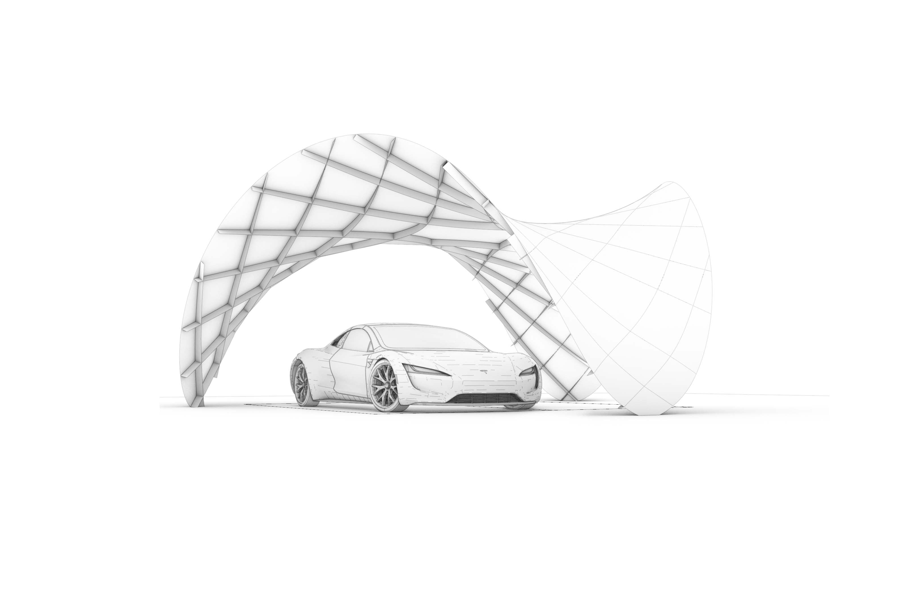
**Fig.** Conceptual model.


**Fig.** (A) sensing device that can work for the real pavilion and a scaled model.

## **Week 01**- Project Objectives
Base idea: a 1:10 model from laser cut thin plywood, filling the spaces with the plate panels, 3D print the foundation structures.

IO additions and difficulty level (+++):
:	add PV elements on some of the plates, connect to battery and show the level of the battery (++);create a sensor at the bottom to remotely display if the place is occupied (+);create a simple machine to erect the structure e.g. an extendable tube in the middle(+++);add sensor of the wind to inform if the wind is too strong (alternatively dismount) (+++)

**Spiral Development**
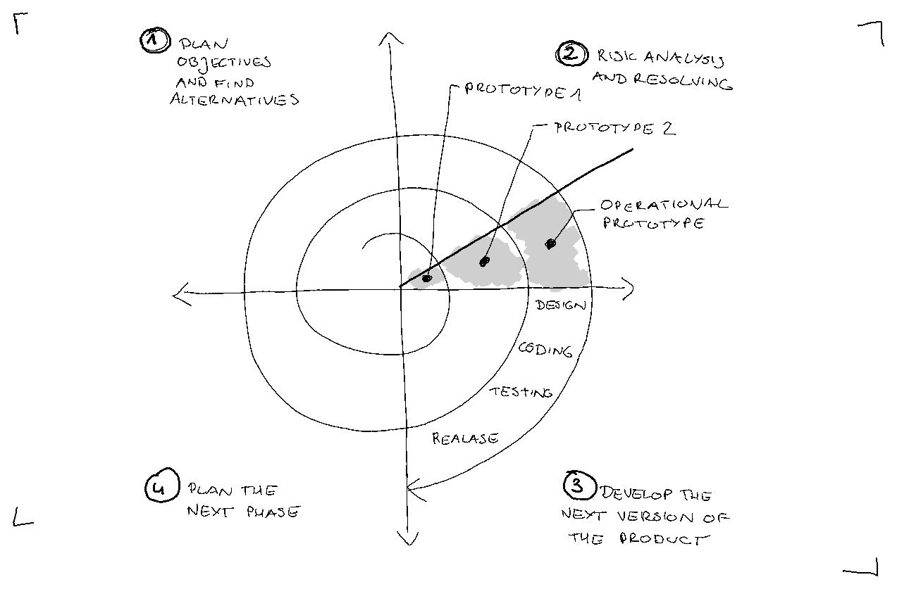

**Spiral 01 Objectives:**

- [ ] 1) static 1:10 stiffness-scaled model from laser cut thin plywood - single layer laths,

- [ ] 2) filling the spaces with the plate panels

- [ ] 3) 3D printed the foundation structures

- [ ] 4) IO - a sensor showing if the space is occupied (remotely)?


**Spiral 02: Objectives:**

- [ ] 1) a static 1:10 stiffness-scaled model from laser cut thin plywood - double layer laths,

- [ ] 2) filling the spaces with the plate panels + cover with small solar cells

- [ ] 3) 3D printed the foundation structures + installed batteries

- [ ] 4) IO - a sensor showing if the space is occupied (remotely)? + level of battery display

**Spiral 03: Objectives:**

- [ ] 1) a KINETIC 1:10 stiffnes-scaled model from laser cut thin plywood

- [ ] 2) filling the spaces with the plate panels + cover with small solar cells

- [ ] 3) 3D printed the foundation structures + installed batteries

- [ ] 4) IO - a sensor showing if the space is occupied (remotely)? + level of battery display

- [ ] 5) a small machine for self-assembly

## **Week 02** - Architectural Design

I reviewed some research papers about asymptotic gridshells.

1. Asymptotic Gridshells - applications and analysis. [paper](https://www.behance.net/gallery/86066625/MT-Asymptotic-Gridshells-applications-and-analysis)

2. DESIGN AND CONSTRUCTION OF THE ASYMPTOTIC PAVILION [paper](https://mediatum.ub.tum.de/doc/1468899/1468899.pdf)

3. The design, fabrication and assembly of an asymptotic timber gridshell. [paper](https://www.researchgate.net/publication/336367443_The_design_fabrication_and_assembly_of_an_asymptotic_timber_gridshell)

4. Morphology of Kinetic Asymptotic Grids. [paper](https://eikeschling.com/2022/09/23/morphology-of-kinetic-asymptotic-grids/)

5. Designing Asymptotic Geodesic Hybrid Gridshells. [paper](https://eikeschling.com/2022/09/05/designing-asymptotic-geodesic-hybrid-gridshells/)


 “if surface is completely minimal, the asymptotics in the gridshell will coincide perfectly perpendicular, which result in torsion-free nodes and straight strips” (Eike Schling, 2018)

**Design goal**

A small scale roof structure/ a canopy, which can be built without a building permit, providing a sheltered space from the rain and the sun.

- [ ] 1) timber gridshell from flat straight planks

- [ ] 2) covered with watertight matter

- [ ] 3) assembly from flat

- [ ] 4) approx. coverage area 35m2


**Geometric Requirements**


**Table 1.** Geometric requirements for asymptotic gridshell.

**Proposals V1 V2**

Taking into consideration the geometric requirements, 2 subsurfaces were cut out of the minimal surface Enneper 3. The asymptotic curves were found with the custom-scripted component for Grasshopper.


**Fig 1.** Geometric comparison of the V1 and V2 proposals.

Two proposal V1 and V2 can be built as a stand-alone structures. However for the modular assembly is important for the possibilities to cover large spaces. Some modular arrangements are presented below.

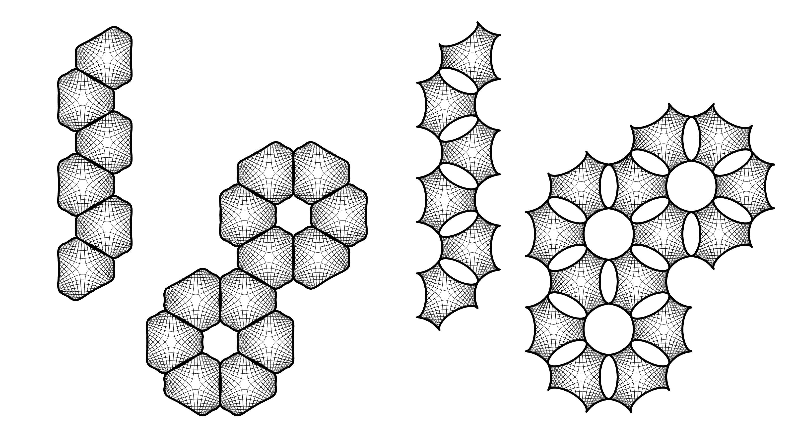
**Fig 2.** Modular arrangements - top view.


**Fig 3.** Modular arrangements - isometry.

## **Week 03**- Prototyping Fabrication

I prepared the first model from the thin plywood to test the unrolling script.

<video width="960"  controls>
  <source src="../../files/week03/WhatsApp Video 2023-02-13 at 19.02.52.mp4" type="video/mp4">
</video>


**Key take aways:**

 - the material thickness was around 0.88mm, and the slot had 1mm width, not taking into account kerf, allowing on the rotation around 75deg -> this caused difficulty to assemble it in the flat state, but also triggered the self-assembly effect
 - larger tolerances on joints cause that elements that has few connections required fastening to not fall off from the flat model state

 **Next steps:**

  - accounting for kerf, and the mobility of 60 deg will help in the flat assembly, but decrease the self assembly "willingness"
  - self-interlocking joint would allow to keep the larger tolerances and prevent from falling of elements in the flat state

## **Week 04**- Assembly Mechanism Ideas


Assembly Mechanism Ideas

The inflatable one seems like one that could be multi-scale: resemble quite fine the real properties in the scaled model.

## **Week 05**- Rotational Joint Design

I developed a kinetic 3D printed joint that doesn't need glue.
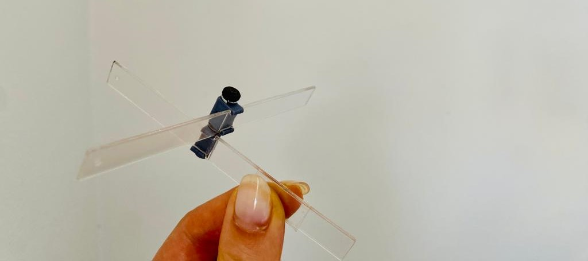

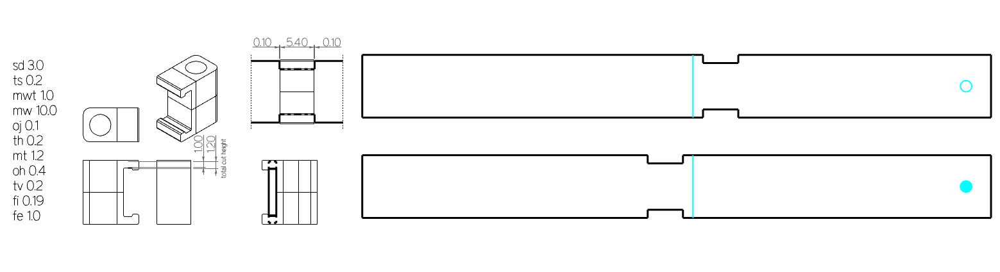
**Fig.** The best working dimensions for the joint model for the lath in scale 1:18 (1cm width).


Please see the [3D Scanning and Printing Assigment](../assignments/week05.md) for further details.
## **Week 06** - Structural Analysis: Single vs Double Layer

**Design Workflow**
Realizing the complexity of the asymptotic gridshell design enabling erection from a flat grid.


source: <div class="csl-entry">Schling, E., &#38; Schikore, J. (2022). Morphology of Kinetic Asymptotic Grids. In C. Gengnagel (Ed.), <i>DMS 2022, Towards Radical Regeneration</i> (pp. 374–393). Springer Nature Switzerland.</div>

**Structural Analysis**

Lath: 10cm width, 2x6.5mm thickness (double)

Material: wood 'birch' E:910[kN/cm2] G12:360[kN/cm2] G3:360[kN/cm2] gamma:4.5[kN/m3] alphaT:5.0E-6[1/C°] ft:3.8[kN/cm2] fc:-3.8[kN/cm2]

Total mass: 131.504203kg

<video width="960"  controls>
  <source src="../../images/230329_analysis.mp4" type="video/mp4">
</video>
**Video**Double layer: Deformation of the structure factorized 0-20: Left - gravity, Right: Wind.

|Analysis|    Gravity                      | Wind 0.365kN/m2|
| ----------- | ------------------------------------ |--|
|Load Case| 1.4D | 0.9D + 1.0W|
| displacement [cm]     | 1.8 | 2.87|
| Buckling Factor    | 79| 49|

Lath: 10cm width, 6.5mm thickness (single)

Material: wood 'birch' E:910[kN/cm2] G12:360[kN/cm2] G3:360[kN/cm2] gamma:4.5[kN/m3] alphaT:5.0E-6[1/C°] ft:3.8[kN/cm2] fc:-3.8[kN/cm2]

Total mass: 65.752102kg

- [model folding](https://youtube.com/embed/Y_U2DWwXKLk)
**Video** Single layer: Deformation of the structure factorized 0-20: Left - gravity, Right: Wind.

|Analysis|    Gravity                      | Wind 0.365kN/m2|
| ----------- | ------------------------------------ |--|
|Load Case| 1.4D | 0.9D + 1.0W|
| displacement [cm]     | 5.7 | 17.8|
| Buckling Factor    | 25| 8|
|Energy|0.009754 |0.087255|

**Key take aways:**

 - double-layer necessary for timber structures (or alternative stiffening strategies for single layer structure)

 - the stiffness scaled model should account for double layer thickness in real pavilion


## **Week 07** - Simulation & Angle Calculation (tolerances indication)
Simulation of assembly-disassembly with different rotation DOF at joints.


**Key take aways:**

 - the angle between joints change more further from the center -> joints closer to legs(supports) need more rotational freedom

 - the joints should allow movement 75-90 deg (more is not necessary e.g. most right example)


## **Week08** - Feasibility study for artificial muscle folding

Small research on artificial muscles - dielectric elastomer actuators ( Electroactive Polymers)

[paper1](https://link.springer.com/article/10.1007/s42558-019-0005-1)
[paper2](https://www.science.org/doi/10.1126/science.1246906)

https://fab.cba.mit.edu/classes/865.18/motion/dielectric/index.html

nylon liner material actuators (NLMAs):

[artificial muscle at home](https://www.instructables.com/Fabricating-Fishing-Line-Artificial-Muscle-at-Home/)
Shape memory wire:
https://www.youtube.com/watch?v=2YVwpBAiA1A&t=39s
https://fab.cba.mit.edu/classes/863.22/doc/ArtificialMuscles/artificialmuscles.html
http://fab.cba.mit.edu/classes/863.10/people/jie.qi/jieweek10.html

Manufacturers:
https://www.pi-usa.us/en/products/piezo-actuators-stacks-benders-tubes/


*Application fields: Industry and research. Can also be applied to curved surfaces or used for integration in structures. For adaptive systems, energy harvesting, structural health monitoring.*
[link](https://www.pi-usa.us/en/products/piezo-actuators-stacks-benders-tubes/p-876-duraact-patch-transducer-101790#downloads)
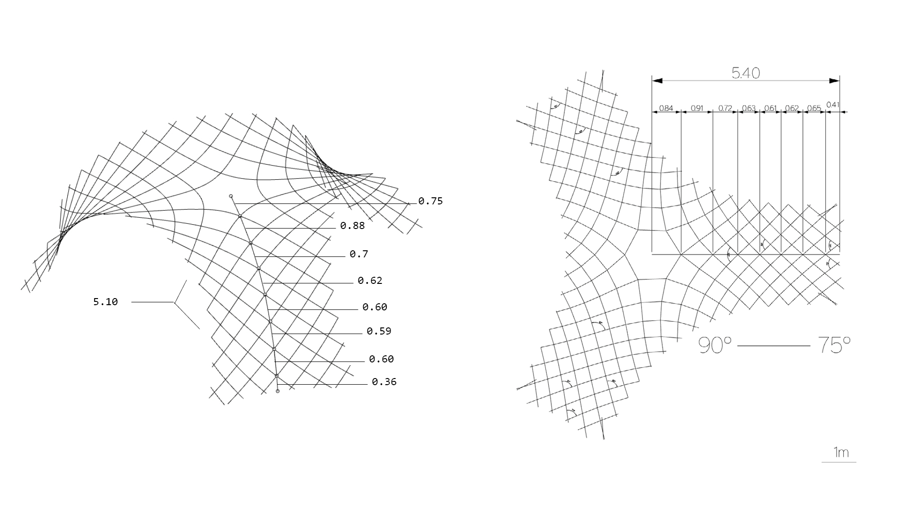

|Line Segments    |1|2|3|4|5|6|7|8|
| -----------   |---|---|---|---|---|----|----|----|
| **Set1-3D**   |0.75|0.88|0.70|0.62|0.60|0.59|0.60|0.36|
| **Set2-Flat** |0.84|0.91|0.72|0.63|0.61|0.62|0.65|0.41|
| **Difference Set1-Set2**| +0.09|+0.03|+0.02|+0.01|+0.01|+0.03|+0.05|+0.08|

Trying to find a function of the geodesic wire extension:

- Linear regression: set2 = 0.184 + 0.977 * set1

- Polynomial regression: set2 = -0.221 + 3.776 * set1 - 12.416 * set1^2 + 16.306 * set1^3 - 8.350 * set1^4 + 1.647 * set1^5

- Pearson correlation coefficient (-1 (perfect negative correlation) to 1 (perfect positive correlation)):  0.962


**Key take aways:**

 - if the artificial muscle is a geodesic can be a "tape" (wide), if is not a geodesic curve should be a wire with rotational cross section

 - the artificial muscle should shrink about 5% (for the flat structure 75-90 angle at joints)

 - middle cell of the structure moves only vertically during assembly and almost doesn't change the shape between flat (dissemble state) and erected (assemble state) -> possibility to mount one stiff panel


## **Week 09** - Testing Interlocking Connections

As for one-time assembly the kinetic joints might not be necessary and it will be enough to account for the rotation between flat and fully assembled state providing adequate tolerances in slots. However, as the slots are bigger to allow some rotation they also cause the problem of elements sliding from each other in the flat state.


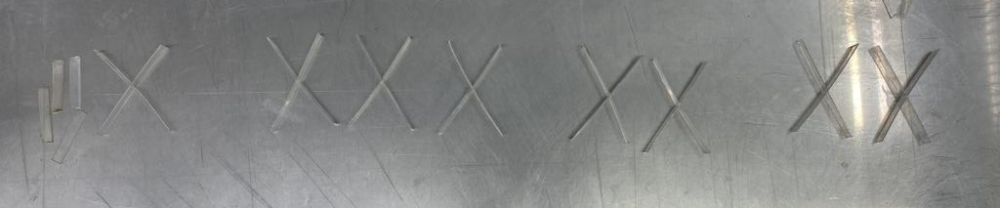

Material: PET, 1.18mm
The laser either didnt cut through or removed the bumps. The pocket size made a difference in the possible rotations at joints.

The best worked the cut on the small machine with:
cut - s4.0, 75p
engrave - s80 p65

with the kerf:

- clear - **0.8** - 1.45, 1.28 (0.4-0.65mm kerf - slower on arc)

- pocket - **1,65** - 1.76, 1.81 (0.1-0.15mm kerf - line cut)

big machine:
cut: s3.0, p90
engrave: s80 p70

- clear - **0.8** - 1.47, 1.52 (0.67-0.72mm kerf - slower on arc)

- pocket - **1.65** - 1.87, 1.95 (0.22-0.30mm kerf - line cut)

**Key take aways:**

 - the scaled model needs to be larger than scale 1:18 or 1:10 to be cut with laser and these joints
 - the bump needs to be bigger than kerf on arc cut

##**Week 10** - Structurally Feasible 1:1 model

For the kinetic-actuated assembly with simple joints (cuts in the laths), I have to keep the structure of the asymptotic gridshell from a single layer of asymptotic laths. However, as the structural analyis shows above, the structure is too weak with the single layer plywood laths 6.5mm thick. Increasing thickness is not possible due to the bending (thicker material cannot bend that easily and can easily break- casuing structural failoure). The project assumption is to use kinetic movement for assembly (and maybe dissasembly), prefarably only once in the Life Cycle of the structure - to assemble it on the site. The assembly device should work as assembler of the sttucture and not as a kinetic actuator for the kinetic sculpture. Therefore to keep the single layer of the asymptotic grid (which can be easily assebmled from flat), I added a developable plates, which will be mounted between laths after assembly to check the structural performance.


**Key take aways:**

 - assuming the 1:1 gridshell structure with filling developable plates the structural performance is satisfactory

 **Next steps:**

  - calculation of the material thickness for 1:5 stiffness scaled model  -> testing the kinetic joints with tolerances - > preparation of the fabrication files


##**Week 11** - Sensing ideas
Some Ideas of the Input Devices for OPTIshell:


**Key take aways:**

 - if the xino-remote boards work correctly: 1 SLAVE with battery which can be attached wherever and 1 HOST reading data from SLAVE and connected to the computer which can read data or pass instructions, in the basic desing with xiao nRF52840 the 6DOF sensor and microphone are embedded, however having these 2 boards talking remotely, gives a lot of oportunities to make additional senses to the pavilion :)

##**Week 12** - PCB design
Xino-remote with battery concepts:


**Key take aways:**

 - only the smallest battery can be fitted into the pcb outline -> I ordered EEMB Lithium Polymer Batería 3.7V 250mAh 502030 [here](https://www.amazon.com.mx/gp/product/B08FD3V6TF/ref=ppx_od_dt_b_asin_title_s00?ie=UTF8&psc=1)
 - maybe it would be worth considering pins vertical (to allow attachment from one side)
 - it would be helpful to have a waterproof case (so it can be really attached to the outside structure)

##**Week 13** - PCB fabrication
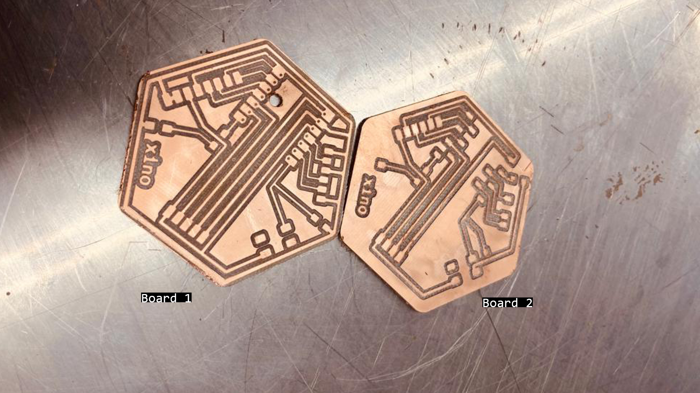
**Fig.** Xino-remote pcb prototypes fabricated: left: with ground, right: without ground.

**Fig.** Xino-remote with nRF5240 and recharchable battery. Left- connected to computer -> the green charging diode lit up. Right: after uploading the file to turn on the inbuilt LED and disconnecting from USB-C, the XINO Remote works.

**Key take aways:**

 - making a whole in the slave board was successful and let the battery to be connected from the other side
 - making the GDN on the whole surface of the PCB (and not seperated path) was a bad idea, the copper stips after fabrication can touch the surface and in general is more likely to make a short touching excidentally the ground parts
 - BLE communication is easy (or maybe only possible) only between 2 boards of the same type -> trying communicate XIAO nRF5240 and XIAO ESP32C3 through Bluethooth was not straightfoward and I didnt manage to do it within considerable timeframe

##**Week 14** - Stiffness-scaled model
Calculating the thickness of plywood for stiffness-scaled model 1:5.

|Analysis Model|   1:1          | 1:5|
| ----------- | ----------------- |--|
|Load Case 1.4D|6.4mm x 10cm, single, **5cm** | disp.**1cm**, thickness x width: 0.5mm x 20mm|
|Load Case 1.4D|6.4mm x 10cm, single + 0.5mm thick plates, disp.**0.19cm** | **0.04cm**, xx|
|Load Case 1.4D|6.4mmx10cm, double, **1.8cm** |thickness x width: 1.0mm x 20mm, disp.**0.34cm**|

**Grasshopper-Karamba Analysis**: [gh -file](../files/final/230510_V2_analysis.gh){: 230510_V2_analysis }


**Fig.**. Stiffness scaled model. Left: The real structure laths 6.5mmx100mm double layer, Birch plywood, Right: model 1:5 laths 1mmx20mm, single layer Birch.

**Key take aways:**

 - considering stiffness-scaling, already for 1:5 scale, I need a very thin plywood of 0.8mm-1mm, therefore the 1:5 scale was considered as suitable for prototype

##**Week 15** - 3D printed supports
3D printed support design for the 1:5 model.


**Fig.** Design of the leg supports in scale 1:5 for plastic robotic extrusion.

**Grasshopper file**: [gh -file](../files/week15/230516-print1.gh){: print1 }
**Robot Path**: [src-file](../files/week15/230516-print1.src){: print1 }


**Fig.** Initial excitement - thinking its going well!


**Fig.** Huge contraction of plastic and failure.

More about the design and fabrication process: [week15](../assignments/week15.md)

**Key take aways:**


- this process is not applicable to not rotational forms and it was a complete waste of time trying to print in this way the linear supports  


##**Week 16** - Assembly membrane
After trying to make a list of materials and where to get them -> I discovered that there is no way (really no way) to find thin plywood in Mexico. I considered ordering it from the US, or even Finland or Poland, but the amount for the model needed (like 1 board for 1:5 prototype) and even if 4 boards to allow the mistakes, the costs and taxes, and effort is not proportional to the amount I need. Therefore after reviewing if I can make it from aluminum sheets, as this is also common for real structures, the thinnest aluminum 0.5mm is already very stiff, what would mean the model would be bigger than 1:5, and no possibility to cut the aluminum in local fab or with the aluminium provider offering cutting services, I looked for alternative ways to errect resembling shape. Desingning a membrane which can errect the structure and potetially stay on the structure after assembly is a great idea. I managed to calculate the inflatable surfaces of the membrane to reseamle exaclty the shortenning and extending of the diagonals of the grid.

Membrane Design resembling the shortening of the diagonals:
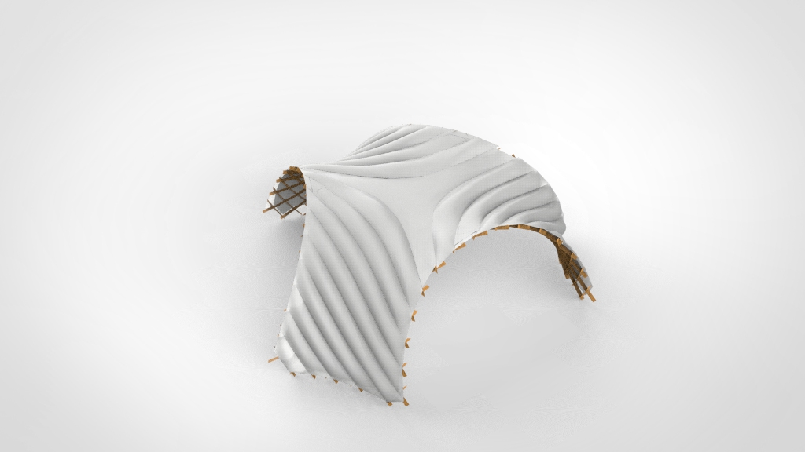
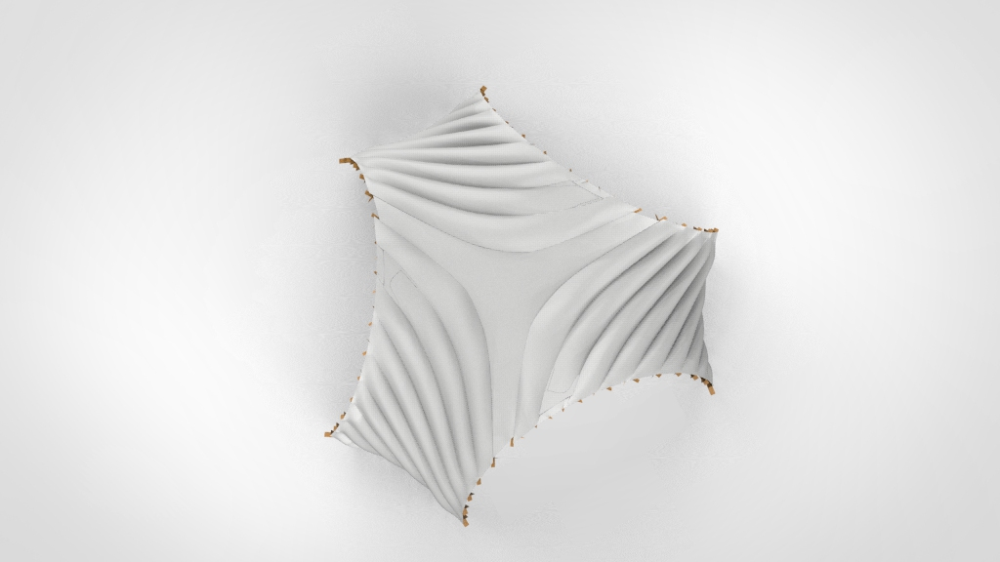
More about the design process: [week16](../assignments/week16.md)

**Key take aways:**

- although it is a great idea and I would really like to make it, I have the same problem as with gridstrucutre -> I don't know what material and where to find it and if I find it on time, and even if I find it -> I never made inflatable with laser and I have no idea how long it can take me to produce it
- I need a air pump -> following the Neil's advice I reviewed this: https://www.softrobotics.io/, aware about ticking clock for the final project, I gave a shot and emailed them asking if I can borrow one unit for the course time or if there is a chance they can send me the components for assembly of it, however I was left without reply
- **no inflatable membrane for the final project**

##**Week 17** - IP, Planning

I had to really quickly find replacement material for thin plywood, that can be used to produce asymptotic gridshell model. Alternative Materials (PET/Aluminum) available in CDMX: [acriplast](https://www.acriplass.com) with following materials: [material catalogue](http://www.acriplass.com/blog/wp-content/uploads/2020/02/ACRIPLAS_MEXICO_CATALOGO_ACRILICOS.pdf)


**Fig.** The creative facade design and very kind service eating ice-cream made me think, the acrylic model will be great :).

CC - Creative Common License:


**Key take aways:**

-  I touched the thinnest aluminium sheets available and realize they are too stiff for any model scale
- I have a lot of PET20, PET30, PET40- > and now this is the only option -> I need to make a laser tests and choose a scale for the model
- **finding the scale for the acrylic thickness**
- I have also reviewed CC licenses and chose: Attribution-NonCommercial 4.0 International (CC BY-NC- 4.0).


##**Week 18** - Acrylic Model
I design and produce samples to assess the kerf and posible precision of cutting for PET20, PET30, PET40.
Obviously the best precision was for the thinnest PET20.


**Fig.** Self-interlocing joint test PET20 V4 with tolerance allowing flat assembly (50-90deg) - it worked well :).

The PET30 &PET 40 was not possible to be cut on laser with a detail allowing controllnig the tolerances (slot size for rotation) & bump slot design stopping the stripes from falling, **therefore I had to find a scale for the PET20** for which elements has enough stiffness.
I made first the model 1:10 from PET20 - it was to slender.


I assembled also model 1:20, that was still not stiff enough.
The next attempt was successful: **PET20 1:25 scale** -> elements had enough stiffness and could be cut with satisfactory precision so that the self locking joints hold the laths.

After 2 hours of removing carefully elements from the acrylic sheet without breaking:

.jpeg)
After 5 hours of cleaning elements with aceton and assembling the flat structure:


More about the fabrication process: [week18](../assignments/week18.md)

**Key take aways:**

-  I hate cutting plastic
- it is great that asyptotic gridshell work so well as a system, but also it makes it almost impossible to evaluate performance of structure based on 2 laths connected - > only assembling the whole model the scale and/or thickness could be evaluated :(
- Selected laser parameters:
    - **PET-G 20 0.55mm**: Overall: S11P100: Divided: ->S10P100/S11P100 - long Lines ->S13P100 - details
    - **PET-G 30 0.74mm**: Overall: S10P100: Divided: ->S10P100/S09P100 - long Lines ->S11P100 - details
________________________________________________________
## **FINAL PROJECT**


This project is licensed under Attribution-NonCommercial-ShareAlike 4.0 International (CC BY-NC-SA 4.0).

“© Judy Curie, 2023
This work may be reproduced, modified, distributed, performed and displayed for any purpose, but must acknowledge "MOREvLESS". Copyright is retained and must be preserved. The work is provided as is; no warranty is provided, and users accept all liability.”

### **FINAL PROJECT Proposed/Intended solution**

**Fig.** The final idea scheme.


**Reading height - 6DOF**

In Interface and Application Programming week [week 14](../assignments/week14.md) I attempted to assess the position based on the accelometer embedded in 6DOF of the XIAO nRF52840. First of all, the accolometer was very sensitive - showing acceleration even when XIAO was steady lying on the desk. I tried to calibrate it, but without success (in less modern sensors its somehow easier to access the calibration settings). Anyhow I managed to overcome it introducing measuring of the acceleration only if the significant movement is detected.

```

This code calulates the position of the device based on the acceleration only when significant movement detected.
“© Judy Curie, 2023
This work may be reproduced, modified, distributed, performed and displayed for any purpose, but must acknowledge "project name". Copyright is retained and must be preserved. The work is provided as is; no warranty is provided, and users accept all liability.”

#include "LSM6DS3.h"
#include "Wire.h"
#include <SPI.h>

//Create an instance of class LSM6DS3
LSM6DS3 myIMU(I2C_MODE, 0x6A);    //I2C device address 0x6A

// Set initial values for position, velocity, and time
float position[3] = {0, 0, 0};
float velocity[3] = {0, 0, 0};
unsigned long timestamp;
const float accelerationThreshold = 2.5; // threshold of significant in G's

// Define constants for integration
const float SAMPLING_INTERVAL = 0.01; // in seconds
const float GRAVITY = 9.81; // in m/s^2

void setup() {
    // put your setup code here, to run once:
    Serial.begin(9600);
    while (!Serial);
    //Call .begin() to configure the IMUs
    if (myIMU.begin() != 0) {
        Serial.println("Device error");
    } else {
        Serial.println("Device OK!");
    }

  // Set the range of the accelerometer to +/- 16g
  //myIMU.A_SCALE_16G;

  // Set the output data rate of the accelerometer to 104 Hz
  //myIMU.setAccelDataRate(LSM6DS_RATE_104_HZ);

  // Set initial timestamp
  timestamp = millis();
}

void loop() {
  // Read the acceleration data from the LSM6DS3 sensor

  float x = myIMU.readFloatAccelX();
  float y = myIMU.readFloatAccelY();
  float z = myIMU.readFloatAccelZ();

  float aSum = fabs(x) + fabs(y) + fabs(z);
  if (aSum >= accelerationThreshold) {
  //Serial.print(x);
  //Serial.print("   ");
  // Calculate the elapsed time since the last iteration
    unsigned long current_time = millis();
    float elapsed_time = (current_time - timestamp) / 1000.0;

  // Calculate the change in velocity due to acceleration
    float delta_vx = x * GRAVITY * elapsed_time;
    float delta_vy = y * GRAVITY * elapsed_time;
    float delta_vz = z * GRAVITY * elapsed_time;
  //Serial.print(delta_vx);
  //Serial.print("   ");
  // Update the velocity
    velocity[0] += delta_vx;
    velocity[1] += delta_vy;
    velocity[2] += delta_vz;

  // Calculate the change in position due to velocity
    float delta_px = velocity[0] * elapsed_time;
    float delta_py = velocity[1]* elapsed_time;
    float delta_pz = velocity[2]* elapsed_time;
  //Serial.print(delta_px);
  //Serial.print("   ");
  // Update the position
    position[0] += delta_px;
    position[1] += delta_py;
    position[2] += delta_pz;

  // Update the timestamp
    timestamp = current_time;

  }

  // Output the position data
  //Serial.print("Position (x, y, z): ");
  Serial.print(position[0]);
  Serial.print(", ");
  Serial.print(position[1]);
  Serial.print(", ");
  Serial.println(position[2]);

  // Wait for the next iteration
  delay(SAMPLING_INTERVAL * 1000);
  position[0] =0;
  position[1] =0;
  position[2]= 0;
}
```

Although the results still needed to be calibrated to resemble real units. This was working enough to pass information to the HOST pcb through the BLE and the threshold value for the height could be determined empirically (as not sure what was the unit in SI measured).


More : [week14](../assignments/week14.md)-  Reading the IMU data for serial communication.

**Boards and communication**

<video width="960"  controls>
  <source src="../..//images/week13/WhatsApp Video 2023-05-03 at 12.55.21.mp4" type="video/mp4">
</video>
**Video.** Two nRF52840 communicating via BLA: SLAVE board with battery.

Now it was enough to mount the SLAVE pcb on the model and read through BLE the height value measurement.


###**FAIL-FAIL-FAIL-FAIL-FAIL-FAIL-FAIL-PINCHE MURPHY!**

While integrating the pcbs to the model, something went wrong and xiao nRF5240 stopped responding...

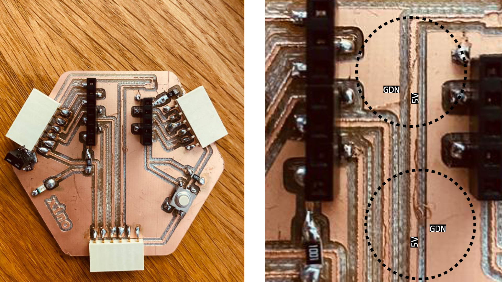


It turned out there was a short on the HOST board. I had this problem before, which I fixed, but apparently some scraps caused a short again...
As I could replace MCU in the HOST board, therefore I put my second XIAO nRF5240 and also fired this one.

**I panicked.**

And after that I checked what I still have working and it was a step response sensor and RP2040 programmed -> [week14](../assignments/week11.md).


____________________________________________________

### **FINAL PROJECT - Implemented solution**

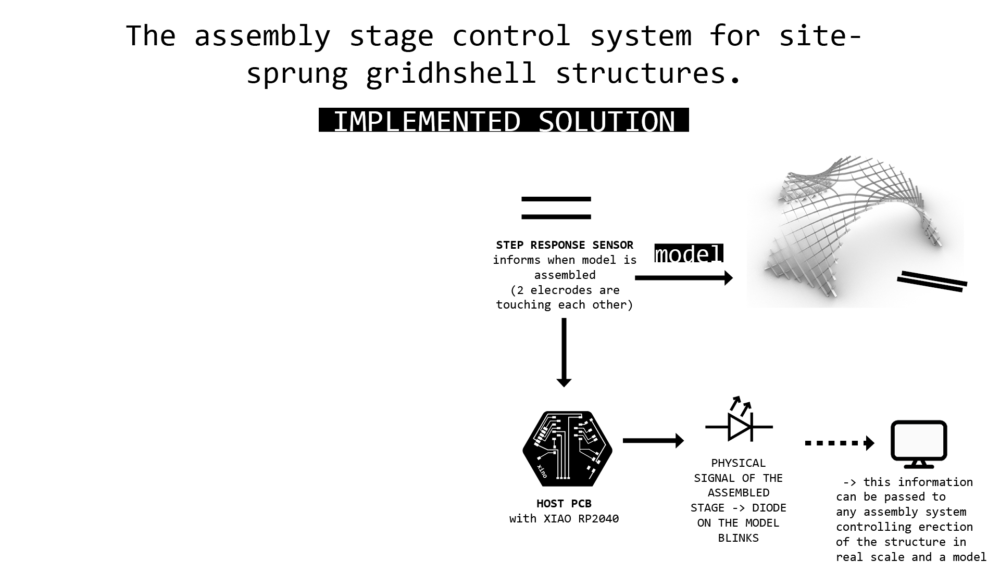
**Fig.** The implemented solution scheme.

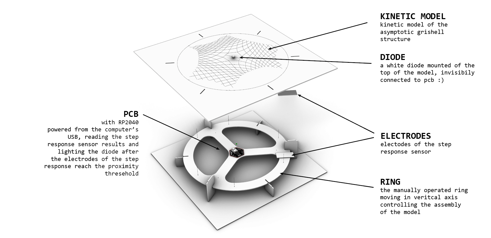
**Fig.** The implemented solution design.


**How it works?**

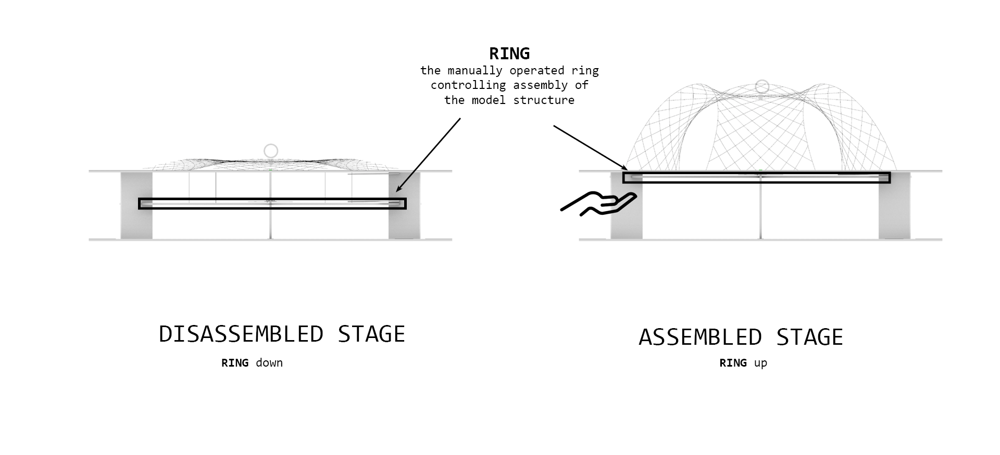


**Prototyping Assembly System  - Acrylic kinetic model 1:25 PET20**

This material is so thin and delicate that the Fish Line the finest I think I could have found (Prueba de 80 libras), bought [here](https://www.amazon.com.mx/dp/B0000AY6K0?ref=ppx_yo2ov_dt_b_product_details&th=1&psc=1) was stronger than the grishell material. Therefore putting it as the geodesic arcs and pushing (extending from bottom) allowed for easy assembly movement.

<video width="960"  controls>
  <source src="../..//images/final-project/WhatsApp Video 2023-06-13 at 21.06.10.mp4" type="video/mp4"">
</video>

**Fig.** PET20 - 0.55m thickness, scale 1:25, V4, rotational slots 50-90deg. All lines cut S11P100.

More about the fabrication process: [week18](../assignments/week18.md)

**Base design & Production**

Production of the base required testing the material - MDF 3mm (3.05mm). All samples were cut with recommeded by workshop  CUT layer = S1.6P90, ENGRAVE layer - S85P60.


**Fig.** Testing dimensions for the base seperators - the connection should be tight enought to not require glueing.  


**Fig.** Evaluating kerf. Kerf with  S1.6P90 was 0.055mm.


**Fig.** Testing connection between ring and seperators - connection should allow the free vertical movement, but should prevent movement in the XY plane.

- CUT settings: S1.6P90
- tight connection 2.8mm width (resulting as 2.91mm after cutting)
- vertical movement connection - 3.2mm (resulting in 3.26-3.30mm after cutting)
- holes for the fishing line mount: 2.2mm (resulting in 2.31mm after cutting)


**Fig.** Lasercut files for testing and base.

<video width="960"  controls>
  <source src="../../images/final-project/WhatsApp Video 2023-06-25 at 17.04.38.mp4" type="video/mp4">
</video>
**Fig.** Manual testing of the mechanisms of the acrylic gridshell model, base connections, and ring movement.

**Electronics Integration**

PCB board design and production:  [week13](../assignments/week13.md)

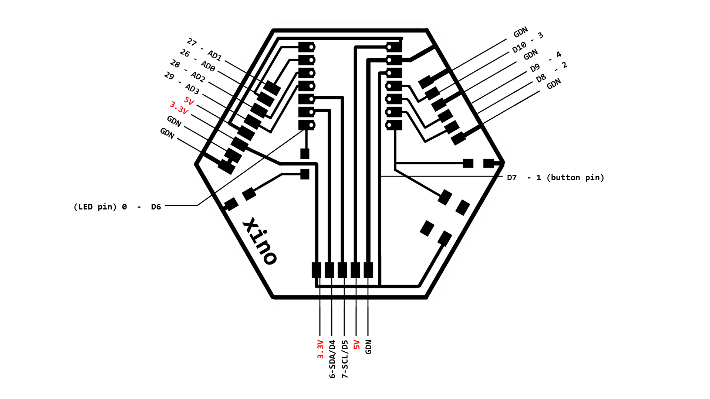

In this picture I still have working XIAO nRF52840, but after firing it and fixing the copper trash causing the shorts, it was replaced with RP2040.
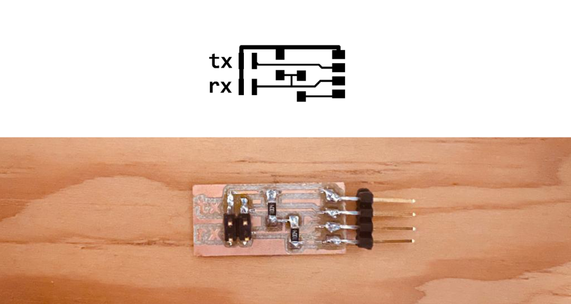

More about step response sensor -> [week11](../assignments/week11.md)

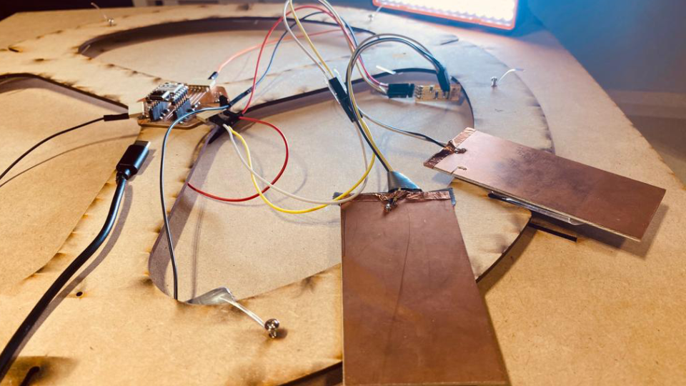
**Fig.** The electronics connectivity (**NOT FIXED AND ARRANGED YET**). After mounting it to the ring and top board, and connecting the ring to the model, its not possible to take a picture of the fixed arrangement without demounting -> I didnt risk demounting it again before the final presentation to take a picture of fixed electronics.

**Programming**

```
# code translated from Arduino examples provided by:
#tx_rx03  Robert Hart Mar 2019( https://roberthart56.github.io/SCFAB/SC_lab/Sensors/tx_rx_sensors/index.html)
# And
# Adrián Torres Omaña, Fab Academy 2023 (http://fabacademy.org/2020/labs/leon/students/adrian-torres/fabxiao.html#step)

“© Judy Curie, 2023
This work may be reproduced, modified, distributed, performed and displayed for any purpose, but must acknowledge "project name". Copyright is retained and must be preserved. The work is provided as is; no warranty is provided, and users accept all liability.”


from machine import Pin, ADC
import time
from ws2812 import WS2812
import utime

power = machine.Pin(11,machine.Pin.OUT)
power.value(1)
result = 0 # variable for the result of the tx_rx measurement.
analog_pin = ADC(29) # Pin A1 of the XIA0 RP2040 or ESP32-C3
tx_pin = Pin(28, Pin.OUT) # Pin D2 of the XIAO RP2040 or ESP32-C3
led = WS2812(12,1)#WS2812(pin_num,led_count)
led_top = Pin(0, Pin.OUT) #pin number for the model top diode

def tx_rx():
    # Function to execute rx_tx algorithm and return a value
    # that depends on coupling of two electrodes.
    # Value returned is a long integer.

    N_samples = 100 # Number of samples to take. Larger number slows it down, but reduces scatter.

    sum = 0
    for i in range(N_samples):
        tx_pin.on() # Step the voltage high on conductor 1.
        read_high = analog_pin.read_u16()# Measure response of conductor 2.
        time.sleep_us(100) # Delay to reach steady state.
        tx_pin.off() # Step the voltage to zero on conductor 1.
        read_low = analog_pin.read_u16() # Measure response of conductor 2.
        diff = read_high - read_low # Desired answer is the difference between high and low.
        sum += diff # Sums up N_samples of these measurements.

    return sum # End of tx_rx function.

r= []
while True:
    result = tx_rx()
    result = int((result - 22000) * (1024/(79000 - 22000))) # Mapping the values of the two copper plates, it will depend on their size.
    print(result)
    if result >200: #when the electrodes touched or almost touched in while monted in the model
        led_top.value(1)
    else:
        led_top.value(0)
    r.append(result)
    time.sleep_ms(10)
    c = int((result-800)/350*255)

    color = [255-c,200-c,150-c] # optional color blinking for RGB LED in XIAO RP2040 -> changes colors when electrodes are changing distance between each other, WHITE when they are touched
    #print(color)

    led.pixels_fill(color)
    led.pixels_show()

```

**How it works together?**
<video width="960"  controls>
  <source src="../../images/final-project/WhatsApp Video 2023-06-23 at 02.54.05.mp4" type="video/mp4">
</video>


**BOM**

|Part|Material   |    Amount/Count   | Price/unit|Cost|
|---| ----------- | ----------------|------|----|
|GRIDSHELL|PET 20 |0.154 m2 = 0.23 x 1PANEL 1.22mx1.22m| $11.60/unit|$2.66|
|GRIDSHELL| Fishing Line    | 2m =  0.025 x 1 roll 80m|$11.60/unit| $0.29|
|GRIDSHELL| Copper wire   0,1mm| 8m =  0.66 x 1 roll 12m| $1.74/unit| $1.16|
|BASE| MDF 3mm | 0.9m2 = 3 x PANEL 0.61 X 1.22 M |$4.79/unit|$14.37|
|XINO HOST, STEP RESPONSE	| PCB Proto Board FR1| 1 copper board 15x15cm |$1.24/unit |$1.24|
|XINO HOST|Seeed Studio XIAO RP2040|x1|$5.00/unit|$5.00|
|XINO HOST|0Ω resistor|x1|$0.09/unit|$0.09|
|XINO HOST|499 Ω resistor|x1|$0.09/unit|$0.09|
|XINO HOST|1kΩ resistor|x1|$0.09/unit|$0.09|
|XINO HOST|LED|x2|$0.35/unit|$0.70|
|XINO HOST|Button|x1|$1.00/unit|$1.00|
|XINO HOST|Female 1 row horizontal header|x3|$0.15/unit|$0.45|
|STEP RESPONSE|Male 2 row vertical header|x1|$0.15/unit|$0.15|
|STEP RESPONSE|1MΩ resistor|x2|$0.09/unit|$0.18|
|**Total**||||**$27.47**|

**Production files**


KINETIC GRIDSHELL MODEL 1:25

ENGRAVE LAYER: S80P65, Piority 1 and with 2 CUT LAYER: CUT1 for details:S13P100 Priority 2, and CUT2 - long Lines S11P100,Piority 3.

**PET20 Laser Cut**: [V4 - Rhino](../files/final/V4-S13P100.3dm){: V4-S13P100.3d}


BASE WITH RING
**MDF 3mm Laser Cut**: [base - Rhino](../files/final/BASE - lasercut.3dm){: BASE - lasercut.3dm}


PCB
**Xino Board 2 with ground plane** [board2 - with  ground plane - kiCad + fabrication files](../files/230426-xino-remote-kicad-fabrication-files.zip){: 230426-xino-remote-kicad-fabrication-files }


STEP RESPONSE SENSOR
**STEP RESPONSE design files**: [Xino - Step Response KiCAD](../files/week11/xino-step-response-kicad.zip){: Xino - Step Response KiCAD}
**STEP RESPONSE production files**: [Xino - Step Response - SVG/PNG](../files/week11/xino-step-response-production.zip){: Xino - Step Response - SVG/PNG}


## FINAL SLIDE & VIDEO
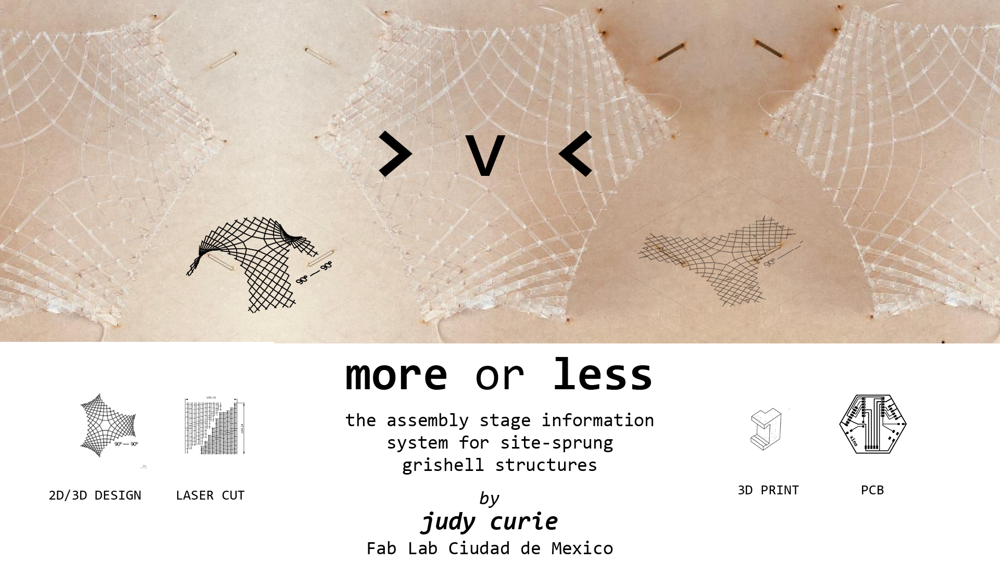

<video width="960"  controls>
  <source src="../../presentation.mp4" type="video/mp4">
</video>


This project is licensed under Attribution-NonCommercial 4.0 International (CC BY-NC 4.0).

“© Judy Curie, 2023
This work may be reproduced, modified, distributed, performed and displayed for any purpose, but must acknowledge "MOREvLESS". Copyright is retained and must be preserved. The work is provided as is; no warranty is provided, and users accept all liability.”
