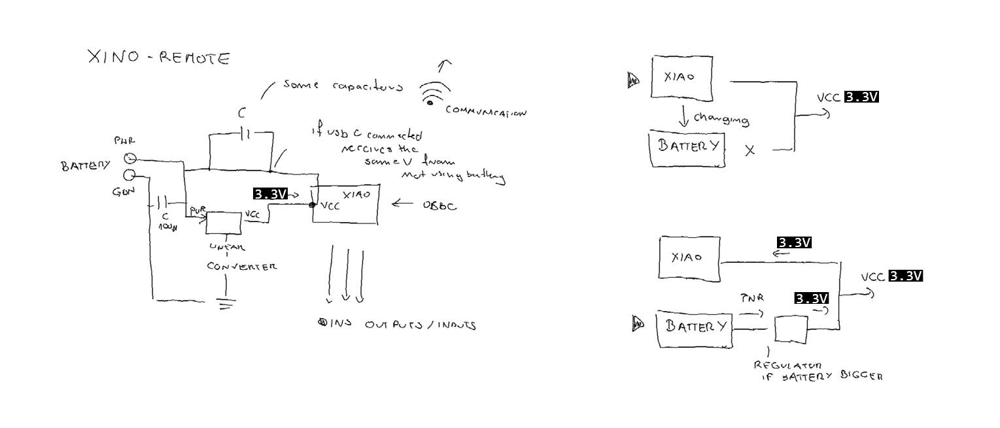
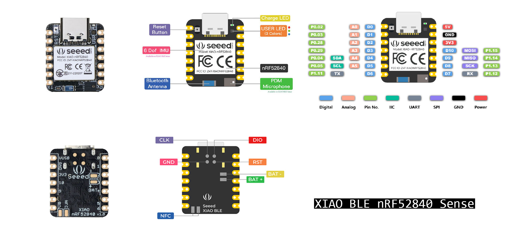
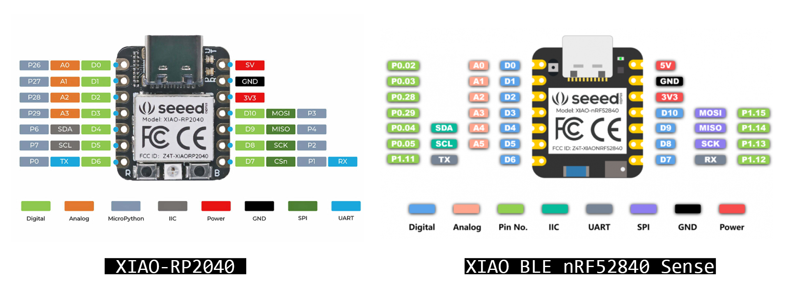
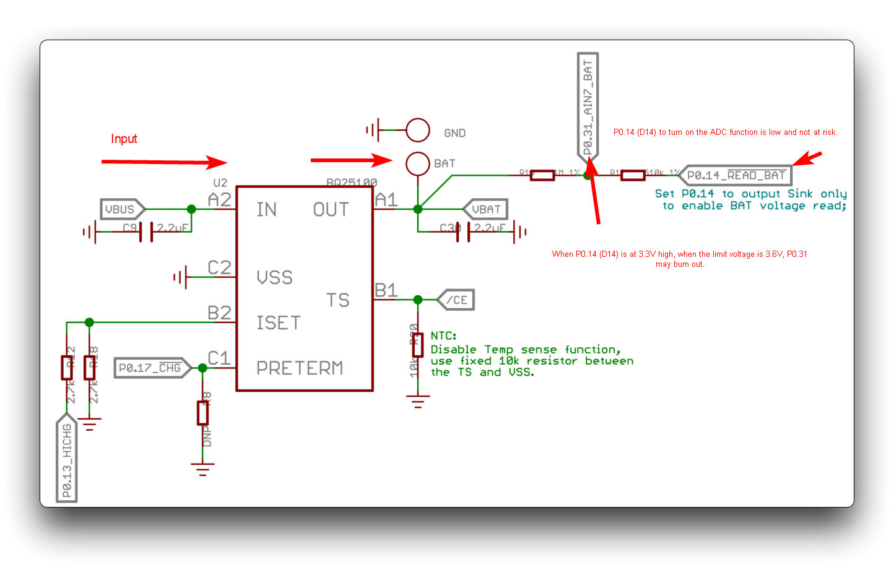

# Xino-Remote

## Idea for Xino Remote
A PCB board based on

## XIAO BLE nRF52840 Sense

## Pin layout

**Fig.**  XIAO nRF52840 (Sense) all pins.

**Fig.**  XIAO nRF52840 (Sense) vs XIAO RP2040 - pin layout comparison.

### Specifications
- Powerful CPU: Nordic nRF52840, ARM® Cortex™-M4 32-bit processor with FPU operating at 64 MHz
- Wireless capabilities: Bluetooth 5.0, NFC, and ZigBee module with onboard antenna
- Ultra-small size: 21 x 17.5mm, Seeed Xiao series classic form-factor for wearable devices
- Ultra-low sleep power: 5 μA, deep sleep model
- Battery charging chip: BQ25101 chip supported lithium battery charge management
- Rich interface: 1x Reset button, Ix UART, 1x IIC, 1x SPI, 1x NFC, 1x SWD, 11x GPIO, 6x ADC, 1x Three-in-one LED,1x User LED
- Onboard 2 MB flash
- Onboard PDM microphone and 6-axis IMU (only for XIAO BLE nRF52840 Sense)
- Single-sided components, surface mounting design

## XIAO BLE nRF52840 Sense -battery

**Fig.** Considerations when using XIAO nRF52840 (Sense) for battery charging. source:https://wiki.seeedstudio.com/XIAO_BLE/

[Battery-AS1337A/B EB: 3.3V @ 200mA, 0.65 ~ 4.5V in](https://www.digikey.lt/reference-designs/en/ac-dc-and-dc-dc-conversion/dc-dc-smps-single-output/1161)

## Links:

- [link how to use in-built sensors](https://how2electronics.com/using-imu-microphone-on-xiao-ble-nrf52840-sense/)

- [producent website](https://www.seeedstudio.com/Seeed-XIAO-BLE-Sense-nRF52840-p-5253.html)

- [data sheet](https://files.seeedstudio.com/wiki/XIAO-BLE/BQ25101.pdf)

- [micro-python for seed xiao nrf52](https://github.com/micropython/micropython/tree/master/ports/nrf/boards/seeed_xiao_nrf52)

- [Getting Started with Seeed Studio XIAO nRF52840 (Sense)](https://wiki.seeedstudio.com/XIAO_BLE)

**Attention:All the I/O pins are 3.3V, please do not input more than 3.3V, otherwise, the CPU may be damaged.**

## XINO remote - Kicad

[kicad resources](https://wiki.seeedstudio.com/Seeeduino-XIAO/#resourses)

**Import the Symbol library to Kicad**
- Open your Kicad Project
- Go to Preference —> Manage Symbol Libraries

- Click the “+” button below
- Configure the Nick Name and the Library Path (choosing the Library you download from the wiki, called: …\Seeeduino XIAO KICAD\Seeeduino XIAO.lib)
- Then hit OK

Import the Footprint library to Kicad
Go to Preference —> Manage Footprint Libraries
