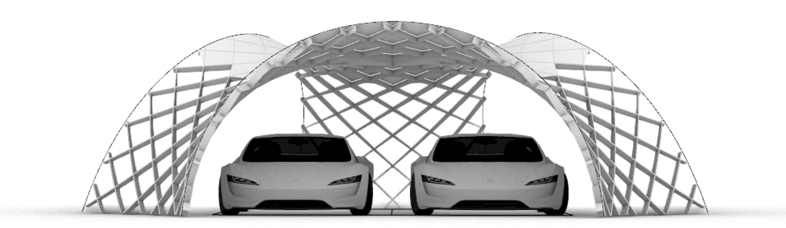

# Final Project

My course is sponsored by the individual grant MSCA IF OPTIshell (EU funding: 101033646).
One of the goals of this research project is to build a protorype of the timber solar canopy structure covered with the PV material.
More about the project [optishell.io](https://https://optishell.io//).

## Ideas Development

During Fab Academy I would like to build a stiffness-scaled model in 1:10 or 1:18 scale. 

### Week 01
spiral 1: building 1:10 model from laser cut thin plywood, filling the spaces with the plate panels, 3D print the foundation structures, 

	IO addition:
	1) add PV elements on some of the plates, connect to battery and show the level of the battery (++)
	2) create a sensor at the bottom to remotely display if the place is occupied (+)
	3) create a simple machine to erect the structure e.g. an extendable tube in the middle controlled by (+++)
	4) add sensor of the wind to inform if the wind is too strong (alternatively dismount) (+++)